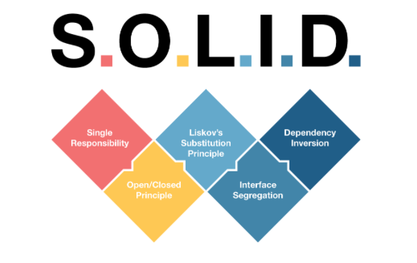
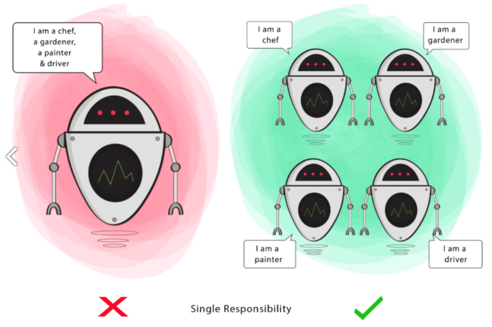
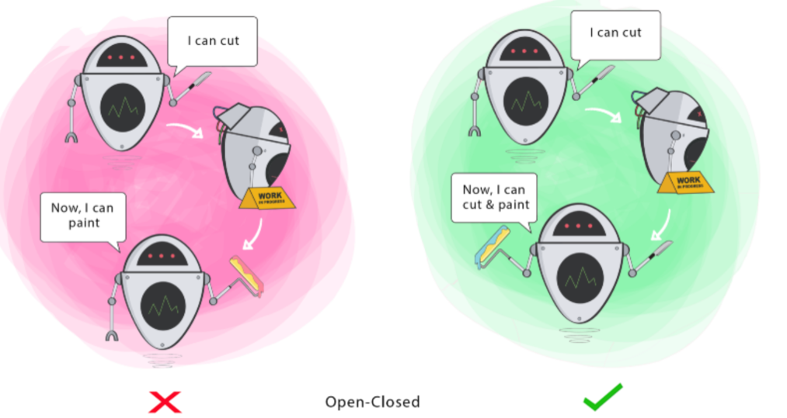
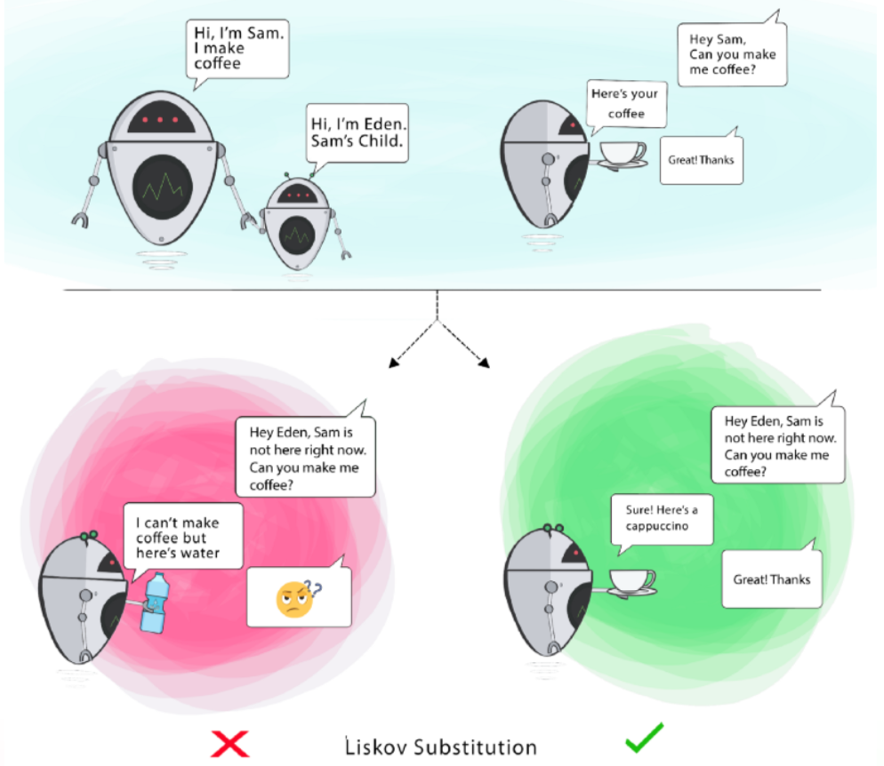
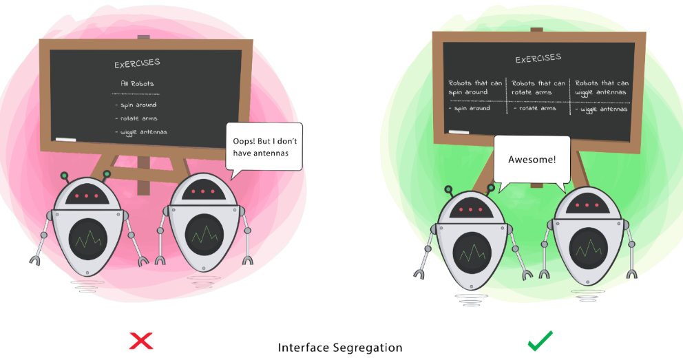
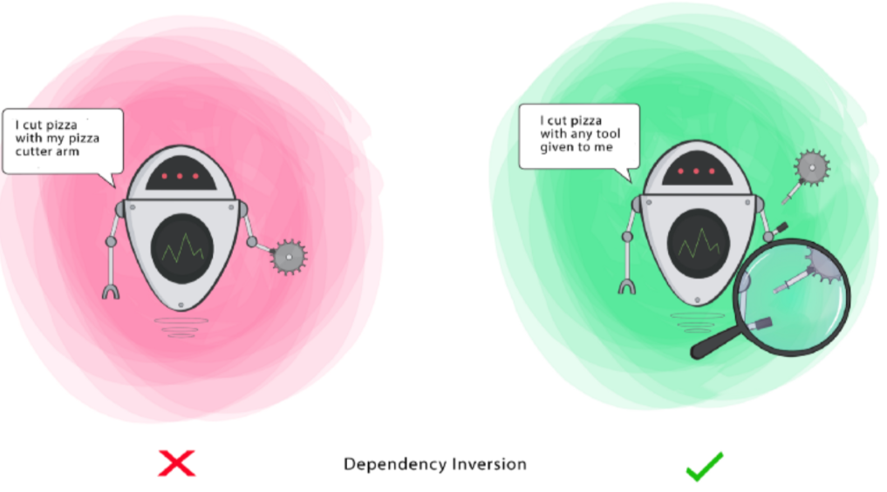
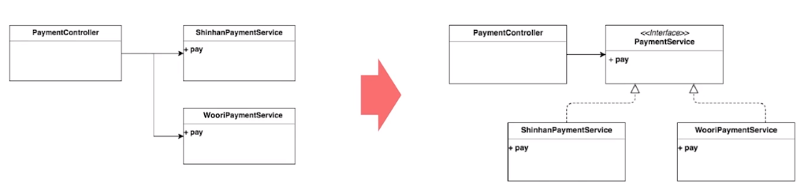

**클린코드** **3장 함수**

## SOLID원칙 (객체지향 설계의 5가지 원칙)



### **SRP( Single Responsibility Principle ), 단일 책임 원칙**



**객체는 단 하나의 책임만 가져야 한다는 원칙**.

- 클래스는 하나의 기능만 가지며, 어떤 변화에 의해 클래스를 변경 해야 하는 이유는 오직 하나뿐이어야 한다.
- SRP 책임이 분명해지기 때문에, 변경에 의한 연쇄작용에서 자유로워질 수 있다.
- 가독성 향상과 유지보수가 용이해진다.
- 실전에서는 쉽지 않지만 늘 상기해야 한다!

### **OCP ( Open-Closed Principle ), 개방-폐쇄 원칙**

**기존의 코드를 변경하지 않으면서( closed ), 기능을 추가할 수 있도록( open ) 설계가 되어야 한다는 원칙**.



- 변경을 위한 비용은 가능한 줄이고, 확장을 위한 비용은 가능한 극대화 해야 한다.
- 요구사항의 변경이나 추가사항이 발생하더라도, 기존 구성요소에는 수정이 일어나지 않고, 기존 구성 요소를 쉽게 확장해서 재사용한다.
- 객체지향의 추상화와 다형성을 활용한다.

### **LSP ( Liskov Substitution Principle ), 리스코프 치환 원칙**



**자식 클래스는 최소한 자신의 부모 클래스에서 가능한 행위는 수행할 수 있어야 한다는 설계 원칙**.

**서브 타입 언제나 기반 타입으로 교체할 수 있어야 한다.**

- 서브 타입은 기반 타입이 약속한 규약(접근제한자, 예외 포함)을 지켜야 한다.
- 클래스 상속, 인터페이스 상속을 이용해 확장성을 획득한다.
- 다형성과 확장성을 극대화하기 위해 인터페이스를 사용하는 것이 더 좋다.
- 합성(composition)을 이용할 수도 있다.

### **ISP ( Interface Segregation Principle ), 인터페이스 분리 원칙**



**자신이 사용하지 않는 인터페이스는 구현하지 말아야 한다는 설계 원칙**.

- 가능한 최소한의 인터페이스만 구현한다.
- 만약 어떤 클래스를 이용하는 클라이언트가 여러 개고, 이들이 클래스의 특정 부분만 이용한다면, 여러 인터페이스로 분류하여 클라이언트가 필요한 기능만 전달한다.
- SRP가 클래스의 단일 책임이라면, ISP는 인터페이스의 단일 책임

### **DIP ( Dependency Inversion Principle ), 의존 역전 원칙**



객체들이 서로 정보를 주고 받을 때 의존 관계가 형성되는데, **이 때** **객체들은** **나름대로의 원칙을 갖고 정보를 주고 받아야 한다는 설계 원칙**.

**상위 모델은 하위 모델에 의존하면 안된다. 둘 다 추상화에 의존해야 한다.
추상화는 세부 사항에 의존해서는 안된다. 세부 사항은 추상화에 따라 달라진다.**

- 하위 모델의 변경이 상위 모듈의 변경을 요구하는 위계관계를 끊는다.
- 실제 사용관계는 그대로이지만, 추상화를 매개로 메시지를 주고 받으면서 관계를 느슨하게 만든다.

DIP 예제

```java
class PaymentController {
    
    @GetMapping("/api/payment")
    public void pay(@RequestBody ShinhanCardDto.paymentRequest req) {
        shinhanCardPaymentService.pay(req);
    }
}

class ShinhanCardPaymentService {
    public void pay(ShinhanCardDto.paymentRequest req) {
        shinhanCardApi.pay(req);
    }
}
```

새로운 카드사가 추가된다면?

```java
@GetMapping("/api/payment")
public void pay(@RequestBody CardPaymentDto.paymentRequest req) {
    if(req.getType() == CardType.SHINHAN) {
        shinhanCardPaymentService.pay(req);
    } else if(req.getType == CardType.WOORI) {
        wooriCardPaymentService.pay(req);
    }
}
```
**해결방법!**



```java
class PaymentController {

    @GetMapping("/api/payment")
    public void pay(@RequestBody CardPaymentDto.paymentRequest req) {
        final CardPaymentService cardPaymentService = cardPaymentFactory.getType(req.getType());
        cardPaymentService.pay(req);
    }
}

public interface CardPaymentService {
    void pay(CardPaymentDto.paymentRequest req);
}

public class ShinhanCardPaymentService implements CardPaymentService {
    @Override
    public void pay(ShinhanCardDto.paymentRequest req) {
        shinhanCardApi.pay(req);
    }
}
```
## 간결한 함수 작성하기


```java
public class String renderPageWithSetupsAndTeardowns(PageData pageData, boolean isSuite) throw Exception {
    boolean isTestPage = pageData.hasAttribute("Test");
    if(isTestPage) {
    	WikiPage testPage = pageData.getWikiPage();
        StringBuffer newPageContent = new StringBuffer();
        includeSetupPages(testPage, newPageContent, isSuite);
        newPageContent.append(pageData, getContent());
        includeTeardownPages(testPagem newPageContent, isSuite);
        pageData.setContent(newPageContent.toString());
    }
    
    return pageData.getHtml();
}
```
‘함수가 길고, 여러가지 기능이 섞여있다..’

```java
public static String renderPageWithSetupsAndTeardowns(PageData pageData, boolean isSuite) throws Exception {
    if(isTestPage(pageData))
        includeSetupAndTeardownPages(pageData, isSuite);
    return pageData.getHtml();
}
```
작게 쪼갠다.

함수 내 추상화 수준을 동일하게 맞춘다.<br>

#### 한 가지만 하기(SRP), 변경에 닫게 만들기(OCP)


```java
public Money calculatePay(Employee e) throws InvalidEmployeeType {
	switch(e.type) {
    	case COMMISSIONED :
        	return calculateCommisstionedPay(e);
        case HOURLY :
        	return calculateHourlyPay(e);
        case SALARIED :
        	return calulatedSalariedPay(e);
        default :
        	throw new InvalidEmployeeType(e.type)
    }
}
```

‘계산도 하고, 돈도 생성한다.. 두 가지 기능이 보인다’

‘새로운 직원 타입이 추가된다면?’

```java
public abstract class Employee {
    public abstract boolean isPayday();
    public abstract Money calculatePay();
    public abstract void deliveryPay(Money pay);
}

public interface EmployeeFactory {
	public Employee makeEmployee(EmployeeRecode r) throw InvalidEmployeeType;
}

public class EmployeeFactoryImpl implements EmployeeFactory {
    public Employee makeEmployee(EmployeeRecode r) throw InvalidEmployeeType {
      switch(e.type) {
        case COMMISSIONED :
        	return new CommissionEmployee(e);
        case HOURLY :
        	return new HourlyEmployee(e);
        case SALARIED :
        	return new SalariedEmployee(e);
        default :
        	throw new InvalidEmployeeType(e.type)
      }
   }
}
```

계산과 타입관리를 분리

타입에 대한 처리는 최대한 Factory에서만 진행

#### 함수 인수

인수의 갯수는 0~2개가 적당하다.

3개 이상인 경우는?

```java
// 객체를 인자로 넘기기 👍
Circle makeCircle(double x, double y, double radius); //👎
Circle makeCircle(Point center, double radius); // 👍

// 가변 인자를 넘기기 -> 특별한 경우가 아니면 잘..
String.format(String format, Object... args) :
```

## 안전한 함수 작성하기

### 부수 효과(Side Effect) 없는 함수

**부수효과란?**

- 값을 반환하는 함수가 외부 상태를 변경하는 경우
- 함수와 관계없는 외부 상태를 변경시킨다

```java
public class UserValidator {
    
    private Crytographer crytographer;
    
    public boolean checkPassword(String username, String password) {
        User user = UserGateway.findByName(username);
        if(user != User.NULL) {
            String codedPhrase = user.getPhraseEncodedByPassword();
            String phrase = crytographer.decrpt(codedPhrase, password);
            if("Valid Password".equals(phrase)) {
                Session.initialize();	// 문제코드!!
                return true;
            }
        }
        return false;
    }
}
```

## 함수 리펙토링

#### 1. 기능을 구현하는 서투른 함수를 작성한다.
- 길고, 복잡하고, 중복도 있다.

#### 2. 테스트 코드를 작성한다
- 함수 내부의 분기와 엣지값마다 빠짐없이 테스트하는 코드를 짠다.

#### 3. 리펙터링 한다
- 코드를 다듬고, 함수를 쪼개고, 이름을 바꾸고, 중복을 제거한다.