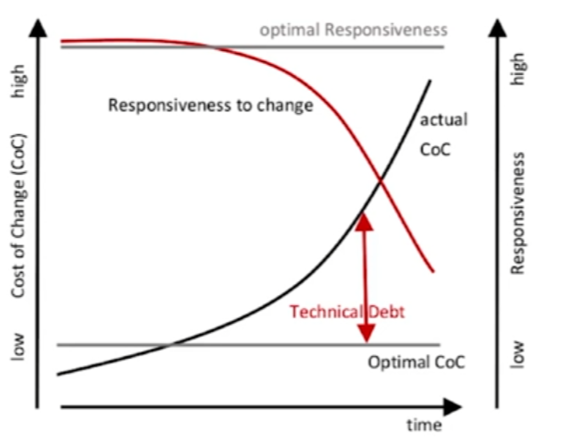
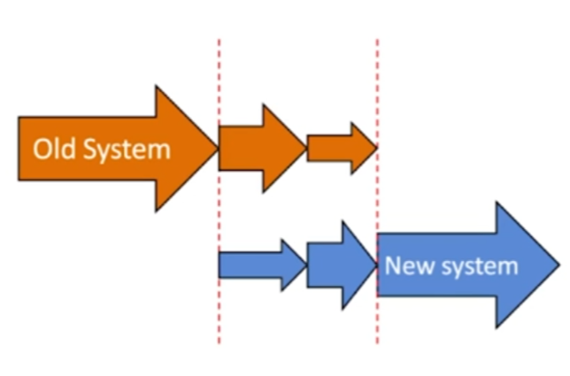
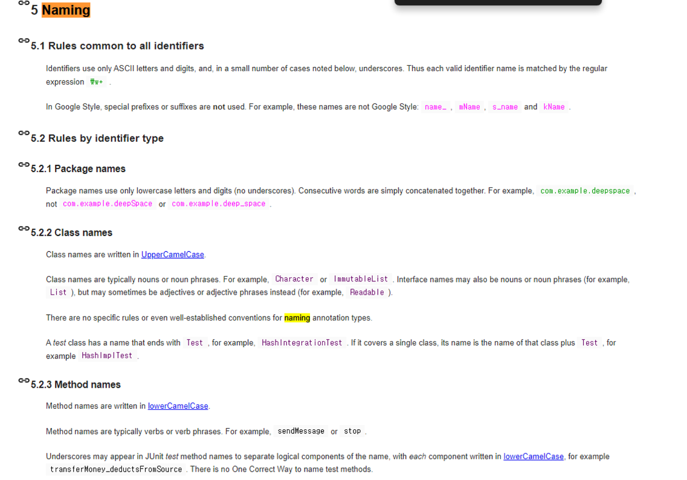

**클린코드** **1장 깨끗한 코드, 2장 의미 있는 이름 page 1-38**


## 나쁜 코드

**성능이 나쁜 코드**

> 불필요한 연산이 들어가서
개선의 여지가 있는 코드
>

**의미가 모호한 코드**

> 이해하기 어려운 코드 네이밍과 그 내용이 다른 코드
>

**중복된 코드**

> 비슷한 내용인데 중복되는 코드들은
버그를 남는다.
>

### 나쁜 코드가 나쁜이유


**깨진 유리창 법칙**

> 나쁜 코드는 깨진 유리창처럼
계속 나쁜 코드가 만들어지도록 한다.
>



**생산성 저하**

> 나쁜 코드는 팀 생산성을 저하시킨다.
기술부채를 만들어 수정을 더 어렵게 한다.
>



**새로운 시스템을 만들어야 한다.**

> 현시스템을 유지보수하며
대처할 새로운 시스템 개발은 현실적으로 매우 어렵다.
>


**일정이 촉박해서**

> 일정 안에 새로운 기능을 완성해야 한다.
하지만..
나쁜 코드는 생산성을 저하하기 때문에
오히려 일정을 못맞춘다.
>


**영향 범위가 넓어서**

> 생각보다 영향 범위가 넘어서 건드렸다가 다른 부분에 버그가 발생할까봐
하지만..
기술부채는 부메랑처럼 우리에게 돌아온다.
>

## 클린 코드란?


> “
나는 우아하고 효율적인 코드를 좋아한다.<br>
논리가 간단해야 버그가 숨어들지 못한다.<br>
의존성을 최대한 줄여야 유지보수가 쉬워진다.<br>
오류는 명백한 전략에 의거해 철저히 처리한다.<br>
성능을 최적으로 유지해야 사람들이 원칙 없는 최적화로
코드를 망치려는 유혹에 빠지지 않는다.<br>
<span style="color:red">**깨끗한 코드는 한 가지를 제대로 한다.**</span>"<br>
> _**비야네 스트롭스트룹**_


> “
깨끗한 코드는 단순하고 직접적이다.<br>
<span style="color:red">**깨끗한 코드는 잘 쓴 문장처럼 읽힌다.**</span><br>
깨끗한 코드는 결코 설계자의 의도를 숨기지 않는다.<br>
오히려 명쾌한 추상화와 단순한 제어문으로 가득하다."<br>
> _**그래디 부치**_


**요약**


💡 성능이 좋은 코드<br>
💡 의미가 **명확한** 코드 = **가독성**이 좋은 코드<br>
💡 **중복이 제거**된 코드<br>


### 보이스카우트 룰

> **“전보다 더 깨끗한 코드를 만든다”**
>

## 의미 있는 이름 짓기

### 의미가 분명한 이름 짓기

- **잘못된 예**

```java
int a;
String b;

// ..

System.out.printf("User Requested %s. count = %d", b, a);
// Console Output
// User Requested book count = 3

```

```java
int itemCount;
String itemName;

// ..

System.out.printf("User Requested %s. count = %d", b, a);
// Console Output
// User Requested book count = 3

```

```java
//클래스를 활용해서 더 명확하게 변신

class SalesItem {
	ItemCode code;
	String name;
	int count;
	}
	
// ..
SalesItem selectedItem = salesItemRepository.getItemByCode(purchaseRequest.getItemCode())
System.out.printf("User Requested %s. count = %d", 
										selectedItem.getName(), selectedItem.getName());

// ConsoIe Output
// User Requested book. count = 3
```

### 루프 속에 ijk 사용하지 않기

배열을 순회할 때 index를 의미하는 i사용하지 않고 advanced for문으로 대체한 수 있다.


자바 8에서는 **lamda**를 사용 할 수도 있다.


최대한 의미를 찾을 수 있다.


- i, j, k 대신 맥락에 맞는 이름이 있다.<br>
- i, j -> row, col / width, height<br>
- i, j, k -> row, col, depth<br>

### 통일성 있는 단어 사용하기

- Member / Customer / User <br>
- Service / Manager <br>
- Repository / Dao <br>

### 변수명에 타입 넣지 않기

```java
String nameString(👎) -> name
lnt itemPriceAmount(👎) -> itemPrice

Account[] accountArray(👎)-> accounts
List<Account> accountList(👌) -> accounts, accountList
Map<Account> accountMap(👌) => 대체 불가능해서 가능

public interface IShapeFactory(👎) -> ShapeFactory
public class ShapeFactoryImpl(👍) -> CircleFactory
```

## Google Java Naming Guide

[Google Java Style Guide](https://google.github.io/styleguide/javaguide.html#s5-naming)



### Package Naming Guide

- All lower case, no underscores

```java
com.example.deepspace(👍)
com.example.deepSpace(👎)
com.example.deep_space(👎)
```

### Class Naming Guide

- UpperCamelCase (대문자로 시작)

```java
// 클래스는 명사. 명사구
Character, ImmutableList

// 인터페이스는 명사. 명사구. (형용사)
List, Readable

// 테스트클래스는 Test로 끝나기
HashTest, HashIntegrationTest
```

### Method Naming Guide

- LowerCameICase (소문자로 시작)
```java
sendMessage, stop // 메서드는 동사, 동사구
```