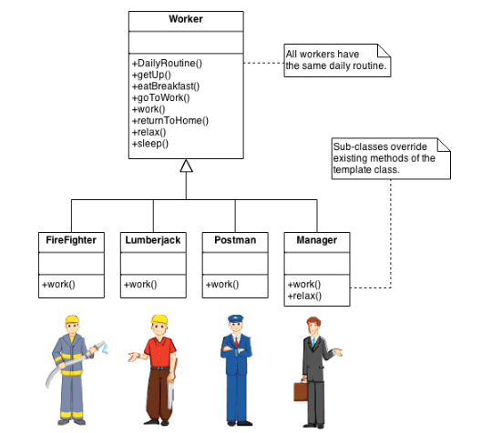
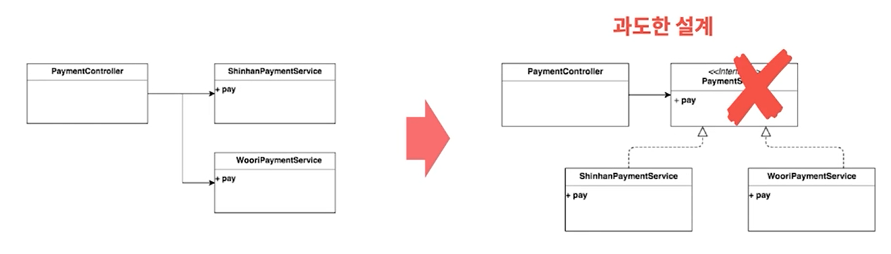

**Chapter 12. 창발성**<br>
**page 215 ~ 224**

## 1. 창발적 설계란

### 1) 창발성(Emergence)

>**창발성(創發性)**<br/>
**명사** 남이 모르거나 하지 아니한 것을 처음으로 또는 새롭게 밝혀내거나 이루어 내는 성질.

- 하위 계층에는 없는 특성이나 행동이 상위 계층(전체 구조)에서 자발적으로 돌연히 출연하는 현상
- 각각의 개미는 집을 지을 능력이 없지만, 작은 개미들의 상호작용을 통해 집이라는 결과물이 나오는 것처럼
- 작은 요소들의 상호작용의 반복이 전체구조에 영향을 미친다.

### 2) 창발적 설계
#### 단순한 4가지를 반복하다보면 전체적으로 깨끗한 코드가 만들어진다.
1. 모든 테스트를 실행한다.
2. 중복을 없앤다.
3. 프로그래머 의도를 표현한다.
4. 실용적 관점에서 타협 한다.<br/>
-켄트 백-

---
## 2. 모든 테스트를 실행한다

### 테스트를 작성할수록 설계 품질이 좋아진다.
- 모든 테스트 케이스를 항상 통과하는 시스템은 '**테스트가 가능한 시스템**'이다. 테스트가 불가능한 시스템은 검증도 불가능하고, 절대 출시하면 안된다. 
- 테스트가 가능한 시스템을 만들려고 애쓰면 설계 품질이 높아진다. 크기가 작고 목적 하나만 수행하는 클래스가 나온다.
- 결합도가 높으면 테스트 케이스를 작성하기 어렵기 때문에 결합도를 낮추는 설계를 하게 된다. 
- '모든 테스트를 실행한다.'는 규칙을 따르면 시스템은 낮은 결합도와 높은 응집도라는 목표를 저절로 달성할 수 있다.

---
## 3. 중복을 없앤다

### 1) 기존의 코드를 최대한 재활용한다.
#### 예제 1. 코드 재활용
```java
int size() {}
boolean isEmpty() {}

// 각 메서드를 따로 구현하는 방법도 있지만, 중복을 없애기 위해 서로 호출하도록 한다.

boolean isEmpty() {
    return this.size() == 0;
}
```
### 2) 중복을 없앤다
#### 예제 2. 나쁜 예 👎
```java
public void scaleToOneDimension(float desiredDimension, float imageDimension) {
  if (Math.abs(desiredDimension - imageDimension) < errorThreshold)
    return;
  float scalingFactor = desiredDimension / imageDimension;
  scalingFactor = (float)(Math.floor(scalingFactor * 100) * 0.01f);
  
  RenderedOpnewImage = ImageUtilities.getScaledImage(image, scalingFactor, scalingFactor);
  image.dispose();
  System.gc();
  image = newImage;
}
 
public synchronized void rotate(int degrees) {
  RenderedOpnewImage = ImageUtilities.getRotatedImage(image, degrees);
  image.dispose();
  System.gc();
  image = newImage;
}
```
- 중복된 코드를 별도의 메소드로 분리한다.

#### 예제 3. 좋은 예 👍
```java
public void scaleToOneDimension(float desiredDimension, float imageDimension) {
  if (Math.abs(desiredDimension - imageDimension) < errorThreshold)
    return;
  float scalingFactor = desiredDimension / imageDimension;
  scalingFactor = (float) Math.floor(scalingFactor * 10) * 0.01f);
  replaceImage(ImageUtilities.getScaledImage(image, scalingFactor, scalingFactor));
}
 
public synchronized void rotate(int degrees) {
  replaceImage(ImageUtilities.getRotatedImage(image, degrees));
}
 
private void replaceImage(RenderedOpnewImage) {
  image.dispose();
  System.gc();
  image = newImage;
}
```
- scaleToOneDimension, rotate replaceImage의 목적이 달라졌다.
- 별도의 클래스로 분리하면 추후 재활용성이 높아진다.

### Template Method 패턴
- 알고리즘의 구조를 상위 클래스의 메소드에서 정의하고, 하위 클래스에서 자신에 맞게 세부 알고리즘을 정의한다.

DailyRoutine - 알고리즘 <br/>
getUp 등 메서드 - 알고리즘의 각 단계

- 구현하려는 알고리즘에 일정한 단계가 있고, 세부 단계마다 조금씩 구현 내용이 다를 때 사용한다.
- 알고리즘의 여러 단계를 각 메서드로 선언하고, 그 알고리즘을 수행할 템플릿 메서드를 만든다.
- 하위 클래스에서는 나눠진 메서드(단계)를 구현한다.


#### 예제 4. 나쁜 예 👎
```java
public class VacationPolicy {
  public void accrueUSDDivisionVacation() {
    // 지금까지 근무한 시간을 바탕으로 휴가 일수를 계산하는 코드
    // ...
    // 휴가 일수가 미국 최소 법정 일수를 만족하는지 확인하는 코드
    // ...
    // 휴가 일수를 급여 대장에 적용하는 코드
    // ...
  }
  
  public void accrueEUDivisionVacation() {
    // 지금까지 근무한 시간을 바탕으로 휴가 일수를 계산하는 코드
    // ...
    // 휴가 일수가 유럽연합 최소 법정 일수를 만족하는지 확인하는 코드
    // ...
    // 휴가 일수를 급여 대장에 적용하는 코드
    // ...
  }
}
```
- 최소 법정 일수를 계산하는 코드를 제외하면 두 메서드는 거의 동일하다.
- 중복을 줄이기 위해 템플릿 에서드 패턴을 적용한다면?

#### 예제 5. 좋은 예 👍
```java
abstract public class VacationPolicy {
  public void accrueVacation() {
    caculateBseVacationHours();
    alterForLegalMinimums();
    applyToPayroll();
  }
  
  private void calculateBaseVacationHours() { /* ... */ };
  abstract protected void alterForLegalMinimums();
  private void applyToPayroll() { /* ... */ };
}
 
public class USVacationPolicy extends VacationPolicy {
  @Override protected void alterForLegalMinimums() {
    // 미국 최소 법정 일수를 사용한다.
  }
}
 
public class EUVacationPolicy extends VacationPolicy {
  @Override protected void alterForLegalMinimums() {
    // 유럽연합 최소 법정 일수를 사용한다.
  }
}
```

- 공통된 알고리즘을 accrueVacation 템플릿 메서드에 담고, 동일한 내용에 대해서는 메서드를 구현하고 다른 내용(미국/유럽연합)은 하위 클래스가 구현하도록 abstract 메서드로 만든다.
- 하위 클래스 UsVacationPolicy, EUVacationPolicy는 각자의 알고리즘을 구현한다.

---
## 4. 의도를 표현한다
1. 좋은 이름을 선택한다.
2. 함수와 클래스 크기를 가능한 줄인다.
   - 작은 클래스와 작은 함수는 이름 짓기도 쉬우니까!
3. 표준 명칭을 사용한다. 다른 개발자가 보고 바로 이해할 수 있도록
   - 디자인 패턴을 사용했다면 그 이름을 클래스에 넣어준다.
4. 단위 테스트 케이스를 꼼꼼하게 작성한다.
5. 다른 사람을 위해 조금이라도 더 읽기 쉽게 만드려고 노력한다.

---
## 5. 실용적 관점에서 타협한다

### 과도한 설계 No

- 여러가지 규칙에 극단적으로 심취해 클래스와 메서드를 무수하게 만들지 말라.
- 결국 좋은 코드를 만드는 이유는 생산성을 올리기 위한 것이다.
- 실용적인 관점에서 타협해야 한다.

**“개집 짓는데 사람 집 지으면 안된다”**

### DIP

**상위 모델은 하위 모델에 의존하면 안된다. 둘 다 추상화에 의존해야 한다.
추상화는 세부 사항에 의존해서는 안된다. 세부 사항은 추상화에 따라 달라진다.**

- 하위 모텔의 변경이 상위 모듈의 변경을 요구하는 위계관계를 끊는다.
- 실제 사용관계는 그대로이지만, 추상화를 매개로 메시지를 주고 받으면서 관계를 느슨하게 만든다.

#### 예제 6. 확장성이 떨어지는 예제
```java
class PaymentController {
  @RequestMapping(value = "/api/payment", method = RequestMethod.POST)
  public void pay(@RequestBody ShinhanCardDto.PaymentRequest req) {
    shinhanCardPaymentService.pay(req);
  }
}

class ShinhanCardPaymentService {
  public void payShinhanCardDto.PaymentRquest req) {
    shinhanCardApi.pay(req);
  }
}
```
~~새로운 카드사가 추가된다면~~<br>
카드사 직영 가맹점이라 다른 카드는 절대 쓸 수 없다.

```java
class PaymentController {
  @RequestMapping(value = "/api/payment", method = RequestMethod.POST)
  public void pay(@RequestBody CardPaymentDto.PaymentRequest req) {
  if (req.getType() == CardType.SHINHAN) {
    shinhanCardPaymentService.pay(req);
  } else if(req.getType() == CardType.WOORI) {
    wooriCardPaymentService.pay(req);
  }
}
```
~~확장에 유연하지 않다..~~<br/>
확장에 유연할 필요가 없어진다..


~~둘 다 추상화된 인터페이스에 의존하도록 한다.~~<br/>
하나만 있을 클래스에 인터페이스를 만들 필요가 없다.

### 예상치 못한 변경이 발생한다면?
~~카드사 직영 가맹점이라 다른 카드는 절대 쓸 수 없다.~~<br/>
새로운 카드사와 합병하여. 두 가지 카드를 쓰게 됐다..!

> 그럼 그때 확장하는 설계를 하면 된다.  
> 거의 발생하지 않을 일에 미리 투자하는 비용이 더 크다.