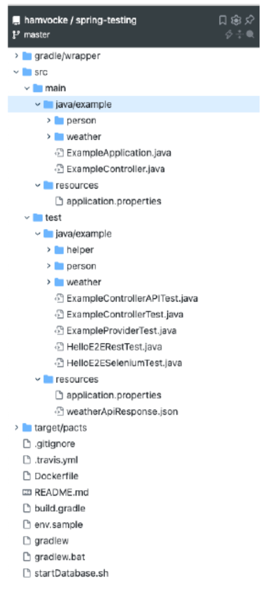
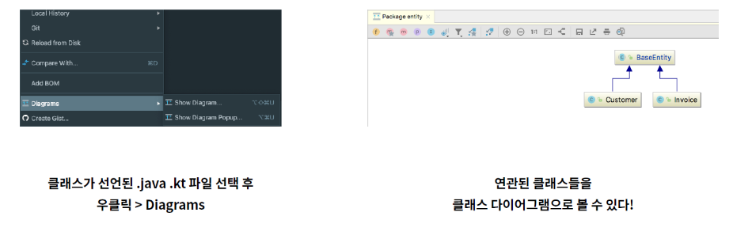

**Chapter 15. JUnit 들여다보기**<br>
**Chapter 16. SerialDate 리팩터링**<br>
**page 323 ~ 366**<br>
## 1. 책 내용
### JUnit 프레임워크
> JUnit은 자바 테스팅 프레임워크다. 사실상 표준이라고 할만큼 널리 사용되고 있다. 개념은 단순하며 정의는 정밀하고 구현은 우아하다. JUnit은 저자가 많지만 시작은 켄트 벡과 에릭 감마, 두 사람이 비행기를 타고 가다 JUnit을 만들었다.
- 지금부터 살펴볼 예제는 문자열 비교 오류를 파악할 때 유용한 모듈이다.
    - ComparisonCompactor는 두 문자열을 받아 차이를 반환한다. 예를 들어, ABCDE와 ABXDE를 받으면 <…B[X]D…>를 반환한다.

### ComparisonCompactorTest.java
```java
// https://github.com/junit-team/junit4/blob/main/src/test/java/junit/tests/framework/ComparisonCompactorTest.java

package junit.tests.framework;

import junit.framework.ComparisonCompactor;
import junit.framework.TestCase;

public class ComparisonCompactorTest extends TestCase {

    public void testMessage() {
        String failure = new ComparisonCompactor(0, "b", "c").compact("a");
        assertTrue("a expected:<[b]> but was:<[c]>".equals(failure));
    }

    public void testStartSame() {
        String failure = new ComparisonCompactor(1, "ba", "bc").compact(null);
        assertEquals("expected:<b[a]> but was:<b[c]>", failure);
    }

    public void testEndSame() {
        String failure = new ComparisonCompactor(1, "ab", "cb").compact(null);
        assertEquals("expected:<[a]b> but was:<[c]b>", failure);
    }

    public void testSame() {
        String failure = new ComparisonCompactor(1, "ab", "ab").compact(null);
        assertEquals("expected:<ab> but was:<ab>", failure);
    }

    public void testNoContextStartAndEndSame() {
        String failure = new ComparisonCompactor(0, "abc", "adc").compact(null);
        assertEquals("expected:<...[b]...> but was:<...[d]...>", failure);
    }

    public void testStartAndEndContext() {
        String failure = new ComparisonCompactor(1, "abc", "adc").compact(null);
        assertEquals("expected:<a[b]c> but was:<a[d]c>", failure);
    }

    public void testStartAndEndContextWithEllipses() {
        String failure = new ComparisonCompactor(1, "abcde", "abfde").compact(null);
        assertEquals("expected:<...b[c]d...> but was:<...b[f]d...>", failure);
    }

    public void testComparisonErrorStartSameComplete() {
        String failure = new ComparisonCompactor(2, "ab", "abc").compact(null);
        assertEquals("expected:<ab[]> but was:<ab[c]>", failure);
    }

    public void testComparisonErrorEndSameComplete() {
        String failure = new ComparisonCompactor(0, "bc", "abc").compact(null);
        assertEquals("expected:<[]...> but was:<[a]...>", failure);
    }

    public void testComparisonErrorEndSameCompleteContext() {
        String failure = new ComparisonCompactor(2, "bc", "abc").compact(null);
        assertEquals("expected:<[]bc> but was:<[a]bc>", failure);
    }

    public void testComparisonErrorOverlappingMatches() {
        String failure = new ComparisonCompactor(0, "abc", "abbc").compact(null);
        assertEquals("expected:<...[]...> but was:<...[b]...>", failure);
    }

    public void testComparisonErrorOverlappingMatchesContext() {
        String failure = new ComparisonCompactor(2, "abc", "abbc").compact(null);
        assertEquals("expected:<ab[]c> but was:<ab[b]c>", failure);
    }

    public void testComparisonErrorOverlappingMatches2() {
        String failure = new ComparisonCompactor(0, "abcdde", "abcde").compact(null);
        assertEquals("expected:<...[d]...> but was:<...[]...>", failure);
    }

    public void testComparisonErrorOverlappingMatches2Context() {
        String failure = new ComparisonCompactor(2, "abcdde", "abcde").compact(null);
        assertEquals("expected:<...cd[d]e> but was:<...cd[]e>", failure);
    }

    public void testComparisonErrorWithActualNull() {
        String failure = new ComparisonCompactor(0, "a", null).compact(null);
        assertEquals("expected:<a> but was:<null>", failure);
    }

    public void testComparisonErrorWithActualNullContext() {
        String failure = new ComparisonCompactor(2, "a", null).compact(null);
        assertEquals("expected:<a> but was:<null>", failure);
    }

    public void testComparisonErrorWithExpectedNull() {
        String failure = new ComparisonCompactor(0, null, "a").compact(null);
        assertEquals("expected:<null> but was:<a>", failure);
    }

    public void testComparisonErrorWithExpectedNullContext() {
        String failure = new ComparisonCompactor(2, null, "a").compact(null);
        assertEquals("expected:<null> but was:<a>", failure);
    }

    public void testBug609972() {
        String failure = new ComparisonCompactor(10, "S&P500", "0").compact(null);
        assertEquals("expected:<[S&P50]0> but was:<[]0>", failure);
    }
}
```

### ComparisonCompactor.java
```java
// https://github.com/junit-team/junit4/blob/main/src/main/java/junit/framework/ComparisonCompactor.java
package junit.framework;

public class ComparisonCompactor {

    private static final String ELLIPSIS = "...";
    private static final String DELTA_END = "]";
    private static final String DELTA_START = "[";

    private int fContextLength;
    private String fExpected;
    private String fActual;
    private int fPrefix;
    private int fSuffix;

    public ComparisonCompactor(int contextLength, String expected, String actual) {
        fContextLength = contextLength;
        fExpected = expected;
        fActual = actual;
    }

    @SuppressWarnings("deprecation")
    public String compact(String message) {
        if (fExpected == null || fActual == null || areStringsEqual()) {
            return Assert.format(message, fExpected, fActual);
        }

        findCommonPrefix();
        findCommonSuffix();
        String expected = compactString(fExpected);
        String actual = compactString(fActual);
        return Assert.format(message, expected, actual);
    }

    private String compactString(String source) {
        String result = DELTA_START + source.substring(fPrefix, source.length() - fSuffix + 1) + DELTA_END;
        if (fPrefix > 0) {
            result = computeCommonPrefix() + result;
        }
        if (fSuffix > 0) {
            result = result + computeCommonSuffix();
        }
        return result;
    }

    private void findCommonPrefix() {
        fPrefix = 0;
        int end = Math.min(fExpected.length(), fActual.length());
        for (; fPrefix < end; fPrefix++) {
            if (fExpected.charAt(fPrefix) != fActual.charAt(fPrefix)) {
                break;
            }
        }
    }

    private void findCommonSuffix() {
        int expectedSuffix = fExpected.length() - 1;
        int actualSuffix = fActual.length() - 1;
        for (; actualSuffix >= fPrefix && expectedSuffix >= fPrefix; actualSuffix--, expectedSuffix--) {
            if (fExpected.charAt(expectedSuffix) != fActual.charAt(actualSuffix)) {
                break;
            }
        }
        fSuffix = fExpected.length() - expectedSuffix;
    }

    private String computeCommonPrefix() {
        return (fPrefix > fContextLength ? ELLIPSIS : "") + fExpected.substring(Math.max(0, fPrefix - fContextLength), fPrefix);
    }

    private String computeCommonSuffix() {
        int end = Math.min(fExpected.length() - fSuffix + 1 + fContextLength, fExpected.length());
        return fExpected.substring(fExpected.length() - fSuffix + 1, end) + (fExpected.length() - fSuffix + 1 < fExpected.length() - fContextLength ? ELLIPSIS : "");
    }

    private boolean areStringsEqual() {
        return fExpected.equals(fActual);
    }
}
```

### 1. ComparisonCompactor.java 부분에서 접두사 f를 제거하면 깔끔
```java
//1. 
private int fContextLength;
private String fExpected;
private String fActual;
private int fPrefix;
private int fSuffix;

//2.
private int contextLength;
private String expected;
private String actual;
private int prefix;
private int suffix;
```

### 2. 조건문을 캡슐화
```java
//1.
public String compact(String message) {
    if (expected == null || actual == null || areStringsEqual()) {
        return Assert.format(message, expected, actual);
    }
 
    findCommonPrefix();
    findCommonSuffix();
    String expected = compactString(this.expected);
    String actual = compactString(this.actual);
    return Assert.format(message, expected, actual);
}
//2.
public String compact(String message) {
    if (shouldNotCompact()) {
        return Assert.format(message, expected, actual);
    }
 
    findCommonPrefix();
    findCommonSuffix();
    String expected = compactString(this.expected);
    String actual = compactString(this.actual);
    return Assert.format(message, expected, actual);
}
private boolean shouldNotCompact() {
    return expected == null || actual == null || areStringsEqual();
}
```

### 3. 변수명을 명확히 하기
```java
// 1.
String expected = compactString(this.expected);
String actual = compactString(this.actual);
//2.
String compactExpected = compactString(expected);
String compactActual = compactString(actual);
```

### 4. 부정문보다는 긍정문으로
```java
// 1.
public String compact(String message) {
    if (shouldNotCompact()) {
        return Assert.format(message, expected, actual);
    }

    findCommonPrefix();
    findCommonSuffix();
    String expected = compactString(this.expected);
    String actual = compactString(this.actual);
    return Assert.format(message, expected, actual);
}

private boolean shouldNotCompact() {
    return expected == null || actual == null || areStringsEqual();
}

// 2.
public String compact(String message) {
    if (canBeCompacted()) {
        findCommonPrefix();
        findCommonSuffix();
        String compactExpected = compactString(expected);
        String compactActual = compactString(actual);
        return Assert.format(message, compactExpected, compactActual);
    } else {
        return Assert.format(message, expected, actual);
    }
}

private boolean canBeCompacted() {
    return expected != null && actual != null && !areStringsEqual();
}
```

### 5. 함수명을 알아볼 수 있게 풀어서 작성하기
```java
// 1.
public String compact(String message) { }

// 2.
public String formatCompactedComparison(String message) { }
```
- 문자열을 압축하는 메소드 compact() 이지만, 형식에 맞추어 반환까지 하고 있음.

### 6. 함수는 한가지 일만 하도록 작성
```java
// 1. 
public String compact(String message) {
    if (canBeCompacted()) {
        findCommonPrefix();
        findCommonSuffix();
        String compactExpected = compactString(expected);
        String compactActual = compactString(actual);
        return Assert.format(message, compactExpected, compactActual);
    } else {
        return Assert.format(message, expected, actual);
    }       
}

private boolean canBeCompacted() {
    return expected != null && actual != null && !areStringsEqual();
}

// 2.
private String compactExpected;
private String compactActual;
 
public String formatCompactedComparison(String message) {
    if (canBeCompacted()) {
        compactExpectedAndActual();
        return Assert.format(message, compactExpected, compactActual);
    } else {
        return Assert.format(message, expected, actual);
    }       
}
 
private void compactExpectedAndActual() {
    findCommonPrefix();
    findCommonSuffix();
    compactExpected = compactString(expected);
    compactActual = compactString(actual);
}
```
- 문자열을 압축하는 로직과 foramt을 맞추는 로직을 분리
- 각 함수가 하나의 기능을 하도록 하면 좋음

### 7. 함수 내부 추상화 수준을 동일한 레벨로 일관적이게 구현하면 좋음
```java
// 1.
private void compactExpectedAndActual() {
    findCommonPrefix();
    findCommonSuffix();
    compactExpected = compactString(expected);
    compactActual = compactString(actual);
}


// 2.
private compactExpectedAndActual() {
    prefixIndex = findCommonPrefix();
    suffixIndex = findCommonSuffix();
    String compactExpected = compactString(expected);
    String compactActual = compactString(actual);
}
 
private int findCommonPrefix() {
    int prefixIndex = 0;
    int end = Math.min(expected.length(), actual.length());
    for (; prefixIndex < end; prefixIndex++) {
        if (expected.charAt(prefixIndex) != actual.charAt(prefixIndex)) {
            break;
        }
    }
    return prefixIndex;
}
 
private int findCommonSuffix() {
    int expectedSuffix = expected.length() - 1;
    int actualSuffix = actual.length() - 1;
    for (; actualSuffix >= prefixIndex && expectedSuffix >= prefix; actualSuffix--, expectedSuffix--) {
        if (expected.charAt(expectedSuffix) != actual.charAt(actualSuffix)) {
            break;
        }
    }
    return expected.length() - expectedSuffix;
}
```
- 하나의 함수에 반환값이 존재하는 함수와 반환값이 존재하지 않는 함수를 혼합하여 사용중인데, 통일하면 좋음.

### 8. 숨겨진 시각적인 결합주의
```java
// 1.
private compactExpectedAndActual() {
    prefixIndex = findCommonPrefix();
    suffixIndex = findCommonSuffix();
    String compactExpected = compactString(expected);
    String compactActual = compactString(actual);
}
 
private int findCommonPrefix() {
    int prefixIndex = 0;
    int end = Math.min(expected.length(), actual.length());
    for (; prefixIndex < end; prefixIndex++) {
        if (expected.charAt(prefixIndex) != actual.charAt(prefixIndex)) {
            break;
        }
    }
    return prefixIndex;
}

private int findCommonSuffix() {
    int expectedSuffix = expected.length() - 1;
    int actualSuffix = actual.length() - 1;
    for (; actualSuffix >= prefixIndex && expectedSuffix >= prefix; actualSuffix--, expectedSuffix--) {
        if (expected.charAt(expectedSuffix) != actual.charAt(actualSuffix)) {
            break;
        }
    }
    return expected.length() - expectedSuffix;
}


// 2.
private compactExpectedAndActual() {
    prefixIndex = findCommonPrefix();
    suffixIndex = findCommonSuffix(prefixIndex);
    String compactExpected = compactString(expected);
    String compactActual = compactString(actual);
}
 
private int findCommonSuffix(int prefixIndex) {
    int expectedSuffix = expected.length() - 1;
    int actualSuffix = actual.length() - 1;
    for (; actualSuffix >= prefixIndex && expectedSuffix >= prefix; actualSuffix--, expectedSuffix--) {
        if (expected.charAt(expectedSuffix) != actual.charAt(actualSuffix)) {
            break;
        }
    }
    return expected.length() - expectedSuffix;
}
```
- 두번째 함수인 findCommonSuffix 함수에서 참조하는 전역변수 prefixIndex는 첫번째 findCommonPrefix의 리턴값을 받는다. 이렇게 첫번째 함수 리턴값에 의존하고있는데 순서가 달라지면 결과값이 달라지는 문제가 발생한다.
- 전역변수 대신 매개변수로 입력받아 사용하면 위 문제가 발생하지 않음.

### 9. Length와 Index를 구분해서 사용하기
변수이름에 Index를 넣을때는 0부터 시작하는 값이여야하고,<br/>
1부터 시작할 경우 Index 대신 Length 라는 이름을 사용하면 좋음.


### 최종 버전 ComparisonCompactor.java
```java
package com.example.japring.junit;

public class ComparisonCompactor {

    private static final String ELLIPSIS = "...";
    private static final String DELTA_END = "]";
    private static final String DELTA_START = "[";

    private int contextLength;
    private String expected;
    private String actual;
    private int prefixLength;
    private int suffixLength;

    public ComparisonCompactor(int contextLength, String expected, String actual) {
        this.contextLength = contextLength;
        this.expected = expected;
        this.actual = actual;
    }

    public String formatCompactedComparison(String message) {
        String compactExpected = expected;
        String compactActual = actual;
        if (shouldBeCompacted()) {
            findCommonPrefixAndSuffix();
            compactExpected = compact(expected);
            compactActual = compact(actual);
        }
        return Assert.format(message, compactExpected, compactActual);
    }

    private boolean shouldBeCompacted() {
        return !shouldNotBeCompacted();
    }

    private boolean shouldNotBeCompacted() {
        return expected == null ||
                actual == null ||
                expected.equals(actual);
    }

    private void findCommonPrefixAndSuffix() {
        findCommonPrefix();
        suffixLength = 0;
        for (; !suffixOverlapsPrefix(); suffixLength++) {
            if (charFromEnd(expected, suffixLength) != charFromEnd(actual, suffixLength)) {
                break;
            }
        }
    }

    private char charFromEnd(String s, int i) {
        return s.charAt(s.length() - i - 1);
    }

    private boolean suffixOverlapsPrefix() {
        return actual.length() - suffixLength <= prefixLength ||
                expected.length() - suffixLength <= prefixLength;
    }

    private void findCommonPrefix() {
        int prefixIndex = 0;
        int end = Math.min(expected.length(), actual.length());
        for (; prefixIndex < end; prefixIndex++) {
            if (expected.charAt(prefixIndex) != actual.charAt(prefixIndex)) {
                break;
            }
        }
    }

    private String compact(String s) {
        return new StringBuilder()
                .append(startingEllipsis())
                .append(startingContext())
                .append(DELTA_START)
                .append(delta(s))
                .append(DELTA_END)
                .append(endingContext())
                .append(endingEllipsis())
                .toString();
    }

    private String startingEllipsis() {
        return prefixLength > contextLength ? ELLIPSIS : "";
    }

    private String startingContext() {
        int contextStart = Math.max(0, prefixLength - contextLength);
        int contextEnd = prefixLength;
        return expected.substring(contextStart, contextEnd);
    }

    private String delta(String s) {
        int deltaStart = prefixLength;
        int deltaEnd = s.length() - suffixLength;
        return s.substring(deltaStart, deltaEnd);
    }

    private String endingContext() {
        int contextStart = expected.length() - suffixLength;
        int contextEnd = Math.min(contextStart + contextLength, expected.length());
        return expected.substring(contextStart, contextEnd);
    }

    private String endingEllipsis() {
        return suffixLength > contextLength ? ELLIPSIS : "";
    }
}
```

---
## 2. 책 내용 요약

### 15장 JUnit 들여다 보기
---
#### 세상에 완벽한 코드는 없다
```java
// Original
private void compactExpectedAndActual() {
    prefixIndex = findCommonPrefix();
    suffixIndex = findCommonSuffix();
    compactExpected = compactString(expected);
    compactActual = compactString(actual);
}

//1st Refactoring
// 호출 순서는 정해지지만 prefixIndex가 필요한 이유를 설명하지 못함
private void compactExpectedAndActual() {
    prefixIndex = findCommonPrefix();
    suffixIndex = findCommonSuffix(prefixIndex);
    compactExpected = compactString(expected);
    compactActual = compactString(actual);
}

//2nd Refactoring
private void compactExpectedAndActual() {
    findCommonPrefixAndSuffix();
    compactExpected = compactString(expected);
    compactActual = compactString(actual);
}

private void findCommonPrefixAndSuffix() {
    findCommonPrefix();
    // ..
}
```
#### 정리
- 의도를 명확하게 표현하기 위해 조건문을 메서드로 분리
- 전후 단계가 있는 변수들 사이 시간적인 결합(hidden temporal coupling)을 해결하기 위해 리팩터링 (왼쪽 코드)
- 더 적절한 의미로 네이밍 변경
- 불필요한 연산을 하는 코드 제거

### 16장 SerialDate 리팩터링

#### 남의 코드를 비판하고, 내 코드의 비판을 듣는 건 편안하게 여겨야 할 활동이다

**Make it Work**
- 테스트 코드가 모든 경우를 테스트하지 않는다.<br/>
   -> 주석 처리된 테스트 코드들을 모두 동작하도록 손본다.
- 코드의 구조를 개선하기 전에 버그들을 수정한다.<br/> 
  경계 조건 오류, 늘 거짓인 조건문

**Make it Right (실제 개선)**
- 옛날 스타일 코드 제거 (MonthConstants를 상속하는 방식 → enum Month)
- seriaIVersionUID를 컴파일러가 자동 생성하도록 함<br/>
(직접 변경하지 않아 생기는 버그보다 변경된 UID로 발생한 예외를 디버경하는게 낫다)
- DayDate(SeriaIDate) Abstract Factory를 통해 생성하도록 한다.
- 캡슐화를 위해 접근제한자를 수정(public → private)
- 사용되지 않는 변수 제거
- 불필요한 주석 제거

---
## 3. 오픈 소스 접근법

### <오픈 소스: 코드 분석 어떻게 하나?> 같이 읽기

#### [오픈 소스: 코드 분석 어떻게 하나?](https://www.popit.kr/%EC%98%A4%ED%94%88%EC%86%8C%EC%8A%A4-%EC%BD%94%EB%93%9C-%EB%B6%84%EC%84%9D-%EC%96%B4%EB%96%BB%EA%B2%8C-%ED%95%98%EB%82%98/) 김형준 (2016-09-01)

> MySQL, Apache, Tomcat 등과 같은 오픈 소스는 매뉴얼이나 문서, 책 등도 많이 나와 있으며 오픈 소스이지만 솔루션 자체도 안정적이라서 특별한 이유가 아니면 소스를 분석할 필요는 없습니다.<br>
하지만 Hadoop이나 HBase 등과 같은 솔루션은 문서도 부족하지만 문서로만 설명할 수 없는 복잡한 내용으로 구성되어 있는 솔루션이 않습니다.<br>
따라서 **제대로 솔루션을 사용하거나 운영하기 위해서는 소스 코드를 봐야 하는 경우가 많습니다.**<br>
최근 Presto, Zeppelin, Kafka 등을 사용하면서 필요한 기능을 추가하거나 설치, 운영 중 에러를 해결하기 위해 사용하는 오픈 소스의 코드를 분석하였습니다.<br>
이때 사용되었던 제 나름대로 가지고 있는 오픈소스 코드 분석 방법에 대해 정리해 보았습니다.


#### 해당 솔루션에 대한 기본 지식을 먼저 익혀라

> **하둡을 분석하려면 구글에서 발표한 논문을 읽어 봐야하고, HBase를 분석하기 위해서는 BigTable 논문을 읽어야 합니다.**<br/> 분석하고자 하는 솔루션에 대한 이론적인 배경 지식이 없는 상태에서 소스 코드를 바로 보면 그냥 스파게티처럼 얽혀 있는 코드를 보고 있는 느낌이 듭니다.<br/><br/>
>**복잡한 분산 컴퓨팅 환경에서 운영되는 솔루션인 경우 더욱 더 그 시스템의 기본 개념과 아키텍처를 이해하고 있어야 합니다.**


### 본인 PC에 빌드 및 실행 환경을 구축하라

> 코드 분석을 빨리하기 위해서는 분석에 필요한 로그를 추가하여 재 컴파일한 후 실행하면서 로그를 확인하는 것이 좋습니다.<br/> 
> 단순 코드만 보면 특정 연산의 흐름이 어떻게 진행되고 있는지를 파악하기 어려운 경우가 많기 때문입니다. <br/>
> 실제로 필자가 가장 먼저 하는 부분이 바로 이 항목입니다.<br/><br/>
>최근의 오픈소스들은 분산 환경에서 운영되는 경우가 많은데 이 경우라 하더라도 **개발자의 PC(가능하면 노트북)에 빌드와 실행환경을 모두 구성하는 것이 좋습니다. “좋다”라는 정도가 아니라 필수 사항이라 할 수 있습니다.**<br/><br/>
> 빌드 및 실행환경을 구성하는 것만으로 코드 분석의 500/0는 진행되었다고 할 수 있습니다.


#### 수정, 실행, 확인 사이클을 짧게 만들어라

> 코드를 분석하기 위해서는 분석에 필요한 정보를 출력하는 코드나 확인을 위한 코드를 추가한 다음에 기능을 실행해서 확인해야 하는 경우가 많습니다. 
> 이 경우 수정, 실행, 확인을 위한 시간이 길어지면 그 만큼 효율이 떨어지게 되고 많은 시간이 소요됨니다.<br/><br/>
> **몇번 반복하다 보면 같은 작업 패턴을 찾게되는데 이때에는 스크립트를 만들어서 반복 작업을 효율적으로 하는 것이 좋습니다.**


#### 자신에게 질문을 많이 하라

> 오픈 소스 개발자라고 해서 하늘에서 떨어진 개발자는 아닙니다. 대부분 비슷한 교육을 받고 비
슷한 경험을 했습니다.<br/><br/>
> **특정 기능에 대해서 "나라면 어떻게 개발했을까?" 라고 자신에게 질문을 던지고 머리속에 어떻
게 구현할 것인지를 먼저 그려 봅니다.**<br/><br/>
> 처음에는 자신이 예측했던 부분이 많이 틀리겠지만 코드를 많이 보고 연습을 많이 하면 이것도
얼추 많이 맞추게 됩니다. 유사한 오픈 소스 그름은 유사한 패턴으로 개발하기 때문입니다. 대표
적인 오픈 소스 그룹이 Hadoop 및 그 패밀리들(Base, ZooKeeper, HBase, Hive 등) 입니다.

#### 분석하면서 문서로 정리하라

> **분석을 하면서 그림 또는 문서로 정리를 하면 분석하는 그 시점에도 도움이 되지만 나중에도 도움이 됩니다.**<br/>
> 문서는 굳이 UML이 아니더라도 ppt 같은 도구로 정리하면 됩니다. 이렇게 중간 중간에 정리하면 머리속에서만 빙빙 돌던 생각이 정리될때가 많습니다.<br/> 
> “분석이 다 된 다음에 깔끔하게 정리해야지” 라는 생각이면 거의 정리는 못한다고 봐야 합니다. 나중에 정리 하려면 정리도 어렵고 생각도 잘 나지 않습니다.


#### 디버거 활용하기

> **LOG level을 DEBUG로 설정하라.**<br/>
> 배포되는 패키지는 대부분 Logger의 설정이 INFO 또는 WARN으로 설정된 경우가 많습니다.<br/> 
> 더 많은 정보를 얻기 위해서는 logger의 레벨을 DEBUG로 설정합니다. <br/>
> DEBUG로 설정할 경우 너무 많은 로그 메시지가 나올 수 있는데 패키지 별로 서로 다른 수준의 LOG level을 설정하는것이 좋습니다.<br/><br/>
> **디버거의 breakpoint 기능을 활용하라**<br/>
> 집중적으로 분석하고 싶은 구간은 디버거의 breakpoint 기능을 이용하여 step 단위로 실행하면서 각 변수의 변화 상태를 확인하는 것이 좋습니다.<br/><br/>
> **System.out.println 보다는 Thread.dumpStack()을 활용하라.**<br/>
>최근 오픈 소스는 리플렉션을 적극 활용하거나 미 등을 이용하여 코드 그 자제만으로는 어떤 클래스가 실행중에 바인딩 되는지 찾기 어려운 경우가 많습니다. <br/>
> 그리고 해당 로직이 어떤 경로를 거셔 호출되는지 찾기 어려운 경우가 많습니다.<br/> 
> 이 경우 앞에서 설명한 디버거를 이용할 경우에도 어디에 breakpoint를 걸어야 할 지 애매한 경우가 많은데 이 경우 짐작이 가는 부분에 Thread.dumpStack() 코드를 추가하면 전체 호출 흐름 및 실제 바인딩 되는 클래스를 확인할 수 있습니다.


#### 코드의 일부를 통해 먼저 파악하기

> **당장 관심있는 부분부터 집중적으로 파악하라**<br/>
> 방대한 시스템의 경우 전체를 보다 보면 금방 지루하고 갈 곳을 읽어 버리는 수가 많습니다. 당장 필요하거나 관심있는 부분부터 집중해서 보는 것이 좋습니다.<br/><br/>
> **테스트 코드는 좋은 교본이 된다**<br/>
> 좋은 오픈 소스는 좋은 테스트 코드를 가지고 있습니다. <br/>
> 테스트 코드는 실제 운영되는 기능이나 모듈의 동작을 테스트하기 위한 프로그램 코드이기 때문에 특정 기능을 수행하기 위해 어떤 클래스의 어떤 메소드가 호출되는지가 바로 나타나 있는 경우가 않습니다.<br/> 
> 그리고 테스트 코드 중 일부는 데몬을 실행하지 않고 바로 실행, 확인할 수 있는 코드가 많기 때문에 이런 테스트 코드와 breakpoint 등을 잘 조합하면 쉽고 빠르게 소스 코드를 분석할 수 있습니다.<br/><br/>
> **그래도 어려우면 초기 버전을 다운로드 받아 분석하라**<br/>
> 복잡해보이는 오픈소스도 초창기 버전은 단순하게 기본 기능만 구현되어 있는 경우가 많습니다.<br/> 
> 버전이 올라가면서 개발자들이 많이 참여하 게 되고 코드는 점점 복잡해지고 기능도 많아지게 됩니다. <br/>
> 초창기 버전에서는 핵심 기능에만 집중하는 경우가 많기 때문에 핵심 기능을 분석이기에는 초창기 버전이 좋습니다.<br/>

---
## 3. Spring 프로젝트 접근법



1. repository 이름과 README.md를 보고 프로젝트의 성격을 파악한다
2. 패키지 구조를 살퍼본다- 멀티 모듈 프로젝트?
3. 빌드 설정 파일(build.gradle)을 보고, 어떤 디펜던시(모듈)을 쓰나 살퍼본다
4. config 패키지 하위에 어떤 설정들이 되어있는지 확인한다.<br/>
   - RedisConfig, KafkaProducerConfig, DataSourceConfig, CircuitBreakerConfig, CacheConfig...
5. controller 패키지 하위 코드를 보고 어떤 요청들을 처리하는지 감을 잡는다.
6. service 패키지 하위를 보고 비즈니스 로직을 추측한다.
7. 데이터 구조를 알기 위해 resource 하위의 db 설정 파일을 보고 db에 접근해본다.
   - schema.sql 파일이 있으면 DDL을 읽어본다.
8. 세부적인 비즈니스 로직을 확인할 때는 test 코드와 비교하며 이해한다.

### IDE Code Analysis 기능
