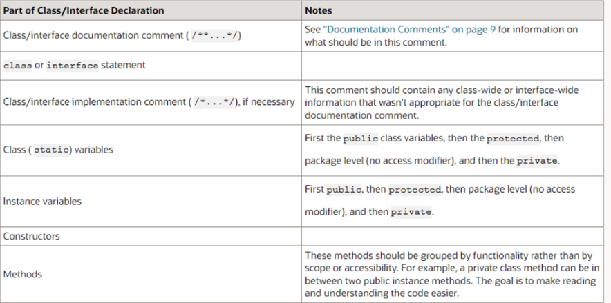

**5장 형식 맞추기**<br>
**page 95 ~ 116**

## 포멧팅이 중요한 이유

```java
public void horriblyFormattedMethod() {
	System.out.println("First line");
			System.out.println("Second line");
		System.out.println("Third line");
	for (int i = 0; i < 3; i++)
	System.out.println("number " + i);
}
```
```java
public void horriblyFormattedMethod() {
	System.out.println("First line");
	System.out.println("Second line");
	System.out.println("Third line");
	for (int i = 0; i < 3; i++) {
		System.out.println("number " + i);
	}
}
```
### 가독성이 필수적이다.
- 코드를 수월하게 읽어나갈 수 있다.
- 아마추어처럼 보이지 않는다.
- 포맷팅으로 인해 코드를 잘못해석해 버그를 발생할 위험을 줄인다!


---
## 클린코드 포맷팅

### 적절한 길이 유지
👍~200 lines < 500 lines
#### 200라인

- “코드 길이를 200줄 정도로 제한하는 것은 반드시 지길 엄격한 규칙은 아니지만, 일반적으로 큰 파일 보다는 작은 파일이 이해하기 쉽다"<br>

  → 현업에서의 대부분의 코드들도 200라인 정도를 유지한다.


• 코드 길이가 200라인을 넘어간다면, 클래스가 여러 개의 일을 하고 있을 수 있다. ~> SRP 위배!

### 밀접한 개념은 가까이

#### 밀접한 개념은 서로 가까이 둔다.
• 행 묶음은 완결된 생각 하나를 표현하기 때문에 개념은 빈 행으로 분리한다.
• 변수는 사용되는 위치에서 최대한 가까이 선언한다.

-----

## Java Class Declearations




### Class 내부 코드 순서
**Class 내부 코드 순서를 맞추어 개발해야 한다.**

**1. static 변수<br>**
- public -> protected -> package -> private 순서<br>
  **2. instance 변수<br>**
- public -> protected -> package -> private<br>
  **3. 생성자<br>**
  **4. 메서드<br>**
- public 메서드에서 호출되는 private 메서드는 그아래에 둔다. **가독성** 위주로 그룹핑한다.<br>


```java
/*
 * @(#)Blah.java            1.82 99/03/18
 *
 * Copyright (C) 1994-1998 Sun Microsystems, Inc.
 * 901 San Antonio Road, Palo Alto, California, 94303, U.S.A.
 * All rights reserved.
 *
 * This software is the confidential and proprietary information of Sun
 * Microsystems, Inc. (*Confidential Information"). You shall not
 * disclose such Confidential Information and shall use it only in
 * accordance with the terms of the license agreement you entered into
 * with Sun.
 */

package java.blah;

import java.blah.blahdy.BlahBlah;

/**
 *
 * Class description goes here.
 *
 * @version 1.82 18 Mar 1999
 * @author Firstname Lastname
 */
public class Blah extends SomeClass {
    public static int classVar1;
    private static Object classVar2;  // static 변수
    public Object instanceVar1;
    protected int instanceVar2;
    private Object[] instanceVar3;  // instance 변수
    public Blah() {  // 생성자
        // ...implementation goes here...
    }
    public void doSomething() {  // 메서드
        // ...implementation goes here...
    }
    public void doSomethingElse(Object someParam) {
        // ...implementation goes here...
    }
}
```

### Team Coding Convention(참고)

코딩 스타일에 관한 약속 👨🏻‍💻
> 팀의 코딩 스타일에 관한 약속이다.<br>
> 개발 언어의 컨벤션이 우선이지만, 애매한 부분은 팀 컨벤션을 따른다. <br>
> 없다면 제안하는 것도 리뷰 시 언쟁이 길어지지 않는 하나의 방법이다.

**Google Java StyIe Guide**

https://google.github.io/styleguide/javaguide.html

**Naver Hackday Java Convention**

https://naver.github.io/hackday-conventions-java/