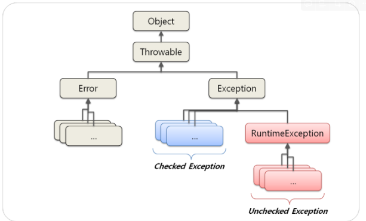
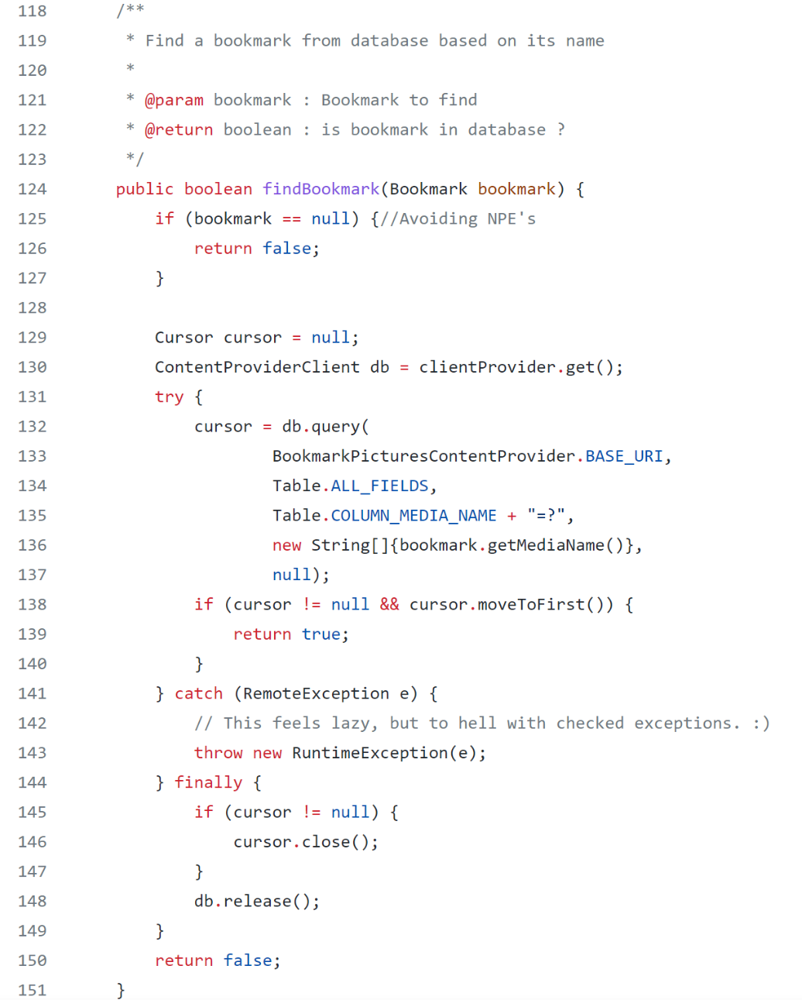

**Chapter 06. 오류 처리**<br>
**page 129 ~ 142**


## 1. 예외 처리 방식
### 1) 오류 코드를 리턴하지 말고, 예외를 던져라

```java
👎 Bad
public class DeviceController {
...
   public void sendShutDown( ) {
        DeviceHandle handle = getHandle(DEV1);
        // Check the state of the device
        if ( handle != DeviceHandle.INVALID ) {
            // Save the device status to the record field
            retrieveDeviceRecord(handle);
            // If not suspended, shut down
            if ( record.getStatus( ) != DEVICE_SUSPENDED ) {
                pauseDevice(handle);
                clearDeviceWorkQueue(handle);
                closeDevice(handle);
            } else {
                logger.log("Device suspended. Unable to shut down");
            }
        } else {
          logger.log("Invalid handle for : " + DEV1.toString( )); 
       }
   }
...
}
```
- 옛날에는 오류를 나타낼 때 에러코드를 던졌다.
- 하지만 예외를 던지는 것이 명확하고, 처리 흐름이 깔끔해진다.

### 2) 예외를 던지고, 처리하는 방식
```java
public class DeviceController {
...
  3번구역 
   public void sendShutDown( ) {
        try {
            tryToShutDown( );
        }  catch (DeviceShutDownError e) {
            logger.log(e);
        }
   }

 2번구역 
   public void tryToShutDown( ) throws DeviceShutDownError {
        DeviceHandle handle = getHandle(DEV1);
        DeviceRecord record = retrieveDeviceRecord(handle);
        pauseDevice(handle);
        clearDeviceWorkQueue(handle);
        closeDevice(handle);
   }
        
1번구역
   private DeviceHandle getHandle(DeviceId id) {
     ...
     throw new DeviceShutDownError ("Invalid handle for : " + id.toString( ));
     ...
   }
...
} 
```

- 1번 구역. 오류가 발생한 부분에서 예외를 던진다.<br>
  (별도의 처리가 필요한 예외라면 checked exception으로 던진다)
- 2번 구역. checked exception에 대한 예외처리를 하지 않는다면 메서드 선언부에 throws를 명시해야한다.
- 3번 구역. 예외를 처리할 수 있는 곳에서 catch 하여 처리한다.


----
## 2. Unchecked Exception을 사용하라

### 1) Checked vs Unchecked Exception
#### Exception 가계도


• **Exception**을 상속하면 **Checked Exception** 명시적인 예외처리가 필요하다.<br>
(예) lOException, SQLException<br>
• **RuntimeException**을 상속하면 **Unchekced Exception** 명시적인 예외처리가 필요하지 않다.<br>
(예) NullPointerException, lllegalArgumentException, IndexOutOfBoundException

### 2) <Effective Java> Exception에 관한 규약

> 자바 언어 명세가 요구하는 것은 아니지만, 업계에 널리 퍼진 규약으로<br>
**Error 클래스를 상속해 하위 클래스를 만드는 일은 자제하자.**<br>
즉, 사용자가 직접 구현하는 uncheked throwable은 모두 <span style="color:red">**RuntimeException의 하위 클래스**</span> 여야 한다.<br>
Exception, RuntimeException, Error를 상속하지 않는 throwable을 만들 수도 있지만, 이러한 throwable은 정상적인 사항보다 나을 게 하나도 없으면서 API 사용자를 헷갈리게 할 뿐이므로 절대로 사용하지 말자.


### 3) Checked Exception이 나쁜 이유
```java
👍 Good 코드를 다시보자

public class DeviceController {
...
  3번구역 
   public void sendShutDown( ) {
        try {
            tryToShutDown( );
        }  catch (DeviceShutDownError e) {
            logger.log(e);
        }
   }

 2번구역 
   public void tryToShutDown( ) throws DeviceShutDownError {
        DeviceHandle handle = getHandle(DEV1);
        DeviceRecord record = retrieveDeviceRecord(handle);
        pauseDevice(handle);
        clearDeviceWorkQueue(handle);
        closeDevice(handle);
   }
        
1번구역
   private DeviceHandle getHandle(DeviceId id) {
     ...
     throw new DeviceShutDownError ("Invalid handle for : " + id.toString( ));
     ...
   }
...
} 
```

1. 특정 메소드에서 checked exception을 throw하고 상위 메소드에서 그 exception을 catch한다면 모든 중간단계 메소드에 exception을 throws 해야한다.<br>
2. OCP(개방 폐쇄 원칙) 위배<br>
   상위 레벨 메소드에서 하위 레벨 메소드의 디테일에 대해 알아야 하기 때문에 OCP 원칙에 위배된다.<br>
3. 필요한 경우 checked exception을 사용해야 되지만 일반적인 경우 득보다 실이 많다.<br>

### 4) Unchecked Exception을 사용하자

> 안정적인 소프트웨어를 제작하는 요소로 확인된 예외가 반드시 필요하지는 않다는 사실이 분명해졌다. <br>
C#은 확인된 예외를 지원하지 않는다.<br> 
> 영웅적인 시도에도 불구하고 C++ 역시 확인된 예외를 지원하지 않는다.<br> 
> 파이썬이나 루비도 마찬가지다. 그럼에도 불구하고 **C#, C++, 파이썬, 루비는 안정적인 소프트웨어를 구현하기에 무리가 없다.** 
>

----

## 3. Exception 잘 쓰기

### 1) 예외에 메시지를 담아라

```java
👍 Good 코드를 다시보자

.... 
1번구역
   private DeviceHandle getHandle(DeviceId id) {
     ...
     throw new DeviceShutDownError ("Invalid handle for : " + id.toString( ));
     ...
   }
```
- 예외에 의미있는 정보가 담겨있다.
- 오류가 발생한 원인과 위치를 찾기 쉽도록, 예외를 던질 때는 전후 상황을 충분히 덧붙인다.
- 실패한 연산 이름과 유형 등 정보를 담아 예외를 던진다.

### 2) exception wrapper

```java
👎 로그를 찍을 뿐 하는 일이 없는 코드 

ACMEPort port = new ACMEPort(12);
   try {
       port.open( );
   } catch (DeviceResponseException e) {
       reportPortError(e);
       logger.log("Device response exception", e);
   } catch (ATM1212UnlockedException e) {
       reportPortError(e);
       logger.log("Unlock exception", e);
   } catch (GMXError e) {
       reportPortError(e);
       logger.log("Device response exception");
  } finally {
       . . .
  }
```
- 로그를 찍을 뿐 할 수 있는 일이 없다.


#### 예외를 감싸는 클래스를 만든다
```java
👍 예외를 감싸는 클래스
 
   LocalPort port = new LocalPort(12);
   try {
       port.open( );
   } catch (PortDeviceFilure e) {
       reportError(e);
       logger.log(e.getMessage( ), e);
  } finally {
       . . .
  }

   public class LocalPort {
      private ACMEPort innerPort;
      public LocalPort(int portNumber) {
            innerPort = new ACMEPort(portNumber);
      }
   }

   public void open( ) {
      try {
          innerPort.open( );
      } catch (DeviceResponseException e) {
         throw new PortDeviceFailure(e);
     } catch (ATM1212UnlockedException e) {
          throw new PortDeviceFailure(e);
      } catch (GMXError e) {
          throw new PortDeviceFailure(e);
     } 
   }
 ...
}
```
- port.open( )시 발생하는 checked exception들을 감싸도록 port를 가지는 LocalPort 클래스를 만든다.
- port.open( )이 던지는 checked exception들을 하나의 PortDeviceFailure exception으로 감싸서 던진다.
- 호출부에서 더 깔끔하게 호출할 수 있다.

----

## 4. 실무 예외 처리 패턴

### 1) getOrElse
: **예외 대신 기본 값을 리턴한다**

#### (1) null이 아닌 기본값

```java
👎 Bad

List<Employee> employees = getEmployees( );
if ( employees != null ) {
    for ( Employee e : employees ) {
        totalPay += e.getPay( );
    }
}
```

- getEmployees를 설계할 때, 데이터가 없는 경우를 null로 표현했는데, 다른 방법이 없을까?
- null을 리턴한다면 이후 코드에서 모두 null 체크가 있어야한다.


```java
👍 Good

List<Employee> employees = getEmployees( );
if ( employees != null ) {
    for ( Employee e : employees ) {
        totalPay += e.getPay( );
    }
}

public List<Employee> getEmployees( ) {
  if (  .. there are no employees .. ) {
      return Collections.emptyList( );
   }
}
```
- 복수형의 데이터를 가져올 때는 데이터의 없음을 의미하는 컬렉션을 리턴하면 된다.
- null 보다 size가 0인 컬렉션이 훨씬 안전하다.

##### 🤚 BUT! 빈 컬렉션, 빈 문자열을 적용할 수 없는 경우라면?

#### (2) 도메인에 맞는 기본 값 

```java
👎 Bad

UserLevel userLevel = null;
try {
     User user = userRepository.findByUserId(userId);
     userLevel = user.getUserLevel( );
 } catch (UserNotFoundException e) {
     userLevel = UserLevel.BASIC;
}
// userLevel을 이용한 처리 
```
- 호출부에서 예외 처리를 통해 userLevel 값을 처리한다.
- 코드를 계속 읽어나가면서 논리적인 흐름이 끊긴다.

```java
👍 Good

public class UserService {
     private static final UserLevel USER_BASIC_LEVEL = UserLevel.BASIC;

     public UserLevel getUserLevelOrDefault(Long userId) {
        try {
            User user = userRepository.findByUserId(userId);
            return user.getUserLevel( ); 
        } catch (UserNotFoundException e) {
            return USER_BASIC_LEVEL;
        }
     }
}


// 호출부 코드 
UserLevel userLevel = userService.getUserLevelOrDefault(userId);
```
- 예외 처리를 **데이터를 제공하는 쪽에서 처리해** 호출부 코드가 심플해진다. 재활용성이 높아진다.
- 코드를 읽어가며 논리적인 흐름이 끊기지 않는다.
- 도메인에 맞는 기본값을 도메인 서비스에서 관리한다.

##### 🤚 도메인에 맞는 기본값이 없다면???!!!

### 2) getOrElseThrow : null 대신 예외를 던진다

#### (1) null 체크 지옥에서 벗어나자

```java
👎 Bad

public void registerItem(Item item) {
    if (item != null) {
        ItemRegistry registry = peristentStore.getItemRegistry( );
        if (registry ! = null) {
             Item existing = registry.getItem(item.getID());
             if (existing.getBillingPeriod( ).hasRetailOwner( )) {
                 existing.register(item);
             }
         }
     }
}
```
- null 체크가 빠진 부분이 발생할 수 있다.
- peristentStore에 대한 null 체크가 빠져있지만 알아챌 수 없다.!
- 코드 가독성이 현저히 떨어진다.

#### (2) 기본 값이 없을 때 null 대신 예외를 던진다
```java
👎 Bad

User user = userRepository.findByUserId(userId);
if ( user != null ) {
      // user를 이용한 처리 
}
```
- user를 사용하는 쪽에서 매번 null 체크를 해야한다.
- 가독성뿐 아니라 안정성도 떨어진다.

```java
👍 Good

public class UserService {
     private static final UserLevel USER_BASIC_LEVEL = UserLevel.BASIC;

     public UserLevel getUserOrElseThrow(Long userId) {
            User user = userRepository.findByUserId(userId);
           if ( user == null ) {
                 throw new IllegalArgumentException("User is not found. userId = " + userId);
            }
             return user;
     }
}
```
- 데이터를 제공하는 쪽에서 null 체크를 하여, 데이터가 없는 경우엔 예외를 던진다.
- 호출부에서 매번 null 체크를 할 필요 없이 안전하게 데이터를 사용할 수 있다.
- 호출부의 가독성이 올라간다.

#### (3) 파라미터의 null을 점검해라

```java
👎 Bad 

public class MetricsCalculator {
     public double xProjection(Point p1, Point p2) {
           return (p2.x - p1.x) * 1.5;
     }
}

// calculator.xProjection(null, new Point(12, 13));
// NullPointerException 발생한다.
```
- null을 리턴하는 것도 나쁘지만 null을 메서드로 넘기는 것은 더 나쁘다.
- null을 메서드의 파라미터로 넣어야 하는  API를 사용하는 경우가 아니면 null을 메서드로 넘기지 마라.


```java
👍 Good 

public class MetricsCalculator {
     public double xProjection(Point p1, Point p2) {
         if ( p1 == null || p2 == null ) {
              throw InvalidArgumentException("Invalid argument for MetricsCalculator.xProjection");
         }
         return (p2.x - p1.x) * 1.5
     }
}
```
- null을 파라미터로 받지 못하게 한다.
- null이 들어오면 unchecked exception을 발생시킨다.

```java
👍 Good

public class MetricsCalculator {
     public double xProjection(Point p1, Point p2) {
        assert p1 !=  null : "p1 should not be null" ;
        assert p2 !=  null : "p2 should not be null" ;
        
        return (p2.x - p1.x) * 1.5
     }
}
```
- assert를 통해 null이 들어오면 에러를 발생시킨다.

----

## 5. 실무에서는 보통 자신의 예외를 정의한다.

```java
public class MyProjectException extends RuntimeException {
     private MyErrorCode errorCode;
     private String errorMessage;

     public MyProjectException(MyErrorCode errorCode) { ... }

     public MyProjectException(MyErrorCode errorCode, String errorMessage) { ... }

}

     public enum MyErrorCode {
          private String defaultErrorMessage;        
   
          INVALID_REQUEST("잘못된 요청입니다.");
          DUPLICATED_REQUEST("기존 요청과 중복되어 처리할 수 없습니다.");
          // ..
          INTERNAL_SERVER_ERROR("처리 중 에러가 발생했습니다.");
    }

  // 호출부 
     if ( request.getUserName( ) == null ) {
        throw new MyProjectException(ErrorCode.INVALID_REQUEST, "userName is null );
     }
```

**장점**
- 에러 로그에서 stacktrace 해봤을 때 우리가 발생시킨 예외라는 것을 바로 인지할 수 있다.
- 다른 라이브러리에서 발생한 에러와 섞이지 않는다.<br> 
  우리도 IllegalArgumentException을 던지는 것보다 우리 예외로 던지는 게 어느 부분에서 에러가 났는지 파악하기에 용이하다.
- 우리 시스템에서 발생한 에러의 종류를 나열할 수 있다.

----

## 오픈소스 속 Exception 살펴보기

### apps-android-commons



**① 125 - 127 라인**<br>
parameter인 bookmark가 null이면 예외를 던지지않고 false를 리턴한다.<br>
-> Bookmark 존재여부에 대한 메서드의 목적에 부합한다.<br>

**② 131  - 143 라인**<br>
db 리소스를 처리할 때 checked exception인 RemoteException을 별도로 처리하지 않고<br>
RuntimeException으로 바꿔서 던졌다.<br>

**③ 144 - 149 라인**<br>
fianally 블록에서 리소스를 close 처리한다. (리소스를 사용했다면 반드시 finally 블록에서 닫아줘야한다.)<br>

