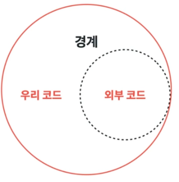
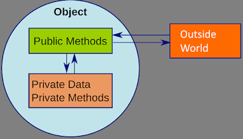
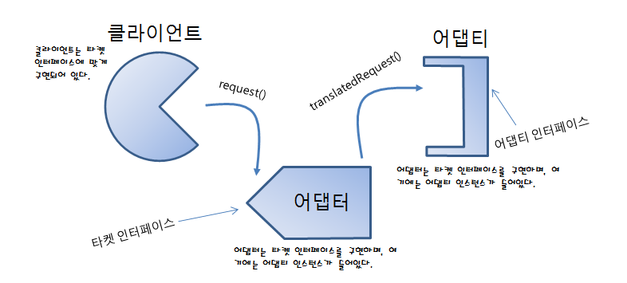
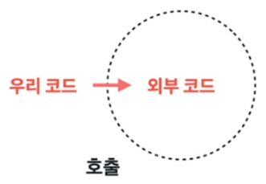

**Chapter 08. 경계**<br>
**page 143 ~ 152**

## 1. 경계란



- 오픈소스, 라이브러리를 안쓰는 프로젝트는 없다.
- 우리가 만든 코드에 외부에서 들어온 코드를 병합해야 한다.
- 외부 코드는 외부에서 만든 코드인데, 외부 시스템과 호출하거나 단순히 외부에서 만들어진 코드일 수 있다.
- 우리 코드와 외부 코드를 깔끔하게 통합시키기 위해 경계를 잘 지어야 한다.

--- 

## 2. 경계 짓기(1) 우리코드를 보호하기

### 캡슐화


- 객체의 실제 구현을 외부로부터 감추는 방식(TMI를 하지 않아야 함)

```java
👎 Bad

map<Sensor> sensors = new hashMap<sensor>();
Sensor s = sensors.get(sensorId);
```

- Map 인터페이스가 제공하는 clear등 불필요한 기능이 노출된다.
- 외부 코드가 함부로 호출하면 sensor 데이터가 손상될 수 있고, 이는 의도와 벗어난다.

```java
👍 Good

public class Sensors {
    private Map sensors = new HashMap();
 
    public Sensor getById(String id) {
        return (Sensor) sensors.get(id);
    }
    // ..
}
```
- 캡슐화를 통해 Map을 감춘다.
- 원하는 기능만 공개할 수 있다.
- 적절한 경계로 우리 코드를 보호할 수 있다.

#### **Sensor를 관리해야 한다. Sensor는 외부에서 사용된다.**

- Sensor id와 Sensor 객체로 저장하고 싶어서, Map을 사용한다.
- 하지만 Map을 그대로 사용하면 Map이 가진 clear()가 외부로 노출된다.
- Sensor의 '외부' 코드 관점에서 Sensor 객체의 값들만 가저오고 싶다.
- 캡슐화를 한다!

----

## 3. 경계 짓기(2) 외부 코드와 호환하기

: 외부 코드를 호출할 때 우리가 원하는 방식으로 사용하고 싶다!



### 어뎁터패턴 (Adapter Pattern)

**📍 외부 코드를 호출 할 때, 우리가 정의한 인터페이스 대로 호출하기 위해 사용하는 패턴**

### 🤚 Adapter 패턴 in Elastic Search
: elastic search 에서 이러한 외부 라이브러리를 Adapter pattern 를 통해 사용하였는지 알아보자!

#### NettyAdapter
```java
package org.elasticsearch.http.nio;

import io.netty.buffer.ByteBuf;
import io.netty.buffer.Unpooled;
import io.netty.channel.ChannelFuture;
import io.netty.channel.ChannelHandler;
import io.netty.channel.ChannelHandlerContext;
import io.netty.channel.ChannelOutboundHandlerAdapter;
import io.netty.channel.ChannelPromise;
import io.netty.channel.embedded.EmbeddedChannel;

import org.elasticsearch.ExceptionsHelper;
import org.elasticsearch.nio.FlushOperation;
import org.elasticsearch.nio.Page;
import org.elasticsearch.nio.WriteOperation;

import java.nio.ByteBuffer;
import java.util.LinkedList;
import java.util.function.BiConsumer;

class NettyAdaptor {

    private final EmbeddedChannel nettyChannel;
    private final LinkedList<FlushOperation> flushOperations = new LinkedList<>();

    NettyAdaptor(ChannelHandler... handlers) {
        nettyChannel = new EmbeddedChannel();
        nettyChannel.pipeline().addLast("write_captor", new ChannelOutboundHandlerAdapter() {

            @Override
            public void write(ChannelHandlerContext ctx, Object msg, ChannelPromise promise) {
                // This is a little tricky. The embedded channel will complete the promise once it writes the message
                // to its outbound buffer. We do not want to complete the promise until the message is sent. So we
                // intercept the promise and pass a different promise back to the rest of the pipeline.

                try {
                    ByteBuf message = (ByteBuf) msg;
                    promise.addListener((f) -> message.release());
                    NettyListener listener = NettyListener.fromChannelPromise(promise);
                    flushOperations.add(new FlushOperation(message.nioBuffers(), listener));
                } catch (Exception e) {
                    promise.setFailure(e);
                }
            }
        });
        nettyChannel.pipeline().addLast(handlers);
    }

    public void close() throws Exception {
        assert flushOperations.isEmpty() : "Should close outbound operations before calling close";

        ChannelFuture closeFuture = nettyChannel.close();
        // This should be safe as we are not a real network channel
        closeFuture.await();
        if (closeFuture.isSuccess() == false) {
            Throwable cause = closeFuture.cause();
            ExceptionsHelper.maybeDieOnAnotherThread(cause);
            throw (Exception) cause;
        }
    }

    public void addCloseListener(BiConsumer<Void, Exception> listener) {
        nettyChannel.closeFuture().addListener(f -> {
            if (f.isSuccess()) {
                listener.accept(null, null);
            } else {
                final Throwable cause = f.cause();
                ExceptionsHelper.maybeDieOnAnotherThread(cause);
                assert cause instanceof Exception;
                listener.accept(null, (Exception) cause);
            }
        });
    }

    public int read(ByteBuffer[] buffers) {
        ByteBuf byteBuf = Unpooled.wrappedBuffer(buffers);
        int initialReaderIndex = byteBuf.readerIndex();
        nettyChannel.writeInbound(byteBuf);
        return byteBuf.readerIndex() - initialReaderIndex;
    }

    public int read(Page[] pages) {
        ByteBuf byteBuf = PagedByteBuf.byteBufFromPages(pages);
        int readableBytes = byteBuf.readableBytes();
        nettyChannel.writeInbound(byteBuf);
        return readableBytes;
    }

    public Object pollInboundMessage() {
        return nettyChannel.readInbound();
    }

    public void write(WriteOperation writeOperation) {
        nettyChannel.writeAndFlush(writeOperation.getObject(), NettyListener.fromBiConsumer(writeOperation.getListener(), nettyChannel));
    }

    public FlushOperation pollOutboundOperation() {
        return flushOperations.pollFirst();
    }

    public int getOutboundCount() {
        return flushOperations.size();
    }
}
```

- 위 코드에서 처럼 엘라스틱서치 NettyAdapter.class 를 보면 (11~18) 라인에서 Netty라는 외부 코드를 사용하는것을(import) 볼 수 있다.
- NettyAdapter 은 외부코드인 NettyChannel을 감싸고 있다.
- 이렇게 되면 NettyChannel 을 사용하기 위해선 NettyAdapter을 통해서 사용을 해야한다

```java
// HttpReadWriteHandler 
public class HttpReadWriteHandler implements ReadWriteHandler {

    private final NettyAdaptor adaptor;
    
    ...
    
    @Override
    public int consumeReads(InboundChannelBuffer channelBuffer) throws IOException {
        int bytesConsumed = adaptor.read(channelBuffer.sliceAndRetainPagesTo(channelBuffer.getIndex()));
        Object message;
        while ((message = adaptor.pollInboundMessage()) != null) {
            handleRequest(message);
        }

        return bytesConsumed;
    }
```
이렇게 하면 아래와 같은 **장점**들이 생기게된다.

- 우리가 원하는 방식인 read할 때 ByteBuffer[]로 parameter를 보내면, 외부 코드인 nettyChannel에 ByteBuf 타입으로 parameter를 변환하여 전달한다.
- Page[]타입 parameter로도 전달할 수 있다. Adapter에 메서드를 추가해 우리가 원하는 타입의 파라미터를 전달할 수 있다.
- 만약 adapter를 통한 변환을 거치지 않았다면 nettyChannel에 데이터를 전달할 때마다 타입을 변환하는 과정이 필요했고, 이는 중복을 발생시켰을 것이다.

---
## 4. 외부 라이브러리 테스트하기 - Learning Test

**📍 Learning Test를 작성해 라이브러리를 테스트한다.**

**🤚이미 거기서 테스트를 하지 않았을까? 근데 라이브러리를 '사용'하는 내가 테스트를?**


- 학습 테스트는 이해도를 높인다.
- 학습 테스트 : 곧바로 우리쪽 코드를 작성해 외부 코드를 호출하는 태신 먼저 간단한 테스트 케이스를 작성해 외부 코드를 익히는 방식
- 외부 코드의 버전이 변경됐을 때, **우리 코드와 호환되는지 확인할 수 있다.**
- API, 라이브러리, 프레임워크가 어떻게 동작하는 지 검증하기 위한 테스트
- 기능 검증을 위한 테스트가 아님
