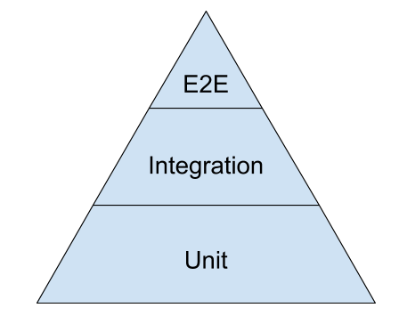
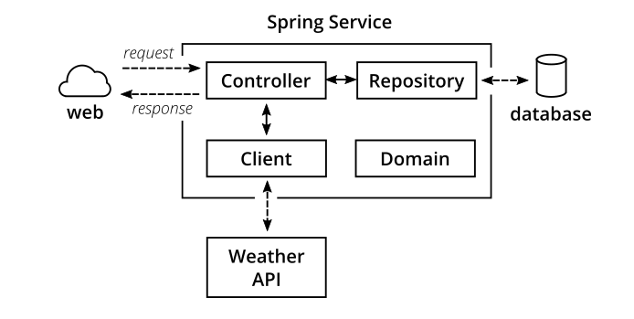
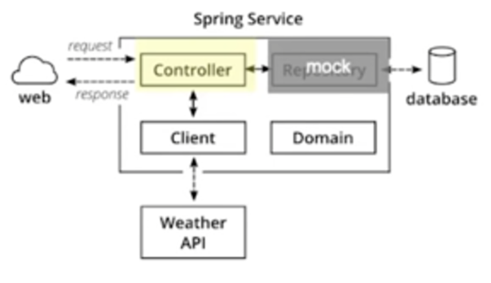
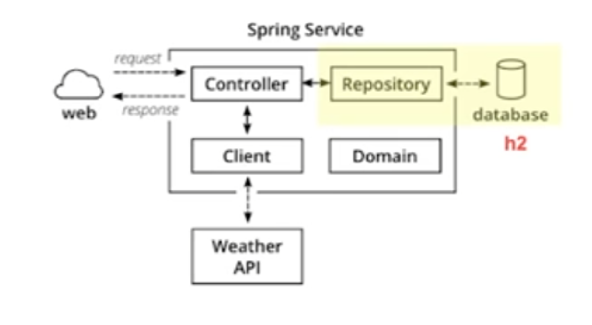
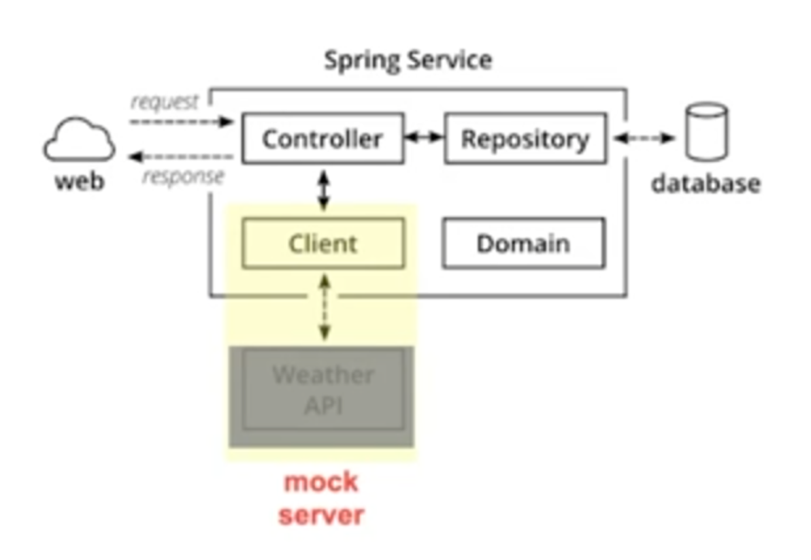

**Chapter 09. 단위 테스트**<br>
**page 153 ~ 170**

## 1. 테스트 코드의 중요성
### 테스트 코드는 중요하다

- 테스트 코드는 실수를 바로잡아준다.
- 테스트 코드는 반드시 존재해야하며, 실제 코드 못지 않게 중요하다.
- **테스트 케이스는 변경이 쉽도록 한다.** 코드에 유연성, 유지보수성, 재사용성을 제공하는 버팀목이 바로 단위테스트다. <br>
  테스트 케이스가 있으면 변경이 두렵지 않다. <br>
  테스트 케이스가 없다면 모든 변경이 잠정적인 버그다. 테스트 커버리지가 높을수록 버그에 대한 공포가 줄어든다.
- 지저분한 테스트 코드는 테스트를 안하니만 못하다.

### 책에서 나온 [Effective unit testing] 테스트의 중요성

> “
테스트는 실사용에 적합한 설계를 끌어내준다.
”
>

> “
테스트를 작성해서 얻게 되는 가장 큰 수확은 테스트 자체가 아니다.
작성 과정에서 얻는 **깨달음**이다.
”
>

### 테스트는 자동화되어야한다


개발자가 코드를 작성하고 테스트 코드를 양심껏 작성하는 것이 아니라 배포하기전에 테스트가 자동화가 되어야 한다.

---

## 2. 테스트의 종류

### Test Pyramid


#### 구글의 제안 : 70% unit tests, 20% integratoin tests, 10% end-to-end tests

### 1) Unit Test
- 프로그램 내부의 개별 컴포넌트의 동작을 테스트한다.
- 배포하기 전에 자동으로 실행되도록 많이 사용한다.

### 2) Integration Test
- 프로그램 내부의 개별 컴포넌트들을 합쳐서 동작을 테스트한다.
- Unit Test는 각 컴포넌트를 고립시켜 테스트하기 때문에 컴포넌트의 interaction을 확인하는 integration Test가 필요하다.

### 3) E2E Test
- End to End test
- 실제 유저의 시나리오대로 네트워크를 통해 서버의 Endpoint를 호출해 테스트한다.

---

## 3. Unit Test 작성

### 1) 테스트 라이브러리를 사용하자

**실무에서는 JUnit 5 + mockito를 많이 사용한다.**

- JUnit : for unit test
- Mockito : for mocking dependencies
- Wiremock : for stubbing out external services
- Pack : for writing CDC tests
- Selenium : for writing UI-driven end-to-end tests
- REST-assured : for writing REST API-driven end-to-end tests

### 2) Test Double
#### 테스트에서 원본 객체를 대신하는 객체
**1. Stub**
- 원래의 구현을 단순한 것으로 대체한다.
- 테스트를 위해 프로그래밍된 항목에만 응답한다.

**2. Spy**
- Stub의 역할을 하면서 호출에 대한 정보를 기록한다.
- 이메일 서비스에서 메시지가 몇 번 전송되었는지 확인할 때

**3. Mock**
- 행위를 검증하기 위해 가짜 객체를 만들어 테스트하는 방법
- 호출에 대한 동작을 프로그래밍 할 수 있다.
- Stub은 상태를 검증하고 Mock을 행위를 검증한다.

#### given-when-then 패턴을 사용하자

```java
public testGetPageHierarchyAsxml() throws Exception {
  givenPages("PageOne", "PageOne.ChildOne", "PageTwo");

  whenRequestIsIssued("root", "type:pages");

  thenResponseShouldBeXML();
}

public void testGetPageHierarchyHasRightTags() throws Exception {
  givenPages("PageOne", "PageOne.ChildOne", "PageTwo");

  whenRequestIsIssued("root", "type:pages");

  thenResponseShouldContain("<name>PageOne</name>", "<name>ChildOne</name>", "<name>PageTwo</name>");
}
```

- given: 테스트에 대한 pre-condition
- when: 테스트하고 싶은 동작 호출
- then 테스트 결과 확인

### 4) Spring Boot Application Test 예제



#### (1) 테스트 대상 ExampleController - main코드

```java
@RestController
public class ExampleController {

    private final PersonRepository personRepo;

    @Autowired
    public ExampleController(final PersonRepository personRepo) {
        this.personRepo = personRepo;
    }

    @GetMapping("/hello/{lastName}")
    public String hello(@PathVariable final String lastName) {
        Optional<Person> foundPerson = personRepo.findByLastName(lastName);

        return foundPerson
                .map(person -> String.format("Hello %s %s!",
                        person.getFirstName(),
                        person.getLastName()))
                .orElse(String.format("Cannot hello to unknown")); // 이부분 테스트
    }
}
```

해당 부분을 어떻게 테스트 해야하는지 보자

#### (2) Unit Test - Controller

```java
public class ExampleControllerTest {
	
    // 테스트 대상
    private ExampleController subject;

    @Mock
    private PersonRepository personRepo;

    @Before
    public void setUp() throws Exception {
        initMocks(this);
        subject = new ExampleController(personRepo);
    }

    @Test
    public void shouldReturnFullNameOfAPerson() throws Exception {
    	// given
        Person peter = new Person("Peter", "Pan");
        given(personRepo.findByLastName("Pan"))
            .willReturn(Optional.of(peter));

	// when
        String greeting = subject.hello("Pan");

	// then
        assertThat(greeting, is("Hello Peter Pan!"));
    }

    @Test
    public void shouldTellIfPersonIsUnknown() throws Exception {
    	// given
        given(personRepo.findByLastName(anyString()))
            .willReturn(Optional.empty());

	// when
        String greeting = subject.hello("Pan");

	// then
        assertThat(greeting, is("Cannot hello to unknown"));
    }
}
```


- PersonRepository mock 사용
  - 테스트하고자 하는 Controller는 Repository에서 데이터를 가져와야 한다.
  - 독립성을 유지하기 위해 실제 Repositiory에서 데이터를 가져오지 않고 mocking하여 사용한다.
- given-when-then 구조
- repository에서 값을 읽어왔을 때와 읽어오지 못했을 때 2가지 경우를 테스트

#### (3) Integration Test(Database)

```java
@RunWith(SpringRunner.class)
@DataJpaTest
public class PersonRepositoryIntegrationTest {
    @Autowired
    private PersonRepository subject;

    @After
    public void tearDown() throws Exception {
        subject.deleteAll();
    }

    @Test
    public void shouldSaveAndFetchPerson() throws Exception {
    	// given
        Person peter = new Person("Peter", "Pan");
        subject.save(peter);

	// when
        Optional<Person> maybePeter = subject.findByLastName("Pan");

	// then
        assertThat(maybePeter, is(Optional.of(peter)));
    }
}
```



- PersonRepository가 데이터베이스와 연결될 수 있는지 확인
- in-memory DB인 h2로 테스트
  - 실제 Database를 사용하지 않고, MySQL 등을 사용하여 내 서버(내 컴퓨터)에서 동일한 형태의 database를 구축하여 사용한다.
- @After 부분의 tearDown 메서드는 독립성을 유지하기 위해 테스트 후 데이터 리셋 용도이다.
- firstByLastName가 정상적으로 동작하는지 확인

#### (4) Integration Test(Service)

```java
@RunWith(SpringRunner.class)
@SpringBootTest
public class WeatherClientIntegrationTest {

    @Autowired
    private WeatherClient subject;

    @Rule
    public WireMockRule wireMockRule = new WireMockRule(8089); // mock 서버를 띄운다.

    @Test
    public void shouldCallWeatherService() throws Exception {
    	// given : mock 서버에 응답을 설정한다.
        wireMockRule.stubFor(get(urlPathEqualTo("/some-test-api-key/53.5511,9.9937"))
                .willReturn(aResponse()
                        .withBody(FileLoader.read("classpath:weatherApiResponse.json"))
                        .withHeader(CONTENT_TYPE, MediaType.APPLICATION_JSON_VALUE)
                        .withStatus(200)));

	// when : weatherClient가 mock 서버로부터 응답을 받는다.
        Optional<WeatherResponse> weatherResponse = subject.fetchWeather();

	// then : 받아온 응답이 기대값과 일치하는 지 확인한다.
        Optional<WeatherResponse> expectedResponse = Optional.of(new WeatherResponse("Rain"));
        assertThat(weatherResponse, is(expectedResponse));
    }
}
```


- WireMock을 이용해 mock 서버를 띄운다.
- client가 실제 서버가 아닌 mock 서버로 요청하게 해서 client의 동작을 테스트한다.
- 
---

## 4. FIRST 원칙 - 유닛테스트를 잘 작성하기 위한 방법

### 1) Fast 
: 빠르게 테스트는 빨리 돌아야 한다. 자주 돌려야 하기 때문이다.

### 2) lndependent
: 독립적으로 각 테스트를 독립적으로 작성한다. 서로에게 의존하면 실패한 원인을 찾기 어려워진다. (다른 테스트의 실패로 인한건지, 코드 오류인지)

### 3) RepeatabIe
: 반복가능하게 테스트는 어떤 환경에서도 반복 가능해야 한다. 실제 환경, QA 환경, 모든 환경에서 돌아가야 한다.

### 4) Self-Validating
: 자가검증하는 테스트는 bool 값으로 결과를 내야 한다.

### 5) Timely
: 적시에 테스트하려는 실제 코드를 구현하기 직전에 구현한다.

---

## 5. 오픈소스 속 Unit Test

### Trino (PrestoSQL)

```java
public class TestTypeCalculation
{
    @Test
    public void testBasicUsage()
    {
        assertEquals(Long.valueOf(42), calculateLiteralValue("42", ImmutableMap.of()));
        assertEquals(Long.valueOf(0), calculateLiteralValue("NULL", ImmutableMap.of()));
        assertEquals(Long.valueOf(0), calculateLiteralValue("null", ImmutableMap.of()));
        assertEquals(Long.valueOf(42), calculateLiteralValue("x", ImmutableMap.of("x", 42L)));
        assertEquals(Long.valueOf(42), calculateLiteralValue("(42)", ImmutableMap.of()));
        assertEquals(Long.valueOf(0), calculateLiteralValue("(NULL)", ImmutableMap.of()));
        assertEquals(Long.valueOf(42), calculateLiteralValue("(x)", ImmutableMap.of("x", 42L)));

        assertEquals(Long.valueOf(42 + 55), calculateLiteralValue("42 + 55", ImmutableMap.of()));
        assertEquals(Long.valueOf(42 - 55), calculateLiteralValue("42 - 55", ImmutableMap.of()));
        assertEquals(Long.valueOf(42 * 55), calculateLiteralValue("42 * 55", ImmutableMap.of()));
        assertEquals(Long.valueOf(42 / 6), calculateLiteralValue("42 / 6", ImmutableMap.of()));

        assertEquals(Long.valueOf(42 + 55 * 6), calculateLiteralValue("42 + 55 * 6", ImmutableMap.of()));
        assertEquals(Long.valueOf((42 + 55) * 6), calculateLiteralValue("(42 + 55) * 6", ImmutableMap.of()));

        assertEquals(Long.valueOf(2), calculateLiteralValue("min(10,2)", ImmutableMap.of()));
        assertEquals(Long.valueOf(10), calculateLiteralValue("min(10,2*10)", ImmutableMap.of()));
        assertEquals(Long.valueOf(20), calculateLiteralValue("max(10,2*10)", ImmutableMap.of()));
        assertEquals(Long.valueOf(10), calculateLiteralValue("max(10,2)", ImmutableMap.of()));

        assertEquals(Long.valueOf(42 + 55), calculateLiteralValue("x + y", ImmutableMap.of("x", 42L, "y", 55L)));
    }
}
```
https://github.com/trinodb/trino/blob/master/core/trino-parser/src/test/java/io/trino/type/TestTypeCalculation.java

- calculateLiteralValue를 테스트하고 있다.
- 호출과 동시에 assert로 결과값을 검증한다.
- 테스트 하나에 여러 assert가 사용된다.<br>
  책에서 권장하는 방식이 아니지만, '조건’을 달리하며 테스트하는 경우 많이 사용된다.
- 테스트 클래스명이 Test로 시작한다. 원래 ~Test로 끝나는게 일반적이지만 이 프로젝트의 컨벤션이다.<br>
  팀 간의 협의(컨벤션)이 일반적인 컨벤션보다 우선이다.

### Junit5 Samples
```java
class CalculatorTests {

	@Test
	@DisplayName("1 + 1 = 2")
	void addsTwoNumbers() {
		Calculator calculator = new Calculator();
		assertEquals(2, calculator.add(1, 1), "1 + 1 should equal 2");
	}

	@ParameterizedTest(name = "{0} + {1} = {2}")
	@CsvSource({
			"0,    1,   1",
			"1,    2,   3",
			"49,  51, 100",
			"1,  100, 101"
	})
	void add(int first, int second, int expectedResult) {
		Calculator calculator = new Calculator();
		assertEquals(expectedResult, calculator.add(first, second),
				() -> first + " + " + second + " should equal " + expectedResult);
	}
}
```
https://github.com/junit-team/junit5-samples/blob/main/junit5-jupiter-starter-ant/src/test/java/com/example/project/CalculatorTests.java

- @DisplayName은 테스트 클래스나 메서드에 보여질 이름을 입력하는 것이다. 테스트의 목적을 명확하게 작정할수 있다.
- @ParameterizedTest는 하나의 테스트 메서드로 여러 가지 paramter를 테스트할 수 있다. @CsvSource의 값을 parameter로 넘긴다.
- JUnit5가 테스트에 관한 유용한 기능을 많이 가지고 있기 때문에 실무에서 많이 사용한다.