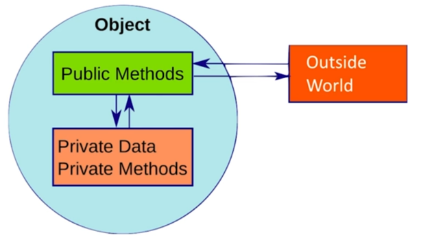

**Chapter 10. 클래스**<br>
**page 171 ~ 192**

## 1.캡슐화되어야 한다



### 캡술화
: 객체의 실제 구현을 외부로부터 감추는 방식

- 클래스를 개발할 때 기본적으로 구현을 감추고, 외부 객체와 상호작용하는 부분만 노출한다
- 외부의 잘못된 사용을 방지한다
- 경계에서 배웠던 Map 과 동일한 개념

#### Stack 예제
```java
public class Stack {
        private int topOfStack = 0;
        private List<Integer> element = new LinkedList<Integer>();

        public List<Integer> getElements() {
                return elements;
        }

        public int size() {
                return topOfStack;
        }

        public void push() throws PoppedWhenEmpty {
                if (topOfStack == 0) {
                        throw new PoppedWhenEmpty();
                }
                int element = elements.get(--topOfStack);
                elements.remove(topOfStack);
                return element;
        }
}
```
- 필드를 private로 제한, get으로 읽기
- 수정은 push, pop 메서드를 통해서 일어나도록 제한

---

## 2. 단일 책임 원칙(SRP)

### 클래스는 작아야한다.

#### 예제 1. 나쁜 코드👎
```java
public class SuperDashboard extends JFrame implements MetaDataUser {
    public Component getLastFocusedComponent()
    public void setLastFocused(Component lastFocused)
    public int getMajorVersionNumber()
    public int getMinorVersionNumber()
    public int getBuildNumber() 
}
```
-> "focus, version 두 가지 책임이 보인다."

#### 예제 2. 좋은 코드👍
```java
public Version {
    public int getMajorVersionNumber()
    public int getMinorVersionNumber()
    public int getBuildNumber() 
}
```
-> 다른 곳에서도 재활용 할 수 있다.

#### 클래스가 맡은 책임이 한 개인가

- 함수와 마찬가지로 클래스도 작아야 한다.
- 함수는 라인 수로 크기를 측정했는데, 클래스는 맡은 **책임**의 수로 크기를 측정한다.
- 클래스 설명은 만일(if), 그리고(and), 하며 (or), 하지만(but)을 사용하지 않고 25단어 내외로 가능해야 한다. → 책임이 한 가지여야 한다.

<br/>

- SRP 해야한다. 자잘한 단일 클래스가 많아지면 큰 그림을 이해하기 어렵다고 우려한다. 하지만 작은 클래스가 많은 시스템이든 큰 클래스가 몇 개뿐인 시스템이든 돌아가는 부품은 그 수가 비슷하다.
- "도구상자를 어떻게 관리하고 싶은가? 작은 서랍을 많이 두고 기능과 이름이 명확한 컴포넌트를 나눠 넣고 싶은가? 아니면 큰 서 몇 개를 두고 모두를 던져 넣고 싶은가?"
- 큼직한 다목적 클래스 및 개로 이뤼진 시스템은 (변경을 가할 때) 당장 알 필요가 없는 사실까지 들이밀어 독자를 방해한다.
- 작은 클래스는 각자 맡은 책임이 하나며, 변경할 이유가 하나며, 다른 작은 클래스와 협력해 시스템에 필요한 동작을 수행한다.

### 단일 책임 원칙 중요성

> 자잘한 단일 클래스가 않아지면 큰 그림을 이해하기 어렵다고 우려한다.
하지만 작은 클래스가 많은 시스템이든 큰 클래스가 몇 개뿐인 시스템이든
돌아가는 부품은 그 수가 비슷하다
>

> 큼직한 다목적 클래스 몇 개로 이뤄진 시스템은 (변경을 가할 때)
당장 알 필요가 없는 사실까지 들이일어 독자를 방해한다.
>

```java
class PaymentService {
    public void pay();
    public void cancel();
    public void getAccount();
    public void getAccountHistory();
}
```

**요구사항: 환불 기능을 추가하라**

클래스가 많은 기능을 가진 만큼
모든 기능을 이해하고 추가 기능을 구현할 수 있다.
그리고 클래스는 더 많은 기능을 가지게 된다..

> 작은 클래스는 각자 맡은 책임이 하나며, 변경할 이유가 하나며,
다른 작은 클래스와 협력해 시스템에 필요한 동작을 수행한다.
>

```java
class PaymentService {
    public void pay();
    public void cancel();
    public void getAccount();
    public void getAccountHistory();
}
```

---

## 3. 낮은 결합도, 높은 응집도

**결합도**

: 다른 모듈간의 의존도

**응집도**

: 모듈 내분의 기능 집중도

### 결합도는 낮을 수록 응집도는 높을 수록 유지보수성이 좋다.


**문제점**

- 결합도가 높은 클래스의 문제점
  - 연관된 클래스가 변경되면 수정이 필요하다
  - 결합도가 높으면 연관된 클래스들을 모두 이해해야한다.
- 응집도가 낮은 클래스의 문제점
  - 여러 기능이 있으므로 이해하기 어렵다
  - 재사용하기 어렵다

### 낮은 결합도

#### 결합도는 낮아야한다

- 시스템의 결합도를 낮추면 유연성과 재사용성도 더욱높아진다.
- DIP - 클래스가 상세한 구현이 아니라 추상화에 의존해야 한다.
- **추상화를 이용하면 테스트 코드 짜기에 용이하다.**


'PortfoIio 클래스 테스트 코드를 짜야하는데..
TokyoStockExchange 함수는 API는 5분마다 값이 달라지는데..


StockExchange 인터페이스를 통해 profolio와 TokyoStockExchange의 결합도를 끊어준다.


테스트 결과가 늘 같도록 한다.
**그러나.. 확장될 가능성이 적다면 일단은 결합하고, 나중에 추상화해도 좋다.**
객체를 Mockking 하면 변경되는 클래스도 테스트할 수 있다.

### 높은 응집도

#### 응집도는 높아야한다.


- 클래스는 인스턴스 변수 수가 적어야 한다. 메서드는 인스턴스 변수를 하나 이상 사용해야 한다. 에서드가 인스턴스 변수를 많이 사용할수록 응집도가 높다.
- 응집도가 높다= 클래스에 속한 메서드와 변수가 서로 의존하며 논리적인 단위로 묶인다 = 서로 관계있는 애들만 모여있다.
- 클래스가 응집도를 잃어간다면 함수를 쪼개야 한다.

---

## 4. 변경하기 쉬워야 한다.


Update문을 추가해야 한다면?
새로운 SQL을 추가할 때도 수정이 발생하고, 기존 SQL문을 수정할 때도 수정이 발생하므로 OCP 위반된다.


- 공개 인터페이스를 전부 SQL 클래스에서 파생하는 클래스로 만들고, 비공개 메서드는 해당 클래스로 옮기고, 공통된 인터페이스는 따로 클래스로 했다.
- 기존의 클래스를 건드리지 않아도 된다.