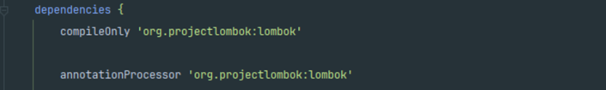
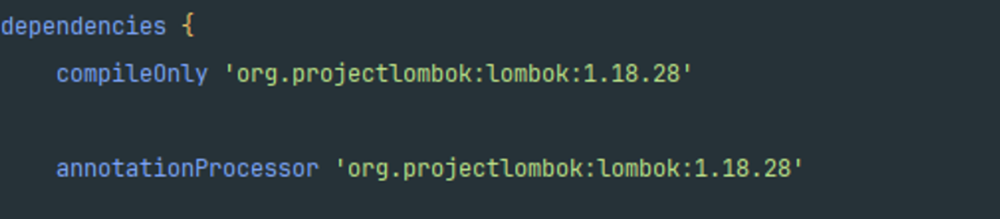
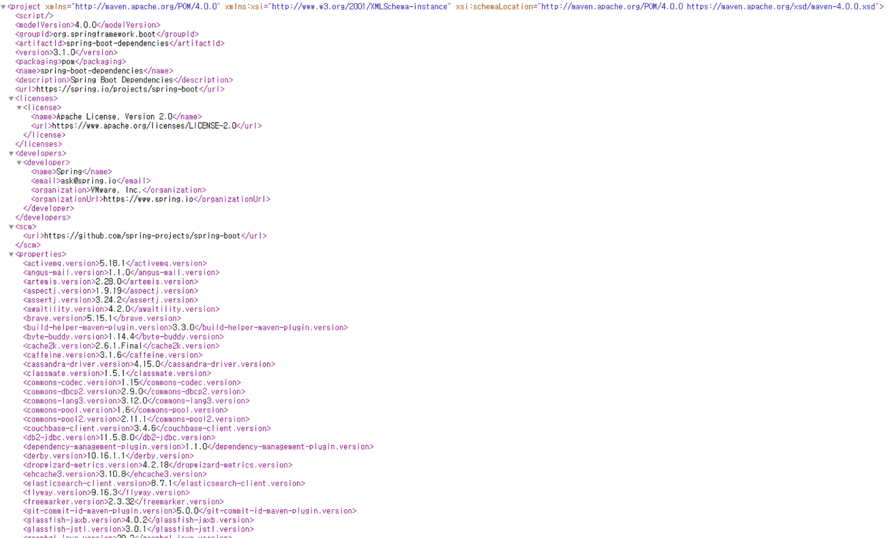

## 상황

자바로 프로그램을 짜고 있었다. lombok 추가해야하는데,, 나는 스프링만 개발하다 보니 버전을 굳이 입력하지 않아도 버전들이 알아서 맞춰질 줄 알았다.

하지만 버전을 입력하지 않았다라는 오류가 발생…

## BOM이란?

Bill Of Materials(자재 명세서)의 약자로 산업분야에 사용되는 용어이다. 스프링부트 공식 문서에서 "**io.spring.dependency-management 플러그인을 적용하면 spring-boot-dependencies bom을 자동으로 가져온다.**"고 명시하고 있기 때문에 spring-boot-dependencies를 bom이라 명명할 수 있겠다. 

## Spring boot BOM이란?

자재 명세서라는 명칭 그대로 bom(**spring-boot-dependencies**)은 스프링이 사용하는 여러 의존성 라이브러리의 버전이 명시되어 있다. [[메이븐 레파지토리](https://mvnrepository.com/artifact/org.springframework.boot/spring-boot-dependencies/3.1.0)]에서 bom을 다운받아보면, 라이브러리 버전들이 명시된 **pom파일**인 것을 확인할 수 있다.

## 정리

- io.spring.dependency-management는 플러그인이다.
- bom은 pom파일이다. 그러므로 bom 또는 bom 파일로 부를 수 있다.
- spring-boot-dependencies는 bom 파일이다.

## 참고문헌
> 💡 - https://onestone-dev.tistory.com/70