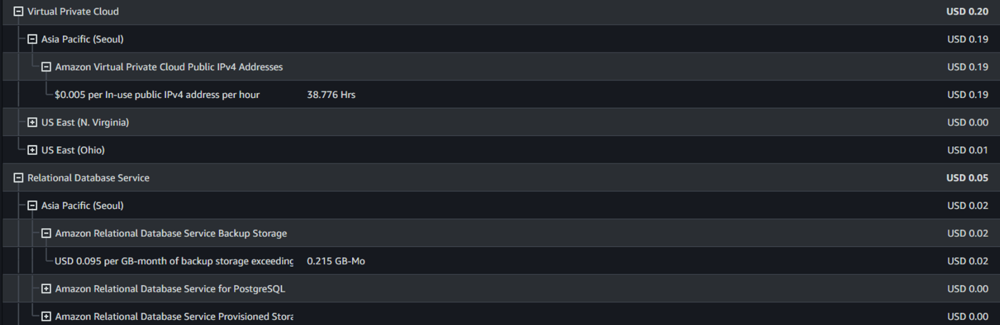
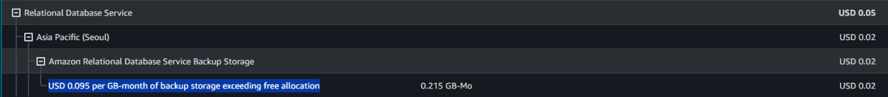
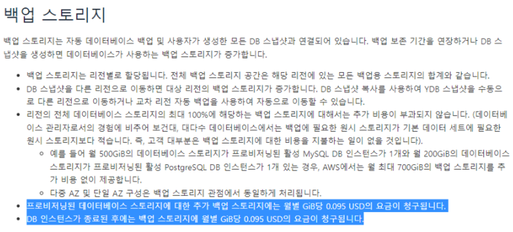
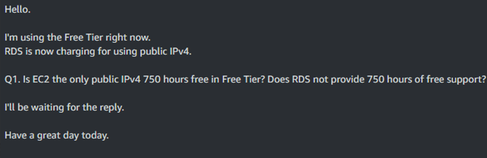
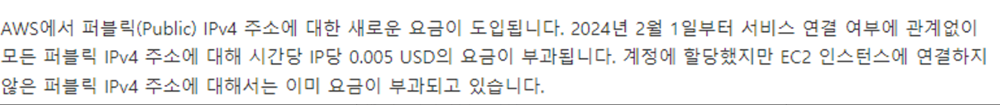
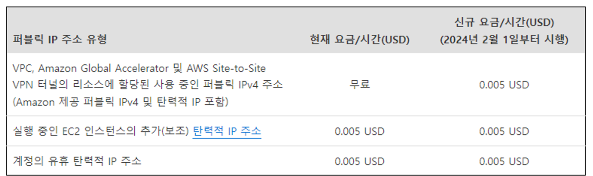
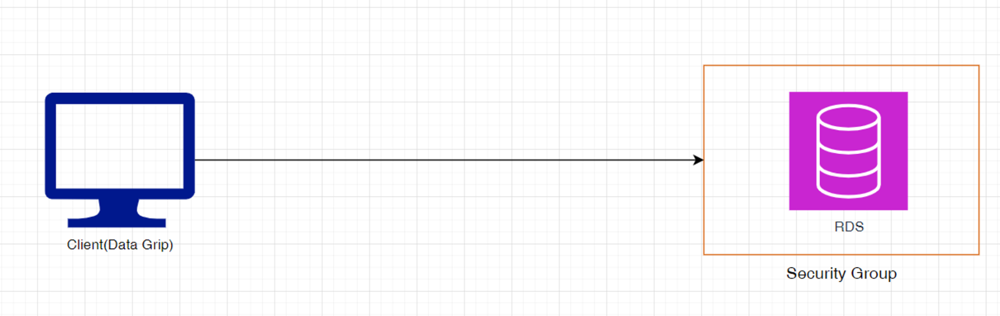
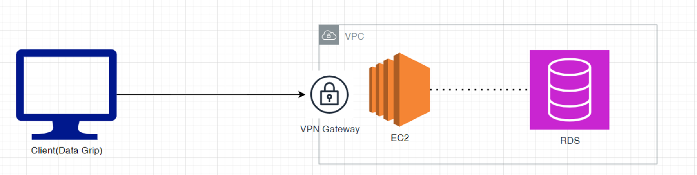

회사 직원과 토이프로젝트를 AWS를 사용하여 배포할려고 하였다. (feat. 프리티어)

하지만 과금되어서 이처럼 글로 적어본다.

## 1. USD 0.095 per GB-month of backup storage exceeding free allocation

**‘GB당 0.095달러의 백업 스토리지가 무료 할당을 초과합니다’**라는 말과 함께 과금되었다.

### 이유

인터넷에서 찾아보니

지금은 지워서 없지만, RDS의 DB인스턴스를 지우고 나서 **스냅샷**인가 남아있어서 과금되었다…. ㅠㅠ (RDS 백업에 대한 요금이라는데,,)

다음에는 DB인스턴스 지우고나서 스냅샷에 남아있는지 확인 해야할 것 같다.. ㅠㅠ

## 2. $0.005 per In-use public IPv4 address per hour

가장 많이 과금된 **‘$0.005 per In-use public IPv4 address per hour’ → ‘사용 중인 공용 IPv4 주소당 시간당 $0.005’** 이라는 항목으로 과금되었다… 😭

각종 Velog, 블로그들을 찾아가며, DB인스턴스를 구성했는데 과금이라니;;

사실 얼마 하지도 않지만,, 그냥 궁금한 마음에 AWS고객센터에 메일을 보내서 확인 해보았다.

### 이유

일단 2024년 2월 1일부로 요금 정책이 바뀐 것을 확인 할 수 있다.

해당 내용은 **[https://aws.amazon.com/ko/blogs/korea/new-aws-public-ipv4-address-charge-public-ip-insights/](https://aws.amazon.com/ko/blogs/korea/new-aws-public-ipv4-address-charge-public-ip-insights/)** 여기에서 확인 가능하다.

고객센터 문의 결과는 **EC2에 대해선 750시간 ‘Public IPv4’를 지원하지만, RDS는 지원하지 않는다는 답변이였다!!!!**

원래는 DB를 datagrip를 연결하여, ‘격자-위경도’ 엑셀 데이터를 DB에 import 할 생각에 퍼블릭으로 설정해놨었다. 대략 아래 같은 아키텍쳐이다.

하지만 EC2 인스턴스에 대해서는 **‘Public IPv4’**를 지원하기 때문에 아래처럼 아키텍처를 변경하였다.!! 🙉

### 결론
> - RDS 인스턴스 삭제 후 스냅샷도 남아있는지 확인
> - EC2를  Bastion Host 처럼 활용   (단, 사용시 RDS, EC2는 같은 VPC안에 소속되어 있지만, EC2가 RDS에 접속하려면 security group을 통해 허용되어야 한다!)
