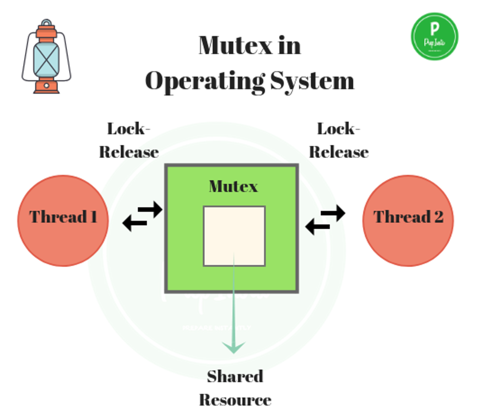
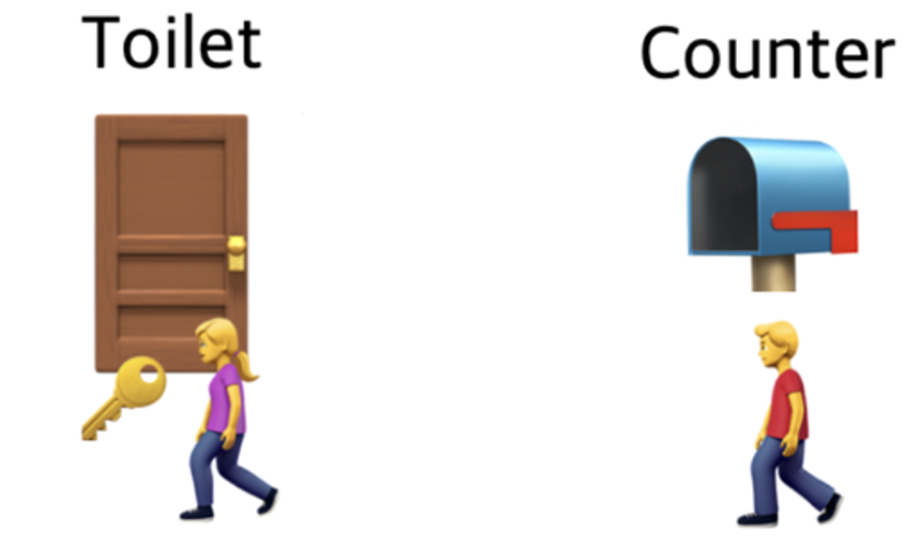
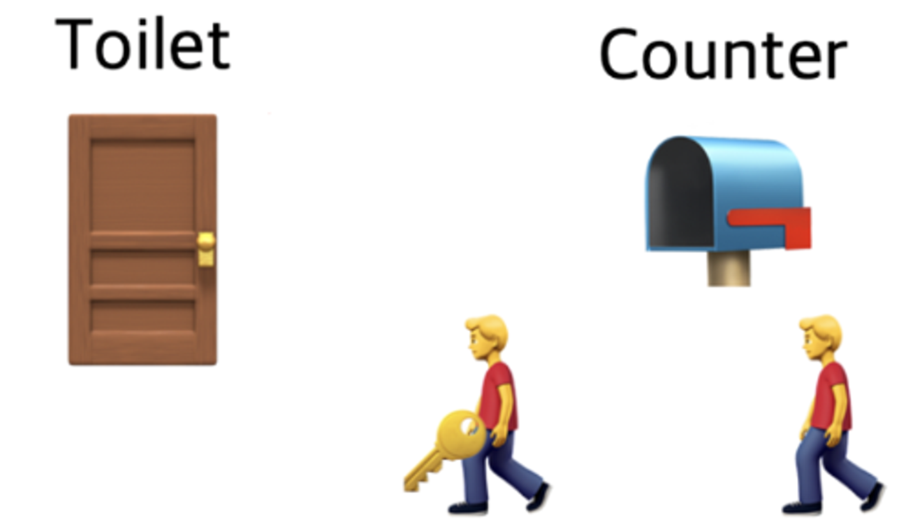
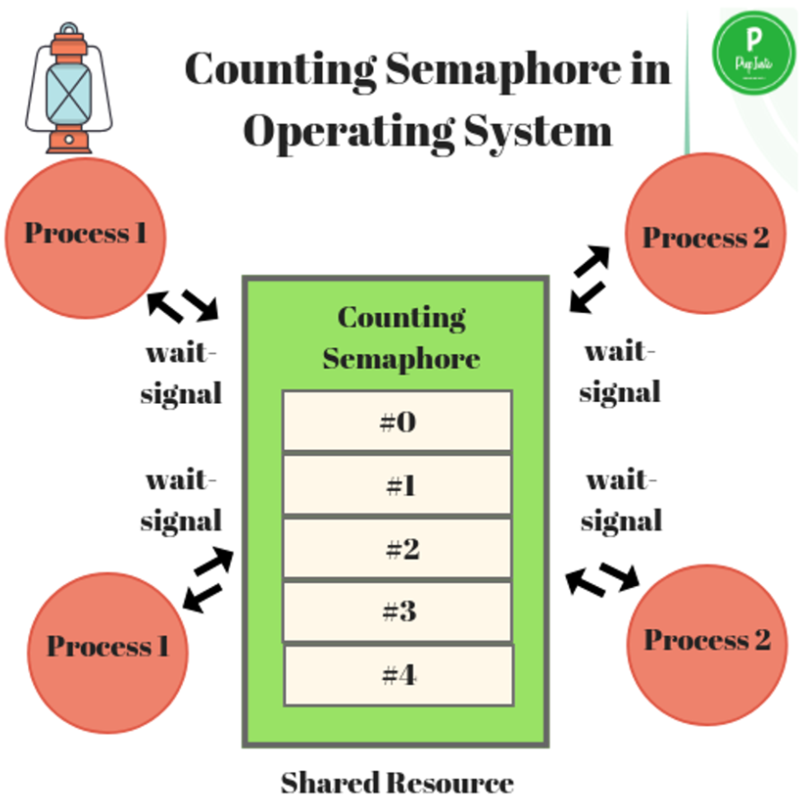
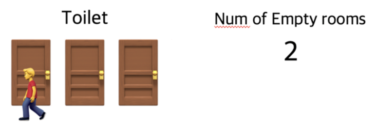
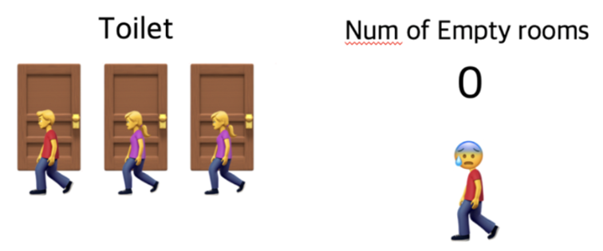

> 💡 프로세스 간 메시지를 전송하거나, 공유메모리를 통해 공유된 자원에 여러 개의 프로세스가 동시에 접근하면 임계영역(여러 프로세스가 데이터를 공유하며 수행될 때, 각 프로세스에서 공유 데이터를 접근하는 프로그램 코드 블록) 문제가 발생할 수 있다. 
이를 해결하기 위해 데이터를 한 번에 하나의 프로세스만 접근할 수 있도록 제한을 두는 동기화 방식을 취해야 한다. 
동기화 도구에는 대표적으로 **뮤텍스(Mutex)**와 **세마포어(Semaphore)**가 있다. 이들은 모두 공유된 자원의 데이터를 여러 스레드/프로세스가 접근하는 것을 막는 역할을 함

# 임계영역(**Critical Section**)

> 💡 **임계 영역**이란 한 순간 반드시 프로세스 하나만 진입해야 하는데, 프로그램에서 임계 자원을 이용하는 부분으로 공유 자원의 독점을 보장하는 코드 영역을 의미한다. 임계 구역은 지정된 시간이 지난 후 종료된다.

## 📌 임계 영역을 해결하기 위한 방법

- 뮤텍스, 세마포어, 모니터 등이 있다.
- 상호 배제, 한정 대기, 융통성이라는 조건을 만족한다.
1. 상호 배제 : 한 프로세스가 임계 영역에 들어갔을 때 다른 프로세스는 들어갈 수 없음.
2. 한정 대기 : 특정 프로세스가 영원히 임계 영역에 들어가지 못하면 안 됨.
3. 진행 : 임계 구역에 들어간 프로세스가 없는 상태에서, 들어가려고 하는 프로세스가 여러 개 있다면 어느 것이 들어갈지를 적절히 결정해주어야 한다.

4. 융통성 : 한 프로세스가 다른 프로세스의 일을 방해해서는 안 됨.

## 특징

- 커널 객체를 사용하지 않는다.
- 서로 다른 프로세스간에 접근이 불가하다**.**
- 내부적으로 인터락 함수를 사용하고 있다.
- 커널 오브젝트를 사용하지 않기 때문에 핸들을 사용하지 않고, CRITICAL_SECTION 이라는 타입을 정의하여 사용한다.

# 뮤텍스(mutex)

> 💡 뮤텍스는 Key 에 해당하는 어떤 오브젝트가 있으며 이 오브젝트를 소유한 (쓰레드,프로세스) 만이 공유자원에 접근할 수 있다.

: 공유된 자원의 데이터 혹은 임계영역(Critical Section) 등에 하나의 Process 혹은 Thread가 접근하는 것을 막아줌 (동기화 대상이 하나)

## 과정

- 1번 프로세스가 자원을 접근하기 위해 Key를점유한다.
- 1번 프로세스는 키를 점유했기 때문에 공유 자원을 사용한다.
- 2번 프로세스가 공유 자원을 사용하기를 원한다.
- 2번 프로세스는 키를 점유하기 위해 대기한다.
- 3번 프로세스 또한 공유 자원을 사용하기 위해 2번 프로세스 다음 순번으로 대기한다.
- 1번 프로세스가 공유 자원을 다 사용하고 Key를 반환한다.
- 2번 프로세스는 대기하고 있다가 반환된 Key를 점유하고 공유 자원을 사용한다.

## 예시

뮤텍스는 화장실이 하나 밖에 없는 식당과 비슷합니다. 화장실을 가기 위해서는 카운터에서 열쇠를 받아 가야 하며 당신이 화장실을 가려고 하는데 카운터에 키가 있으면 화장실에 사람이 없다는 뜻이고 당신은 그 열쇠를 이용해 화장실에 들어갈 수 있다고 가정합니다.

카운터에 열쇠가 없기 때문에 화장실에 사람이 있다는 뜻이며 화장실을 사용할 수 없습니다. 여자가 나올 때 까지 기다려야 합니다.

곧이어 다른 사람도 화장실에 가려고 카운터에 대기하고 있습니다. 앞사람이 화장실에서 나와 카운터에 키를 돌려놓았습니다. 이제 기다리던 사람들 중 맨 앞에 있던 사람이 키를 받아 화장실에 갈 수 있습니다.

이것이 뮤텍스가 동작하는 방식입니다. 화장실을 이용하는 사람은 프로세스 혹은 쓰레드이며 화장실은 공유자원, 화장실 키는 공유자원에 접근하기 위해 필요한 어떤 오브젝트입니다. 즉, 뮤텍스는 Key에 해당하는 어떤 오브젝트가 있으며 이 오브젝트를 소유한 (쓰레드,프로세스) 만이 공유자원에 접근할 수 있습니다.

# 세마포어(Semaphore)

> 💡 공유 리소스에 접근할 수 있는 최대 허용치 만큼 동시 사용자(쓰레드, 프로세스) 접근을 허용하게 한다.

: 공유된 자원의 데이터 혹은 임계영역(Critical Section) 등에 여러 Process 혹은 Thread가 접근하는 것을 막아줌 (동기화 대상이 하나 이상)

## 과정

- 공유 자원에 대한 최대 허용치를 정의한다. 우선, 3으로 해보겠다.
- 1번 프로세스가 공유 자원에 접근한다. 허용치는 2로 감소하였다.
- 2번 프로세스가 공유 자원에 접근한다. 허용치는 1로 감소하였다.
- 3번 프로세스가 공유 자원에 접근한다. 허용치는 0로 감소하였다.
- 4번 프로세스가 공유 자원에 접근한다. 허용치가 0이므로 대기한다.
- 2번 프로세스가 공유 자원을 다 사용하였다. 허용치는 1로 증가하였다.
- 4번 프로세스는 대기 하다 허용치가 1로 증가되어 공유 자원에 접근한다. 허용치는 다시 0으로 감소하였다.

## 예시

세마포어는 손님이 화장실을 좀 더 쉽게 이용할 수 있는 레스토랑입니다. 세마포어를 이용하는 레스토랑의 화장실에는 여러 개의 칸이 있고 화장실 입구에는 현재 화장실의 빈 칸 개수를 보여주는 전광판이 있다고 가정합니다.

만약 당신이 화장실에 가고 싶다면 입구에서 빈 칸의 개수를 확인하고 빈 칸이 1개 이상이라면 빈칸의 개수를 하나 뺀 다음에 화장실로 입장해야 하며 나올 때 빈 칸의 개수를 하나 더해줍니다.

모든 칸에 사람이 들어갔을 경우 빈 칸의 개수는 0이 되며 이때 화장실에 들어가고자 하는 사람이 있다면 빈 칸의 개수가 1 혹은 양수로 바뀔 때까지 기다려야 합니다.

이처럼 세마포어는 공통으로 관리하는 하나의 값을 이용해 상호배제를 달성합니다. 세마포어도 아까와 똑같이 화장실이 공유자원이며 사람들이 쓰레드, 프로세스이다. 그리고 화장실 빈칸의 개수는 현재 공유자원에 접근할 수 있는 쓰레드,프로세스의 개수를 나타냅니다.

# 뮤텍스와 세마포어의 차이

- 세마포어는 뮤텍스가 될 수 있지만, 뮤텍스는 세마포어가 될 수 없다.
- 세마포어는 소유할 수 없으며, 뮤텍스는 소유할 수 있고 소유주가 그에 대한 책임을 가진다.
- 세마포어는 동기화 대상이 여러개 일 때 사용하고, 뮤텍스는 동기화 대상이 오로지 하나 일 때 사용된다

가장 큰 차이점은 동기화 대상의 개수 즉, 위에서 예시든 화장실의 갯수 입니다.

Mutex는 동기화 대상이 오직 1개일 때 사용하며, Semaphore는 동기화 대상이 1개 이상일 때 사용합니다.
Mutex는 자원을 소유할 수 있고, 책임을 가지는 반면 Semaphore는 자원 소유가 불가합니다.
Mutex는 상태가 0, 1 뿐이므로 Lock을 가질 수 있고, 소유하고 있는 스레드만이 이 Mutex를 해제할 수 있습니다. 반면 Semaphore는 Semaphore를 소유하지 않는 스레드가 Semaphore를 해제할 수 있습니다.
Semaphore는 시스템 범위에 걸쳐 있고, 파일 시스템 상의 파일로 존재합니다. 반면, Mutex는 프로세스의 범위를 가지며 프로세스 종료될 때 자동으로 Clean up 됩니다.