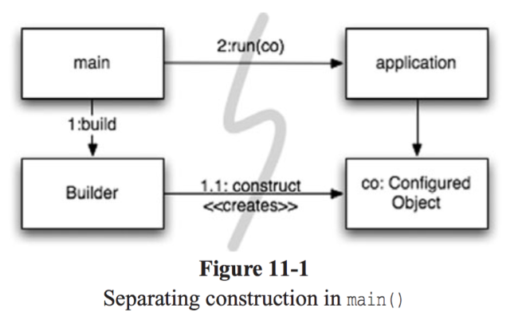
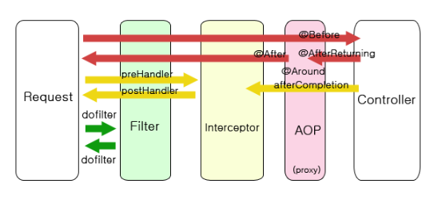
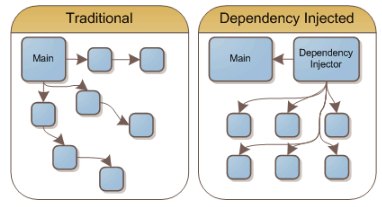
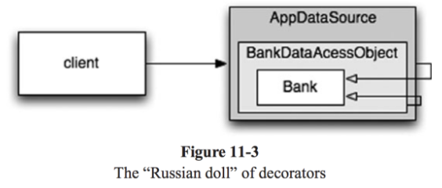

**Chapter 11. 시스템**<br>
**page 193 ~ 214**

>“복잡성은 죽음이다. 개발자에게서 생기를 앗아가며, 제품을 계획하고 제작하고 테스트하기 어렵게 만든다.”<br> 
**레이 오지(Ray Ozzie)**

## 서론: 도시 만들기
#### 도시를 세운다면?
도시를 세운다면 온갖 세세한 사항을 혼자서 직접 관리할 수는 없다.<br> 
이미 세워진 도시라도 한 사람의 힘으로는 무리다. 그럼에도 불구하고 도시는 돌아간다.<br>
도시가 돌아가는 이유에는 수도 관리, 전력 관리, 교통 관리 등 각 분야를 관리하는 팀이 있기 때문이다.<br> 
도시에는 큰 그림을 그리는 사람들도 있으며 작은 사항에 집중하는 사람들도 있다.<br>
도시가 돌아가는 또 다른 이유는 적절한 추상화와 모듈화 때문이다.<br> 
그래서 큰 그림을 이해하지 못하더라도 개인과 개인이 관리하는 ‘구성요소’는 효율적으로 돌아간다.
<br>

소프트웨어 팀도 도시처럼 구성한다. 그런데 막상 팀이 제작하는 시스템은 비슷한 수준으로 관심사를 분리하거나 추상화를 이뤄내지 못한다.<br> 
깨끗한 코드를 구현하면 낮은 추상화 수준에서 관심사를 분리하기 쉬워진다.<br> 
이 장에서는 높은 추상화 수준, 즉 시스템 수준에서도 깨끗함을 유지하는 방법을 살펴본다.


## 1. 관심사 분리
#### construction(생성)과 use(사용)은 아주 다르다
- 소프트웨어 시스템은 (어플리케이션 객체를 제작하고 의존성을 서로 '연결’하는) **준비 과정**과 (준비 과정 이후에 이어지는) **런타임 로직**을 분리해야 한다.
- **객체의 생성과 객체를 사용하는 부분을 분리한다**

### 1) 시작에 대한 관심사 분리

#### 객체의 생성은 시작단계에서, 비즈니스 로직은 객체를 사용하는데 집중한다
- 시작 단계는 모든 어플리케이션이 풀어야할 관심사이다.
- main 함수에서 시스템에 필요한 객체를 생성한 후 어플리케이션에 넘긴다.
- 어플리케이션은 그저 만들어진 객체를 사용한다.
- 모든 객체가 잘 생성되었다고 가정하고, 객체를 이용한 개발에 집중할 수 있다.

### 2) 요청에 대한 관심사 분리
#### spring 프레임 워크를 통해 요청에 대한 관심사를 분리해 요청 처리에 대한 비즈니스 로직에 집중할 수 있다


**Filter, lntercepter, AOP**
- 서블릿 필터는 Dispatcher Servlet 이전에 실행이 되는데, 요청 내용을 변경하거나 요청을 처리하기 전에 작업을 수행할 수 있다.
- Filter와 Interceptor는 Servlet 단위에서 실행된다. 반면 AOP 는 메소드 앞에서 Proxy 패턴으로 실행된다.
- 인터셉터는 여러 개를 사용할 수 있고 로그인 처리, 권한 체크, 프로그램 실행시간 계산작업, 로그 확인 등의 업무 처리에 활용된다.
- AOP는 메서드 앞에서 Proxy 패턴으로 실행된다. 주로 '로깅', '트랜잭션', '에러처리' 등 비즈니스 단의 메서드에서 조금 더 세밀하게 조정하고 싶을 때 사용한다. AOP는 주소, 파라미터, 어노테이션 등 다양한 방법으로 대상을 지정할 수 있다.

---

## 2. Dependency Injection(의존성 주입)

#### 객체 의존성을 DI 컨테이너에 맡긴다

- Setter 메소드 or 생성자 인수를 통해 의존성을 주입한다.
- DI 컨테이너는 요청이 들어올 때 필요한 객체의 인스턴스를 만든 후 의존성을 설정한다.
- 예 : Spring IOC Container

### Spring IoC Container


- DI 컨테이너가 객체를 알아서 wiring 해준다.

---

## 3. Cross Cutting Concerns(횡단 관심 분리)


#### 어플리케이션 전반에서 가지는 공통적인 관심사 분리한다.
- 비즈니스 로직 외에 Logging, Transaction 관리, Security 등 신경써야할 관심사들이 많다.
- 관심사들은 많은 어플리케이션 레이어에 퍼져있는데, 이 관심사들을 분리해 처리하는 것이 효율적이다.

### 횡단 관심사 분리의 필요성
#### 예제 1. before
```java
public Response executeBusinessLogic(Request request) {
  // 공통 기능
  checkAuth(request);

  // 비즈니스 로직
  Response response = businesslogic(userName, message);

  // 공통 기능
  logging(response);
}
```

#### 예제 2. after
```java
public Response executeBusinessLogic(Request request) {
  // 비즈니스 로직
  Response response = businesslogic(userName, message);
}

// 공통 기능은 별도의 코드에서 관리한다.
```
- 비즈니스 로직에 집중할 수 있다

### (Step.1) Java Proxy API
- 자바에서 사용하는 관점 혹은 관점과 유사한 매커니즘들을 알아보자.
- 자바 프록시는 단순한 상황에 적합한다.
- 개별 객체나 클래스에서 메서드 호출을 감싸는 경우가 좋은 예시이다.
- 하지만 JDK에서 제공하는 동적 프록시는 인터페이스만 지원하며, 클래스 프록시를 사용하려면 CGLIB, ASM, Javassist 등과 같은 바이트 코드 처리를 위한 라이브러리가 필요하다.
>참고<br/>
**CGLIB** : Code Generator Library의 약자로 런타임에 동적으로 자바 클래스의 프록시를 생성해준다.<br/>
**ASM** : 자바 바이트 코드 조직 및 분석 프레임워크<br/>
**Javassist** : 동적으로 자바 클래스로 변경하는 바이트 코드 라이브러리<br/>


#### Bank 객체에 Proxy API를 통해 영속성을 추가하는 과정
이해를 위해 계좌 목록을 가져오는 설정하는 메서드만 살펴보자.<br/>
먼저 프록시로 감쌀 Bank 인터페이스를 작성한다.
```java
// Bank.java
// 은행 추상화
import java.util.*;

public interface Bank {
    Collection<Account> getAccounts();
    void setAccounts(Collection<Account> accounts);
}
```
이후 비즈니스 로직을 구현하는 POJO인 BankImpl을 작성한다.
```java
// BankImpl.java
import java.util.*;

// 추상화를 위한 POJO 구현
public class BankImpl implements Bank {
    private List<Account> accounts;
    
    public Collectioin<Account> getAccounts() {
        return accounts;
    }
    public void setAccounts(Collection<Account> accounts) {
        this.accounts = new ArrayList<Account>();
        for (Account account: accounts) {
            this.accounts.add(account);
        }
    }
}
```
프록시를 구현하려면 InvocationHandler 를 구현해야 한다.<br/>
구현한 InvocationHandler는 프록시에 호출되는 Bank의 메서드를 구현하는데 사용한다.<br/>
BankProxyHandler는 리플렉션을 이용해 제네릭스 메서드를 이에 상응하는 BankImpl 메서드로 매핑한다.<br/>

```java
// BankProxyHandler.java

// 프록시 API가 필요한 "InvocationHandler"
public class BankProxyHandler implements InvocationHandler {
    private Bank bank;

    public BankProxyHandler(Bank bank) {
        this.bank = bank;
    }

    // InvocationHandler에 정의된 메서드
    public Object invoke(Object proxy, Method method, Object[] args) throw Throwable {
        String methodName = method.getName();
        if (methodName.equals("getAccounts")) {
          bank.setAccounts(getAccountsFromDatabase());
          return bank.getAccounts();
        } else if (methodName.equals("setAccounts")) {
          bank.setAccounts((Collection<Account>) args[0]);
          setAccountsToDatabase(bank.getAccounts());
          return null;
        } else {
          // ...
        }
    }

    // 세부사항은 여기에 이어진다.
    protected Collection<Account> getAccountsFromDatabase() {
        // ...
    }
    protected void setAccountsToDatabase(Collection<Account> accounts) {
        // ...
    }
}
```
```java
// 자바 Proxy API를 통해 호출
Bank bank = (Bank) Proxy.newProxyInstance(
    Bank.class.getClassLoader(),
    new Class[] { Bank.class }, 
    new BankProxyHandler(new BankImpl())
);
```

- lnvocationHandler를 구현하는 BankProxyHandler를 생성한다. Java Reflection API를 이용해 Bank 인터페이스를 구현하는 객체의 메서드 호출을 가져온다. 데이터 베이스에서 데이터를 가져오는 과정을 추가한다.
- ProxyAPI를 호출할 때 BankImpl 객체를 통해 생성한 BankProxyHandler와 Bank 인터페이스를 사용해 프록시된 인터페이스를 사용해 모델과 로직이 분리된 코드를 작성할 수 있다.<br/>
  ⇒ 보시다시피 장점대비, 코드의 복잡성이 아직도 있음
- 예제에서 알 수 있다시피, 자바 프록시는 코드의 양이 매우 커지는 것이 단점이다.

> **참고** <br> 
동적 프록시가 아닌 일반 프록시는 대상 클래스 수만큼 프록시 클래스를 만들어야하며, 비슷한 코드의 중복이 발생하기 쉽다.

### (Step.2) 순수 Java AOP Framework

#### 스프링 2.5 설정 파일의 일부
```xml
<beans>
    ...
    <bean id="appDataSource"
        class="org.apache.commons.dbcp.BasicDataSource"
        destroy-method="close"
        p:driverClassName="com.mysql.jdbc.Driver"
        p:url="jdbc:mysql://localhost:3306/mydb"
        p:username="me"/>
    
    <bean id="bankDataAccessObject"
        class="com.example.banking.persistence.BankDataAccessObject"
        p:dataSource-ref="appDataSource"/>
    
    <bean id="bank"
        class="com.example.banking.model.Bank"
        p:dataAccessObject-ref="bankDataAccessObject"/>
    ...
</beans>
```
- 각 bean은 러시아 인형의 일부분과 같다.
- Bank 도메인 객체는 bankDataAccessObject(DAO)로 감싸며, DAO는 JDBC 드라이버 데이터 소스로 감싸진 형태로 구성된다.


- 클라이언트는 Bank 객체에서 getAccount()를 호출한다고 믿지만 실제로는 Bank POJO의 기본 동작을 확장한 중첩 Decorator 객체 집합의 가장 외곽과 통신한다.
- 필요에 따라 트랜잭션, 캐싱 등에도 Decorator를 추가할 수 있다.

애플리케이션에서 DI 컨테이너에게 프록시 객체를 요청하려면 다음 코드가 필요하다
```java
  XmlBeanFactory bf = new XmlBeanFactory(new ClassPathResource("app.xml", getClass()));
  Bank bank = (Bank) bf.getBean("bank");
```
스프링 관련 자바 코드가 거의 필요 없으므로 애플리케이션은 **사실상 스프링과 독립적이다.**
- EJB2 시스템이 가졌던 강한 결합이라는 문제가 모두 사라진다.
- 이런 아키텍처를 통해 스프링 프레임워크는 EJB 버전 3을 완전히 뜯어고치는 계기를 제공했다.
<br/>
<br/>
- 순수 자바 관점을 구현하는 스프링 AOP, JBoss AOP 프레임워크는 내부적으로 프록시를 사용한다.
- 설정 파일이나 API를 사용해 객체의 역할을 설정한다
- Bank 객체는 DAO로 프록시되었다.
- 객체를 얻어올 때는 (XML 파일에 설정했던) DI 컨테이너에게 객체를 요청(getBean) 한다.
  <br/>
  <br/>
- 대부분의 프록시 코드는 비슷한 코드로 구성되어 있어 자동화가 가능하다.
- 스프링의 경우 비즈니스 로직을 POJO로 구현한다.
- POJO는 순수하게 도메인에 초점을 맞추기 때문에 엔터프라이즈 프레임워크에 의존하지 않는다. 따라서 테스트가 개념적으로 더 쉽고 간단한다. 
- 자바 프레임워크를 통해 영속성, 트랜잭션, 보안, 캐시, 예외 처리 등과 같은 횡단 관심사를 구현할 수 있다.

### (Step.3) EJB3 - JPA같은 객체 영속성 관리 표준 API

```java
@Entity
@Table(name = "BANKS")
public class Bank implements java.io.Serializable {
    @Id 
    @GeneratedValue(strategy=GenerationType.AUTO)
    private int id;
    
    @Embeddable // Bank의 데이터베이스 행에 '인라인으로 포함된' 객체
    public class Address {
        protected String streetAddr1;
        protected String streetAddr2;
        protected String city;
        protected String state;
        protected String zipCode;
    }
    
    @Embedded
    private Address address;

    @OneToMany(cascade = CascadeType.ALL, fetch = FetchType.EAGER, mappedBy="bank")
    private Collection<Account> accounts = new ArrayList<Account>();

    public int getId() {
        return id;
    }
    
    public void setId(int id) {
        this.id = id;
    }
    
    public void addAccount(Account account) {
        account.setBank(this);
        accounts.add(account);
    }
    
    public Collection<Account> getAccounts() {
        return accounts;
    }
    
    public void setAccounts(Collection<Account> accounts) {
        this.accounts = accounts;
    }
}
```
- EJB2 코드보다 훨씬 깔끔해졌다.
  - 모든 정보가 어노테이션 내부로 갈무리되어 코드가 깔끔해진 것이고, 그만큼 코드를 테스트하거나 유지보수하기 쉬워졌다.
- annotation에 있는 영속성 정보 전부 또는 일부를 XML 설정으로 옮겨도 된다.
  (실무에서는 annotation 사용을 선호한다)


### AspectJ 관점


관심사를 관점으로 분리하는 가장 강력한 도구는 AspectJ 언어이다.

AspectJ는 언어 차원에서 관점을 모듈화 구성으로 지원하는 자바 언어의 확장이다.

스프링 AOP와 JBoss AOP가 제공하는 순수 자바 방식은 관점이 필요한 상황의 80~90% 정도를 충족해준다.

AspectJ는 나머지 10%를 채워주는 좋은 도구이지만, 새로운 도구이니만큼 사용법과 언어 문법을 익혀야할 필요성은 있다.

AspectJ의 어노테이션 폼(annotation form)은 이 부담감을 경감시켜주긴 한다.

어노테이션 폼은 순수한 자바 코드에 자바 5 어노테이션을 사용해 관점을 정의하기에 AspectJ에 대해 미숙한 상태여도 쉽게 사용할 수 있도록 해준다.

