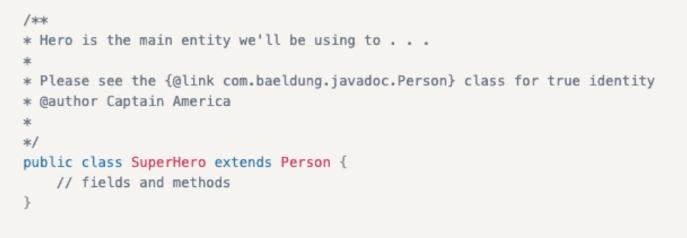
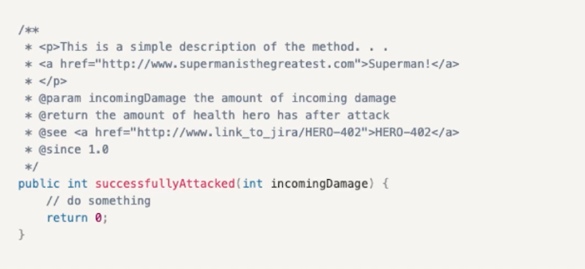

**Chapter 04. 주석**<br>
**page 67 ~ 94**

## 주석을 최대한 쓰지 말자

### 주석은 나쁜 코드를 보완하지 못한다.

```java
// 직원에게 복지 혜택을 받을 자격이 있는지 검사한다.
if((employee.flags && HOURLY_FLAG) && employee.age > 65)

// 의미있는 이름을 지으면 해결된다.
if(employee.isEligibleForFullBenefits())
```

코드에 주석을 추가하는 일반적인 이유는 코드 품질이 나쁘기 때문이다.
자신이 저지른 난장판을 주석으로 설명하지 말고 개선하는데 시간을 보내야 한다.
**코드로도 의도를 표현할 수 있다!**

### 주석은 방치된다.

코드의 변화에 따라가지 못하고, 주석은 방지된다.

코드는 컴파일되어 호출되지만, 주석은 그저 주석이기 때문에 그 자리에 방치되고 결국 의미없는 텍스트가 되어버린다.

## 좋은 주석

#### 구현에 대한 정보를 제공한다.

```java
// kk:mm:ss EEE, MMM DD, yyyy 형식
Pattern timeFormat = Pattern.comfile("\\d*:\\d:\\d* \\w*, \\w* \\d* \\d*");
```

#### 의도와 중요성을 설명한다.

```java
// 스레드를 많이 생성하여 시스템에 영향을 끼쳐 테스트를 만들도록 함
for(int i = 0; i < 25000; i++) {
	SomeThread someThread = ThreadBuilder.builder().build();
}

// 유저로부터 입력받을 값을 저장할 때 trim으로 공백제거 필요
String userName = userNameInput.trim();
```

#### //TODO //FIXME

- TODO : 앞으로 할일. 지금은 해결하지 않지만 나중에 해야할 일을 적어둘 때.

- FIXME : 문제가 있지만, 당장 수정할 필요는 없을때. 가능한 빨리 수정하는게 좋다.

## 주석보다 annotation

#### java.lang.annotation

annotation = 코드에 대한 메타 데이터

- 코드의 실행 흐름에 간섭을 주기도 하고, 주석처럼 코드에 대
  한 정보를 수 있다.

@Deprecated: 컴파일러가 warning을 발생시김. IDE에서 사용시 표시됨<br>
@NotThreadSafe: Thread Safe하지 않음을 나타냄<br> (책에서는 주석으로 표현했지만 어노테이션을 많이 사용)

@Immutable, @Nullable 등 java.lang.annotation 패키지의 어노테이션들을 사용하면
간단하면서 명료하게 주석보다 큰 효과를 얻을 수 있다.
## JavaDoc
**:Java 코드에서 API 문서를 HTML 형식으로 생성해 주는 도구<br>
IDE에서 Reader Mode로 주석 기호를 삭제하고 텍스트만 확인할 수 있다.**

#### Class level

#### Field level

#### Method level
