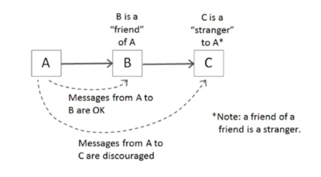
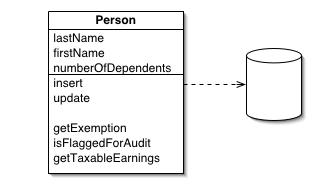
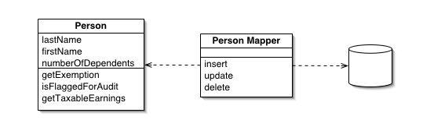

**Chapter 06. 객체와 자료구조**<br>
**page 117 ~ 128**


## 자료구조 vs 객체

| 자료구조 | 객체                                            |
| --- |-----------------------------------------------|
| 데이터 그 자체 | 비즈니스 로직과 관련                                   |
| 자료를 공개한다. | 자료를 숨기고, <br> 추상화한다.자료를 다루는 함수만 공개한다.         |
| 변수 사이에 조회 함수와 설정 함수로 변수를 다룬다고 객체가 되지 않는다(getter, setter) | 추상 인터페이스를 제공해 사용자가 구현을 모른 채 자료의 핵심을 조작할 수 있다. |

### 예시(1) Vehicle
#### 자료구조
- 단순히 getter, setter가 있다고 객체가 되지 않는다. (위에 내용 있음)
```java
public interface Vehicle {
        double getfuelTankCapacityInGallons(); // 연료탱트 용량(갤런 단위)
        double getGallonsOfGasoline(); // 가솔린 (갤런 단위)
}
public class Car implements Vehicle {
        double fuelTankCapacityInGallons;
        double gallonsOfGasoline;

        public double getFuealTankCapacityInGallons() {
            return this.fualTankCapacityInGallons;
        }

        public double getGallonsOfGasoline() {
            return this.gallonsOfGasoline;
        }
}
```


#### 객체
- 자신이 가진 값을 그대로 주는 것이 아닌, 연료를 퍼센트로 변환하는 로직이 들어있다.
```java
public interface Vehicle {
      double getPercentFuelRemain();
}
public class Car implements Vehicle {
        double fuelTankCapacityInGallons;
        double gallonsOfGasoline;
  
      public Car(double fuelTankCapacityInGallons, double gallonsOfGasoline) {
            if (fuelTankcapacityInGalons <= 0) {
                  throw new IllegalArgumentException("fuelTankCapacityInGallons은 0보다 커야한다.");
                  this.fuelTankCapacityInGallons = fuelTankCapacityInGallons;
                  this.gallonsOfGasoline = gallonsOfGasoline;
            }
        
            public double getPercentFuelRemain() {
                 return this.gallonsOfGasoline / this.fuelTankCapacityInGallons * 100;
            }
      }
}
```
- getPercentFuelRemain( ) : 자신이 가진 값을 바로 주는 것이 아니라 나름대로 값을 다뤄서 넘겨주게된다<br>
- Car() : 어떤 숫자를 0으로 나오면 무한대이기 때문에 error가 발생할 수 있다. Car의 인스턴스를 만들 때 이를 다룰 수 있는 예외를 설정해둔다.<br>
**=> 어떤 메소드를 구현할 때 수학적 오류는 없는지, 버그 발생 가능성은 없는지 확인하고 적절한 제어를 해주어야 한다.**<br>

🤚 휴대폰 배터리처럼 실제 수치는 중요하지 않고, 퍼센트만 중요하다면?<br>
-> data로 어떤 비즈니스로직을 다루어 필요한 값만 넘기는 방식인 '객체' 로 사용하는 것이 더 적절하다.<br>

### 예시(2) Shape

#### 자료구조

```java
public class Square {
        public Point topLeft;
        public double side;
}

public class Rectangle {
        public Point topLeft;
        public double height;
        public double width;
}

public class Circle {
        public Point center;
        public double radius;
}

public class Geometry { // * geometry : 기하학 
        public final double PI = 3.141592653589793;
 
        public double area(Object shape) throws NoSuchShapeException {
               if (shape instanceof Square){
                   Square s = (Square) shape;
                   return s.side * s.side;
               } else if (shape instanceof Rectangle) {
                   Rectangle r = (Rectangle) shape;
                   return r.height * r.width;
               } else if (shape instanceof Circle) {
                   Circle c = (Circle) shape;
                   return PI * c.radius * c.radius;
               }
               throw new NoSuchShapeException( );
        }
}
```

👌 절차적인 코드는 새로운 자료 구조를 추가하기 어렵다. 함수를 고쳐야 한다.<br>
-> else if ~~ 를 추가하며 함수를 고쳐야 한다.<br>

#### 객체

```java
public class Square implements Shape {
        private Point topLeft;
        private double side;
        
        public double area( ) {
           return side * side;
        }
}

public class Rectangle implements Shape {
        private Point topLeft;
        private double height;
        private double width;

       public double area( ) {
         return height * width;
       }
}

public class Circle implements Shape {
        private Point center;
        private double radius;
        private final double PI = 3.141592653589793;

       public double area( ) {
         return PI * radius * radius;
       }
}
```

👌 객체지향 코드는 새로운 클래스를 추가하기 쉽다. 하지만 함수를 추가해야한다. <br>
-> area() 라는 공통함수가 있다.<br>

#### 객체지향 vs 절차지향 : 상황에 맞는 선택을 하면 된다.<br>

• 자료구조를 사용하는 **절차적인 코드**는 기본 자료 구조를 변경하지 않으면서 새 함수를 추가하기 쉽다.<br>
• **절차적인 코드**는 새로운 자료 구조를 추가하기 어렵다. 그러려면 모든 함수를 고쳐야 한다.<br>

• **객체지향 코드**는 기존 함수를 변경하지 않으면서 새 클래스를 추가하기 쉽다.<br>
• **객체 지향 코드**는 새로운 함수를 추가하기 어렵다. 그러려면 모든 클래스를 고쳐야 한다.<br>

## 객체 - 디미터 법칙



#### 클래스 C의 메서드 f는 다음과 같은 객체의 메서드만 호출해야 한다<br>

• 클래스 C<br>
• 자신이 생성한 객체<br>
• 자신의 인수로 넘어온 객체<br>
• C 인스턴스 변수에 저장된 객체<br>
#### 휴리스틱 : 경험에 기반하여 문제를 해결하기 위해 발견한 방법. 의사 결정을 단순화하기 위한 법칙들

### 기차 충돌

#### 디미터의 법칙에 어긋나는 상황

연쇄 작용으로 인한 충돌

```java
// 객체 - 기차 충돌. 디미터의 법칙 위배 : 내가 가진 것이 가진 것을 가져오는 연쇄 작용(depth가 깊게 들어감)
final String outputDir = ctxt.getOptions().getScratchDir().getAbsolutePath();

// 자료구조 - OK
final String outputDir = ctxt.options().scratchDir().absolutePath;

// 객체에 대한 해결책이 아니다. getter를 통했을 뿐, 값을 가져오는 것은 자료구조처럼 구현한 것이다.
ctxt.getAbsolutePathOfScratchDirectoryOption();
ctxt.getOptions().getScratchDir().getAbsolutePath();

// 왜 절대 경로를 가져올까.. 근본 원인을 생각해보자! 파일을 생성하기위해!
// 객체는 자료를 숨기고 자료를 다루는 함수만 공개한다. 
BufferedOutputStream bos = ctxt.createScratchFileStreamFileStream(classFileName); // 해당 코드는 객체로서 옳은 방법
-> 인자(classFileName)만 넘기고 내부적인 코드들은 안에서 생성하여 묶어서 처리하는 방식으로 구현해 디미터의 법칙을 지키도록!
```

## DTO ; Data Transfer Object = 자료구조 = 데이터를 전달할 때 사용하는 객체

```java
public class AddressDto {
        private String street;
        private String zip;
        
        public AddressDto (String street, String zip ) {
           this.street = street;
           this.zip = zip ;
        } 

        public String getStreet( ) {
            return street;
        }

        public String setStreet(String street) {
            this.street = street;
        }

        public String getZip( ) {
            return zip;
        }

        public String setZip(String zip) {
            this.zip= zip;
        }
}
```

#### 다른 계층 간 데이터를 교환할 때 사용

• 로직 없이 필드만 갖는다.<br>
• 일반적으로 클래스명이 Dto(or DTO)로 끝난다.<br>
• getter/setter를 갖기도 한다.<br>

#### Beans

Java Beans: 데이터 표현이 목적인 자바 객체<br>
• 멤버 변수는 private 속성이다.<br>
• getter와 setter를 가진다.<br>

## Active Record

```java
public class Employee extends ActiveRecord{
        private String name;
        private String address;
        . . . . .
}
        
  Employee bob = Employee.findByName("Bob Martin");
  bob.setName("Robert C. Martin");
  bob.save( );
}
```

### Database row를 객체에 맵평하는 패턴
: 현업에서의 Repository, Entity와 유사

• 비즈니스 로직 에서드를 추가해 객체로 취급하는 건 바람직하지 않다.<br>
• 비즈니스 로직을 담으면서 내부 자료를 숨기는 객체는 따로 생성한다.<br>
• 하지만.. 객체가 많아지면 복잡하고, 가까운 곳에 관련 로직이 있는 것이 좋으므로 현업에서는 Entity에 간단한 메서드를 추가해 사용한다.<br>
• 예제에서는 db에 직접 접근해 값을 가져오기도하고 가져온 것을 바탕으로 세팅해주기도한다.<br>

### Active Record vs Data Mapper



### Active Record

: insert, update등 한 객체 안에서 사용함 (자바 개발하면서 보기 힘든 패턴) <br>
• 객체가 row를 담을 뿐 아니라 database에 대한 접근을 포함한다.<br>

• Person의 속성을 담을 뿐 아니라, 생성 수정도 객체 안에서 수행할 수 있다. <br>

• 사례 - Ruby on rails<br>



### Data Mapper

• row를 담는 객체와 database에 접근할 수 있는 객체가 분리되어 있다.<br>

• Person은 값만 담고 있고, 생성, 수정 등 액션은 Person Mapper에서 담당한다.<br>

• 사례 - Hibernate<br>