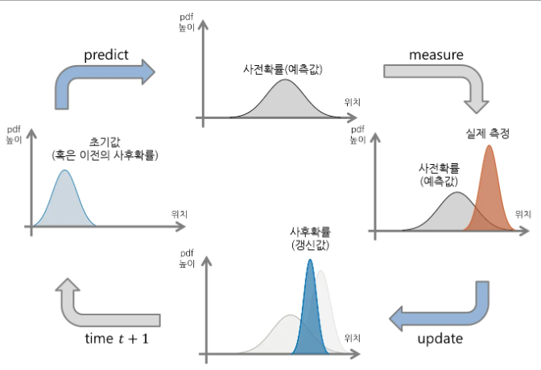

## 칼만 필터

- 칼만 필터는 잡음이 있는 측정에서 동적 시스템의 상태를 추정하는 데 사용되는 알고리즘
- 제어 시스템, 로봇 공학, 내비게이션 및 컴퓨터 비전에 널리 사용되고 있음. 필터는 예측-업데이트 주기로 작동하며 가우스 잡음이 있는 선형 방정식으로 모델링할 수 있는 시스템에 최적
- 칼만 필터는 일반적으로 위치, 속도 등과 같은 변수를 포함하는 시스템의 상태 벡터를 추정. 이 상태 벡터는 잡음이 있는 관찰을 기반으로 시간이 지남에 따라 업데이트 됨.

## 칼만 필터 계산 과정

칼만 필터는 두 가지 주요 단계로 작동

- 예측 단계: 이 단계에서는 시스템의 다음 상태와 불확실성(공분산)을 예측함
- 업데이트(수정) 단계: 이 단계에서는 새로운 측정 데이터를 사용하여 예측을 수정하고 상태 추정을 조정하며 불확실성을 줄임

### 변수

#### **상태 전이 매트릭스(A)**

시간이 지남에 따라 시스템 상태가 어떻게 변화하는지를 나타냄. 시간 단계 $dt$를 사용하여 현재 상태를 기반으로 다음 상태(예: 위치 및 속도)를 예측함

$$
A = \begin{bmatrix}
1&0&dt&0\\
0&1&0&dt\\
0&0&1&0\\
0&0&0&1\\
\end{bmatrix}
$$

- $A$는 현재 위치와 속도를 이용하여 다음 위치를 예측함
- 행렬은 일정한 속도를 가정함

#### **상태 벡터($x_k$)**

이 벡터에는 위치, 속도 등 시스템 상태에 대한 현재 추정치가 포함되어 있음. 예측과 측정을 기반으로 모든 단계에서 업데이트됨

$$
\hat{x}_{k∣k−1}=A\hat{x}_{k−1∣k−1}
$$

- $\hat{x}_{k∣k−1}$은 $k-1$ 시간의 상태를 기반으로 $k$ 시간의 예측 상태

#### **공분산 행렬(P)**

공분산 행렬은 상태 추정의 불확실성을 나타냄. 예측 중에 행렬은 시간이 지남에 따라 증가하는 불확실성을 반영하도록 업데이트됨

$$
P_{k∣k−1}=AP_{k−1∣k−1}A^T+Q
$$

- $P_{k∣k−1}$은 시간 $k$에서 상태의 예측 공분산(불확실성)
- $Q$는 시스템에 영향을 미치는 무작위 교란을 설명하는 프로세스 노이즈를 나타냄

#### **공정 소음 공분산(Q)**

시스템 모델 자체의 불확실성을 나타냄. 예측 단계 동안 시스템 역학의 무작위 변화를 설명하는 데 도움이 됨. $Q$ 값이 클수록 예측의 불확실성이 커짐

$$
Q = \begin{bmatrix}
{\sigma}^2_x&0&0&0\\
0&{\sigma}^2_y&0&0\\
0&0&{\sigma}^2_{v_x}&0\\
0&0&0&{\sigma}^2_{v_y}\\
\end{bmatrix}
$$

- 행렬 $Q$는 일반적으로 위치 불확실성에 대한 작은 값과 속도 불확실성에 대한 큰 값을 갖음

#### **측정 매트릭스(H)**

예측된 상태를 실제 측정값에 연결함. 상태 벡터를 측정된 양(예: 위치)에 매핑. 측정은 예측된 상태를 수정하는 데 도움이 됨

$$
⁍
$$

- $H$는 예측된 상태를 관찰 가능한 양(이 경우 위치만)으로 매핑하여 측정값 $z_k$를 예측하는 데 도움이 됨

#### **측정 잡음 공분산(R)**

행렬 $R$은 측정의 불확실성을 나타냄. 이는 측정 데이터의 노이즈가 얼마나 큰지를 반영하며, $R$이 클수록 측정의 신뢰성이 떨어진다는 의미

$$
R = \begin{bmatrix} \sigma_{z_x}^2 & 0 \\ 0 & \sigma_{z_y}^2 \end{bmatrix}
$$

- 매트릭스 $R$은 측정이 상태 업데이트에 얼마나 영향을 미치는지 결정하는 데 도움이 됩니다.

#### **칼만 게인(K):**

칼만 게인(Kalman Gain)은 예측과 측정의 가중치를 결정. 측정에 잡음이 있는 경우(높은 $R$) 이득은 예측에 더 많이 의존하게 됨. 반대로, 예측이 불확실한 경우(높은 $P$) 측정에 더 의존하게 됨.

$$
K_k = P_{k|k-1} H^T \left( H P_{k|k-1} H ^T + R \right)^{-1}
$$

- $K_k$는 측정값을 사용하여 예측 상태를 조정

#### **측정 잔차(Innovation):**

실제 측정값 $z_k$와 예측 측정값 $H\hat{x}_{k|k-1}$사이의 차이를 Innovation이라고 함. 이는 예측이 실제 관찰과 얼마나 멀리 떨어져 있는지 알려줌.

$$
\text{Innovation} = z_k - H \hat{x}_{k|k-1}
$$

- 이 잔차는 예측 상태를 조정하는 데 사용됨.

#### **업데이트된 주 추정치:**

측정값을 통합한 후 Kalman 필터는 Kalman Gain을 기반으로 예측된 상태를 수정하여 상태 추정을 업데이트함.

$$
\hat{x}_{k|k} = \hat{x}_{k|k-1} + K_k \left( z_k - H \hat{x}_{k|k-1} \right)
$$

- 새로운 상태 $\hat{x}_{k|k}$는 예측과 측정의 가중치 조합

#### **업데이트된 공분산 추정치**

공분산 행렬도 업데이트되어 새로운 측정값을 통합한 후 감소된 불확실성을 반영함.

$$
P_{k|k} = (I - K_k H) P_{k|k-1}
$$

- $P_{k|k}$는 수정 단계 후 감소된 불확실성을 반영하여 업데이트된 공분산

## 칼만 필터 단계

### 1. 예측 단계:

이 단계에서 필터는 다음 상태를 예측하고 공분산 행렬을 업데이트하여 이 예측에 대한 불확실성을 반영

#### 1.1 상태 예측:

$$
\hat{x}_{k∣k−1}=A\hat{x}_{k−1∣k−1}+Buk
$$

- $\hat{x}_{k∣k−1}$*은 k 시간의 예측 상태*
- *A는 상태 전이 행렬*
- $\hat{x}_{k∣k−1}$*은*은 시간 k-1에서의 이전 상태 추정치
- $Bu_k$는 선택적 제어 입력(간단한 모델에서는 종종 생략됨).

#### 1.2 공분산 예측:

$$
P_{k∣k−1}=AP_{k−1∣k−1}A^T+Q
$$

- $P_{k∣k−1}$은 시간 $k$에서의 예측 공분산 행렬
- $P_{k-1∣k−1}$은 이전 공분산 행렬
- $Q$는 프로세스 노이즈 공분산 행렬

### 2. 업데이트(수정) 단계:

새로운 측정값 $z_k$를 사용할 수 있게 되면 필터는 이 새로운 정보를 기반으로 예측을 수정함.

#### 2.1 칼만 게인:

$$
Kk=P_{k∣k−1}H^T(HP_{k∣k−1}H^T+R)^{−1}
$$

- $K_k$는 $k$ 시간에서의 칼만 게인(Kalman Gain)
- $H$는 관측 행렬
- $R$은 측정 잡음 공분산 행렬

#### 2.2 상태 업데이트:

$$
\hat{x}_{k∣k}=\hat{x}_{k∣k-1}+K_k(z_k−H\hat{x}_{k∣k-1})
$$

- $*\hat{x}_{k∣k}$는 새로운 측정 $z_k$를 통합한 후 업데이트된 상태 추정*
- $*z_k-H\hat{x}_{k∣k-1}*$은 혁신 또는 입니다 측정 잔차, 실제 측정값과 예측 측정값의 차이

#### 2.3 공분산 업데이트:

$$
P_{k∣k}=(I−K_kH)P_{k∣k−1}
$$

- $P_{k∣k}$는 수정 후 업데이트된 공분산 행렬
- $I$은 항등 행렬

## 공식 순서 요약:

### 예측 단계:

- $\hat{x}_{k∣k-1}=A\hat{x}_{k∣k-1}+Bu_k​$
- $P_{k∣k-1}=AP_{k-1∣k−1}A^T+Q$

### 업데이트 단계:

- $K_k​=P_{k∣k−1}​H^T(HP_{k∣k−1}​H^T+R)^{−1}$
- $\hat{x}_{k∣k}=\hat{x}_{k∣k-1}+K_k(z_k-H\hat{x}_{k|k-1})$
- $P_{k|k}=(I-K_kH)P_{k|k-1}$

- 예측 단계는 시스템의 미래 상태를 예측하고 업데이트 단계는 새로운 측정값을 기반으로 예측을 수정함.
- 칼만 필터는 예측 단계와 업데이트 단계를 번갈아 가며 작동함. 예측 단계에서는 시스템 모델을 사용하여 다음 상태를 추정하고, 업데이트 단계에서는 실제 측정값을 기반으로 이 추정치를 개선하여 시스템 예측과 관찰 정확도 간의 균형을 맞춤.
- 이를 통해 필터는 노이즈가 있는 경우에도 객체의 상태(예: 위치 및 속도)를 높은 정확도로 추적할 수 있음.

## 구현 코드

### MultiObjectKalmanFilter Class

```java
package com.eastwoo.kalman_conversion;

import lombok.ToString;
import org.apache.commons.math3.linear.*;

@ToString
public class MultiObjectKalmanFilter {
    private RealMatrix A; // 상태 전이 행렬
    private RealMatrix H; // 관측 행렬
    private RealMatrix Q; // 프로세스 노이즈 공분산 행렬
    private RealMatrix R; // 측정 노이즈 공분산 행렬
    private RealMatrix P; // 추정 공분산 행렬
    private RealVector x; // 상태 벡터 (위치와 속도)

    private double dt; // 시간 간격

    public MultiObjectKalmanFilter(double dt, double initialX, double initialY) {
        this.dt = dt;

        // 상태 전이 행렬 (A)
        A = new Array2DRowRealMatrix(new double[][] {
                {1, 0, dt, 0},
                {0, 1, 0, dt},
                {0, 0, 1, 0},
                {0, 0, 0, 1}
        });

        // 관측 행렬 (H)
        H = new Array2DRowRealMatrix(new double[][] {
                {1, 0, 0, 0},
                {0, 1, 0, 0}
        });

        // 프로세스 노이즈 공분산 행렬 (Q)
        Q = new Array2DRowRealMatrix(new double[][] {
                {1e-4, 0, 0, 0},
                {0, 1e-4, 0, 0},
                {0, 0, 1e-2, 0},
                {0, 0, 0, 1e-2}
        });

        // 측정 노이즈 공분산 행렬 (R)
        R = new Array2DRowRealMatrix(new double[][] {
                {1e-1, 0},
                {0, 1e-1}
        });

        // 추정 공분산 행렬 (P)
        P = new Array2DRowRealMatrix(new double[][] {
                {1, 0, 0, 0},
                {0, 1, 0, 0},
                {0, 0, 1, 0},
                {0, 0, 0, 1}
        });

        // 초기 상태 벡터 (x) - 초기 위치를 설정
        x = new ArrayRealVector(new double[] {initialX, initialY, 0, 0}); // vx, vy는 0으로 설정
    }

    // 측정값을 사용해 칼만 필터 업데이트
    public void update(double[] z) {
        RealVector zVec = new ArrayRealVector(z);

        // 예측 단계
        x = A.operate(x); // 상태 예측
        P = A.multiply(P).multiply(A.transpose()).add(Q); // 공분산 예측

        // 업데이트 단계
        RealMatrix S = H.multiply(P).multiply(H.transpose()).add(R); // 혁신 공분산
        RealMatrix K = P.multiply(H.transpose()).multiply(new LUDecomposition(S).getSolver().getInverse()); // 칼만 이득
        RealVector y = zVec.subtract(H.operate(x)); // 혁신
        x = x.add(K.operate(y)); // 상태 갱신
        P = MatrixUtils.createRealIdentityMatrix(P.getRowDimension()).subtract(K.multiply(H)).multiply(P); // 공분산 갱신
    }

    // 현재 상태 추정값 반환 (위치와 속도)
    public double[] getStateEstimate() {
        return x.toArray();
    }

    public void setDt(double dt) {
        this.dt = dt;
    }
}
```

### Client Class

```java
package com.eastwoo.kalman_conversion;

import java.util.HashMap;
import java.util.Map;

public class KalmanFilterExample {
    public static void main(String[] args) {
        // 시간 간격 (초 단위)
        double dt = 1.0;

        // 여러 차량에 대한 칼만 필터 초기화
        Map<String, MultiObjectKalmanFilter> kalmanFilters = new HashMap<>();

        // 예시 데이터: [id, timestamp, x, y] 경위도 위치
        Object[][] measurements = {
                {"vehicle_1", "20240810T000422.613", 10.0, 5.0},
                {"vehicle_2", "20240810T000422.613", 20.0, 15.0},
                {"vehicle_1", "20240810T000423.613", 10.2, 5.3},
                {"vehicle_2", "20240810T000423.613", 20.1, 15.2},
                {"vehicle_1", "20240810T000424.613", 10.4, 5.6},
                {"vehicle_2", "20240810T000424.613", 20.3, 15.4},
                {"vehicle_1", "20240810T000425.613", 10.6, 5.9},
                {"vehicle_2", "20240810T000425.613", 20.5, 15.6}
        };

        // 각 차량의 측정값에 대해 칼만 필터 업데이트
        System.out.println("ID\tTrue Position\tMeasured Position\tEstimated Position");
        for (Object[] measurement : measurements) {
            String vehicleId = (String) measurement[0]; // 차량 ID
            double measuredX = (double) measurement[2]; // 측정된 x 좌표
            double measuredY = (double) measurement[3]; // 측정된 y 좌표

            // 차량 ID에 따라 칼만 필터 초기화 또는 가져오기
            kalmanFilters.putIfAbsent(vehicleId, new MultiObjectKalmanFilter(dt, measuredX, measuredY));
            MultiObjectKalmanFilter kalmanFilter = kalmanFilters.get(vehicleId);

            // 측정값으로 칼만 필터 업데이트
            kalmanFilter.update(new double[]{measuredX, measuredY});

            // 추정된 상태 가져오기
            double[] estimatedState = kalmanFilter.getStateEstimate();
            double estimatedX = estimatedState[0]; // 추정된 x 위치
            double estimatedY = estimatedState[1]; // 추정된 y 위치

            // 결과 출력
            System.out.printf("%s\t(%.2f, %.2f)\t(%.2f, %.2f)\t(%.2f, %.2f)\n",
                    vehicleId, measuredX, measuredY, estimatedX, estimatedY);
        }
    }
}

```

## 참고 문헌

- https://angeloyeo.github.io/2021/04/07/Kalman_filter.html