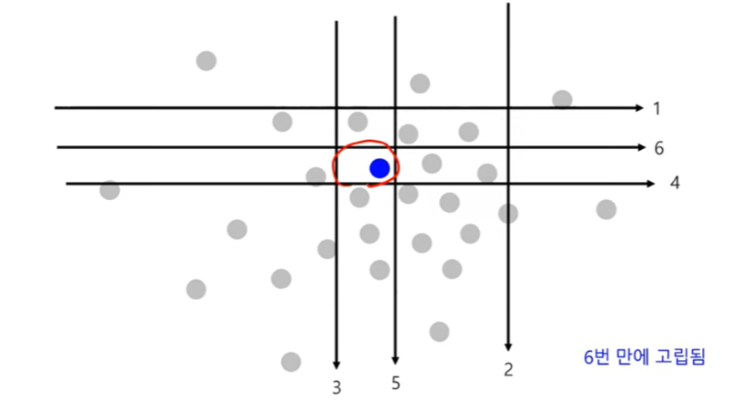
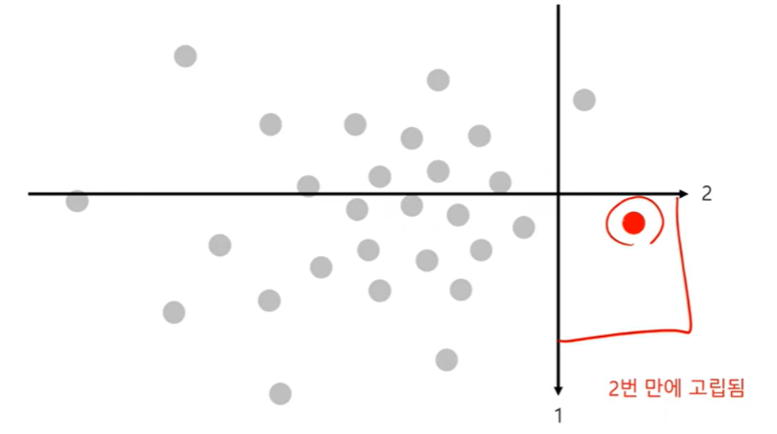
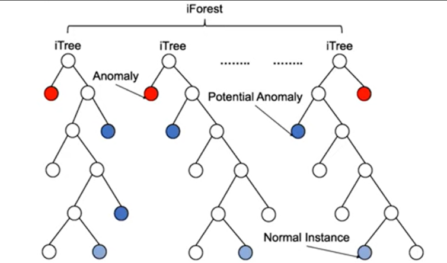
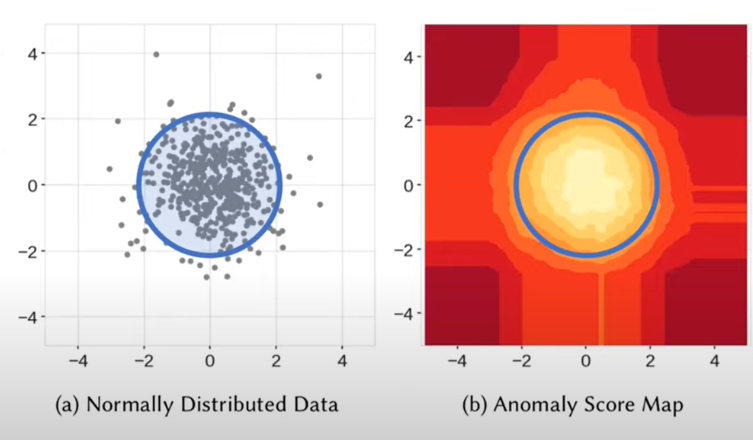

# Introduction

Anomaly Detection의 방법론 소개로 Model-based Methods의 **Isolation Forest**에 대해 살펴보도록 하겠습니다.

[Liu, Fei Tony et al. “Isolation Forest.” *2008 Eighth IEEE International Conference on Data Mining* (2008): 413-422.](https://www.semanticscholar.org/paper/Isolation-Forest-Liu-Ting/00a1077d298f2917d764eb729ab1bc86af3bd241) 논문과 [고려대학교 김성범 교수님의 자료](https://www.youtube.com/watch?v=wADcqMdpuv4&t=2177s&ab_channel=%E2%80%8D%EA%B9%80%EC%84%B1%EB%B2%94%5B%EA%B5%90%EC%88%98%2F%EC%82%B0%EC%97%85%EA%B2%BD%EC%98%81%EA%B3%B5%ED%95%99%EB%B6%80%5D)를 참고했습니다.

# Isolation Forest

> 💡 한 객체를 고립시키는 의사결정나무 모델을 구축하는 방법론

- 가정 : **정상 관측치**는 고립되기 어려울 것이다. ⇒ **정상 관측치**를 고립시키기 위해서는 2진 분할을 여러 번 수행해야 한다.

- 가정 : **이상치**는 쉽게 고립될 것이다 ⇒ **이상치**를 고립시키기 위해서는 2진 분할을 작게 수행해도 된다.

- 관측치를 고립시키기 위한 **분리 횟수를 이상치 점수로 활용**

- Y변수(레이블 정보) 없이 어떻게 iForest 모델을 구축?
    - 전체 데이터에서 일부 관측치를 랜덤하게 선택 (예: 1,000개 데이터에서 700 랜덤하게 선택)
    - 랜덤하게 선택된 관측치에 대해 임의의 변수(splitting variable)와 분할점(splitang point)을 사용하여 다음 조건을 만족할 때까지 이진분할 진행
        - 의사결정나무모델이 사전 정의된 깊이에 도달
        - 모든 터미널 노드에 관측치에 1개씩 존재
        - 모든 터미널 노드에 존재하는 관측치들이 같은 입력변수
    - 위와 같은 과정으로 여러 개의 iTree 구축
    - iTree 마다 각 관측치의 path length를 저장

- 이상치 스코어를 어떻게 정의?
    - Path length를 기반으로 anomaly score 정의
    - Path length (=$h(x)$): Root node로 부터 관측치 x가 속해 있는 terminal node까지 거
      쳐간 edge(branch)의 수 ( x가 고립될 때까지 필요한 분할 횟수)
    - Normalized $h(x)$: $c(n)$ = $2H(n - 1) - \left\{\frac{2(n-1)}{n}\right\}$(모든 관측치들의 평균 path length)
      $H(i) = ln(i) + 0.5772156649$ (Euler's constant; 오일러 상수)
    - Anomaly score $s(x,n)$ = $2 c(n)^\frac{-E(h(x))}{c(n)}$ , $E(h(x))$ is the average of $h(x)$
        - $E(h(x))$ → 0, $s(x,n)$ → $2^0$ → 1 (path length의 **평균값이 0에 가까움으로 이상 데이터**)
            - $E(h(x))$ → $n-1$ , $s(x,n)$ → $2^{-大}$ → 0 (path length의 **평균값이 n에 가까움으로 정상 데이터**)
        - $E(h(x))$ → $c(n)$, $s(x, n)$ → $2^{-1}$ → 0.5 (path length의 평균값이 normalized h(x)와 비슷함으로 **정상 데이터**)

- 실제 데이터로 이상치 점수를 추정한 결과 예시

  

→ 낮은 이상치 점수를 보이는 정상 관측치들

# 참조 문헌

> 📚  
> 📖 [[핵심 머신러닝 ] Anomaly Detection - Local Outlier Factor (LOF) - 김성범](https://www.youtube.com/watch?v=VZWQfQHsGGY&ab_channel=%E2%80%8D%EA%B9%80%EC%84%B1%EB%B2%94%5B%EA%B5%90%EC%88%98%2F%EC%82%B0%EC%97%85%EA%B2%BD%EC%98%81%EA%B3%B5%ED%95%99%EB%B6%80%5D)  

