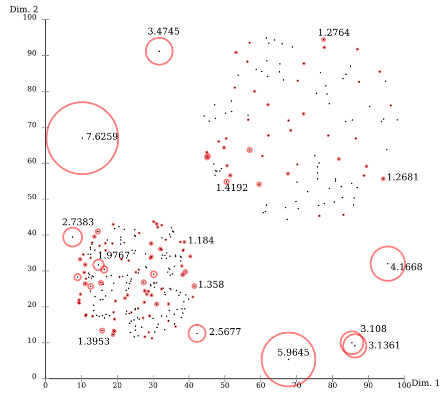

## Introduction

Anomaly Detection의 방법론 소개로 Density-based Methods의 **LOF(Local Outlier Factor)**에 대해 살펴보도록 하겠습니다.

[Breunig, M. M., Kriegel, H. P., Ng, R. T., & Sander, J. (2000, May). LOF: identifying density-based local outliers. In Proceedings of the 2000 ACM SIGMOD international conference on Management of data (pp. 93-104).](https://dl.acm.org/doi/abs/10.1145/342009.335388) 논문과 [고려대학교 김성범 교수님의 자료](https://www.youtube.com/watch?v=wADcqMdpuv4&t=2177s&ab_channel=%E2%80%8D%EA%B9%80%EC%84%B1%EB%B2%94%5B%EA%B5%90%EC%88%98%2F%EC%82%B0%EC%97%85%EA%B2%BD%EC%98%81%EA%B3%B5%ED%95%99%EB%B6%80%5D)를 참고했습니다.

## Anomaly Detection 이상치 탐지

> 💡 쉽게 말해, 데이터 안에서 Normal(정상) sample과 Abnormal(비정상, 이상치, 특이치) sample을 구별해내는 문제를 의미합니다.<br/> 즉, 매우 많은 정상 데이터에서 극소수의 비정상 데이터를 구별하는 것이 목적입니다.

## Local Outlier Factor (LOF)

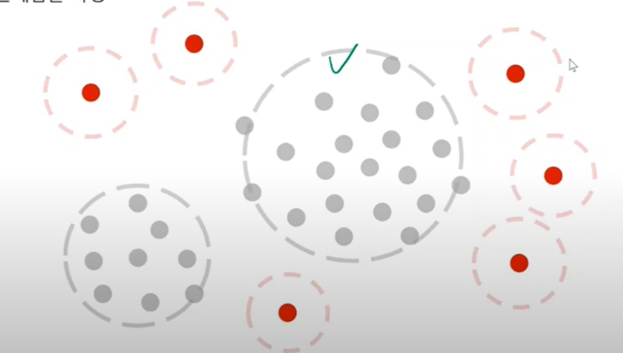

### Notion
> 💡 한 객체 **주변 데이터 밀도**를 고려한 이상치 탐지 알고리즘 <br/>
> 💡 **정상 객체**는 주로 주변에 데이터가 많이 존재하며, **불량 객체**는 주로 단독으로 존재함을 가정


- 각각의 관측치가 데이터 안에서 얼마나 벗어나 있는가에 대한 정도(이상치 정도)를 나타냅니다. <br/> LOF의 가장 중요한 특징은 모든 데이터를 전체적으로 고려하는 것이 아니라, **해당 관측치의 주변 데이터(neighbor)를 이용하여 국소적(local) 관점으로 이상치 정도를 파악**하는 것입니다.
- 정상객체는 주로 주변에 데이터가 많이 존재하며, 불량 객체는 주로 단독으로 존재함을 가정합니다.
- 주변 데이터를 몇개까지 고려할 것인가를 나타내는 k라는 하이퍼-파라미터(hyper-parameter)만 결정하면 되는 장점이 있습니다.
- 데이터가 많아질수록 계산복잡도가 올라가는 알고리즘입니다.
- 데이터가 고차원인 경우, 저차원으로 차원 축소하여 시행하는 것이 좋습니다.

## Motivation

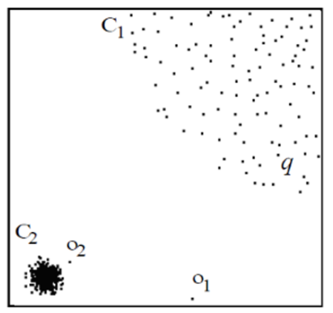

- 집단 C1 과 집단 C2의 density(밀도)가 다르며, 데이터 o1은 눈에 띄게 다른 데이터와의 거리가 멀기에 걸러내기 쉽지만 데이터 o2는 걸러내기가 어렵습니다. <br/> 일정 거리로 기준을 삼을 경우, C1혹은 C2에만 특화된 outlier detction을 하게 됩니다. <br/> 이러한 문제의식에서, local의 상대적인 dense를 비교하여 outlier를 정하자는 lof가 등장했습니다. 큰 틀은, neighbor들의 dense를 고려하여 비교한다는 것입니다.

### Algorithm

#### 1. K-distance of object p

> 자기 자신(*p*)를 제외하고 k번째로 가까운 이웃과의 거리

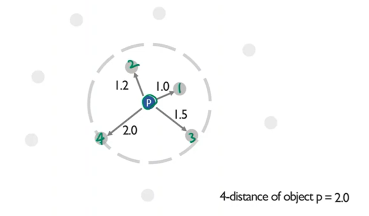

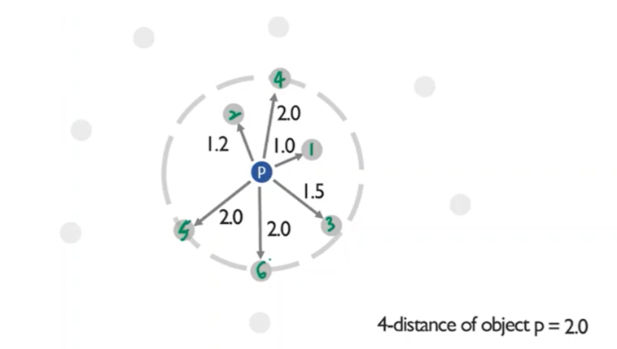

- 예시 : 4-distance of object p : 자기 자신을 제외한 4번째로 가까운 이웃과의 거리 = 2.0
- 주의사항 : distance가 continuous라면 3-distance내에 정확히 3개의 neighbor가 들어있겠지만, 거리가 1,2,3,3,3,3같이 discrete해서 겹치는 경우라면 3-distance내에 5개든 10개든 neighbor로 들어있을 수는 있습니다. 이를 따로 나타내주기 위해 k-distance(p)안에 들어온 데이터갯수를 *Nk*,(*p*)라고 부른다.

#### 2. K-distance neighborhood of object p ($N_k,(p)$)

> k번째로 가까운 이웃과의 거리를 원으로 표현할 때, 원 안에 포함되는 모든 객체들의 개수

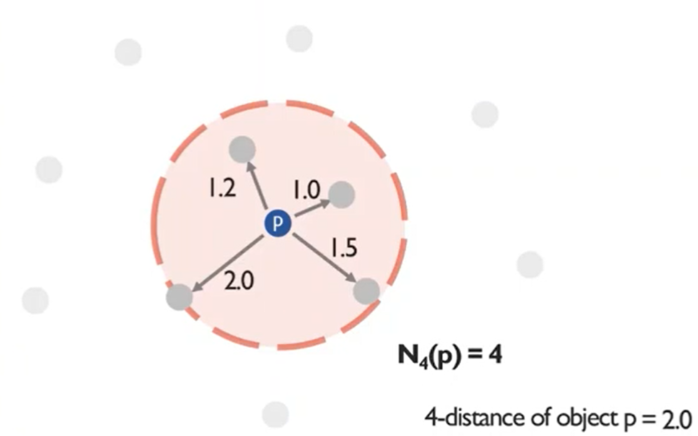

- 예시 : k = 4일 때, $N_4(p)$= 4개 포함

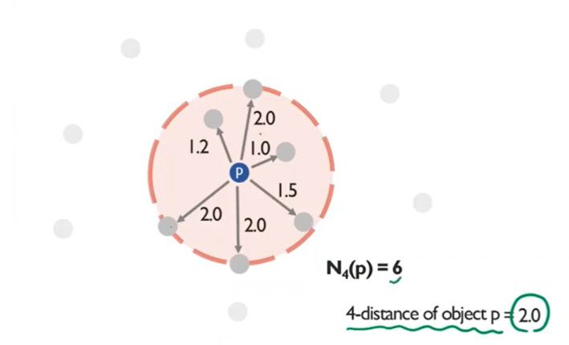

- 예시 : k = 4일 때, $N_4(p)$= 6개 포함

#### 3. Reachabillity Distance ($Reachabillity \ distance_k(p,o)$)

- **주변 데이터 o를 기준으로** k번째 가까운 이웃과의 거리(k-distance of o)와 o와 p사이 거리 간의 **최대값**
    - $Reachabillity \ distance_k(p,o) = max(k−distance \ of \ o,d(p,o))$

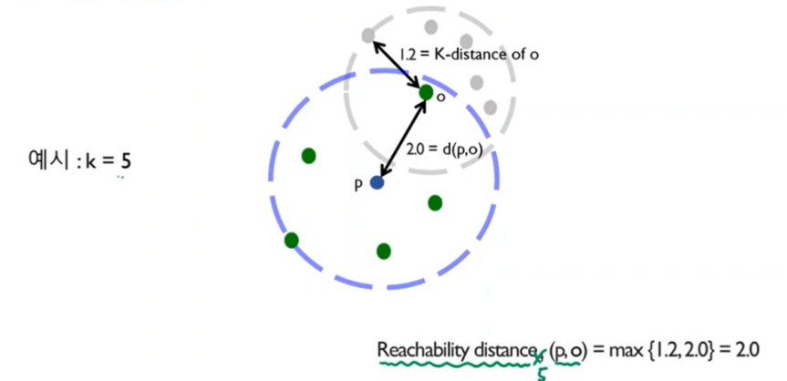

- 예시 : k = 5일 때, k-distance of o는 1.2, $d(p,o)$는 2.0이다. $Reachabillity \ distance_5(p,o)=max(1.2,2.0)=$$2.0$

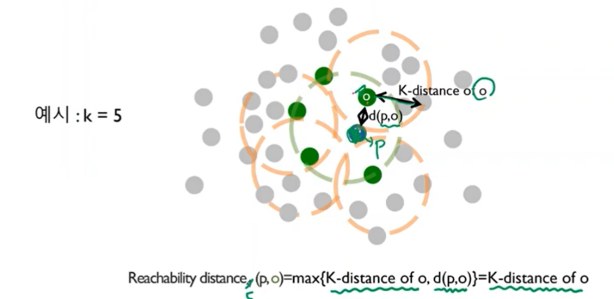

#### 4. Local reachabillity density of object p ($lrd_k(p)$)

- 여러 reachability distance를 하나의 지표로 계산한 값
- p 주변의 k neighbor들과의 reach_dist의 평균을 inverse(역수)취한 것입니다.

  주변의 dense를 고려한 p점에서의 ‘neighbor들과의 적당한 거리’를 나타낼 수 있습니다.

- lrd는 inverse입니다.
    - $lrd_k(p)= \frac{∣N_k(p)∣}{\sum_{o∈N_k(p)}Reachabillity \ distance_k(p,o)}$

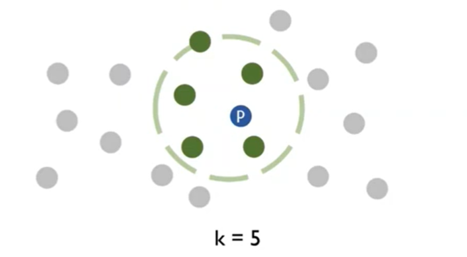

- 자기 자신(p) 주변의 밀도가 높은 경우, 위 식의 분모가 작아지게 되어 $lrd_k(p)$값이 커지게 됩니다. => **정상**

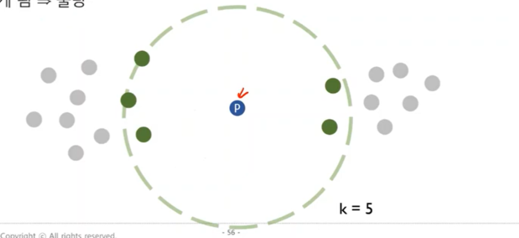

- 반대로 자기 자신(p) 주변의 밀도가 낮은 경우, 위 식의 분모가 커지게 되어 $lrd_k(p)$값이 작아지게 됩니다. => **비정상**

#### 5. Local Outlier Factor of object p ($LOF_k(p)$)

- 자기 자신(p)의 최종 Local Outlier Factor값을 계산
- $LOF_k(p)= \frac{\sum_{o∈N_k(p)}lrd_k(o),lrd_k(p)}{∣N_k(p)∣}$
- Case 1: 자기 자신(p) 주변의 밀도가 높은 경우 ⇒ 큰 $lrd_k(p)$

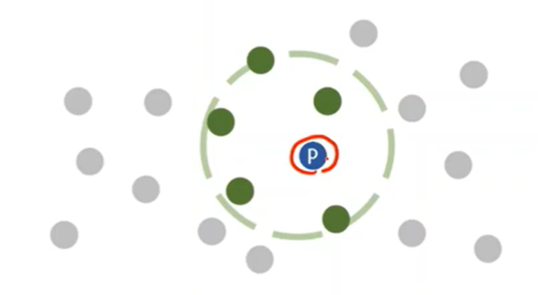

- Case 1: 자기 자신(p) 주변의 밀도가 높은 경우 ⇒ 큰 $lrd_k(p)$

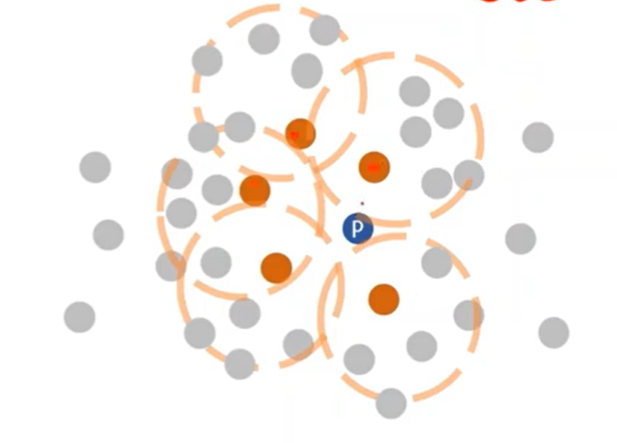

- Case 1: 자기 자신(p) 주변의 밀도가 높은 경우, 큰 $lrd_k(o)$, 큰 $lrd_k(p)$ = 1근방의 $LOF_k(p)$값을 갖습니다.
- 주변의 밀도가 높은 경우 $lrd_k(o)$과 $lrd_k(p)$이 모두 큼

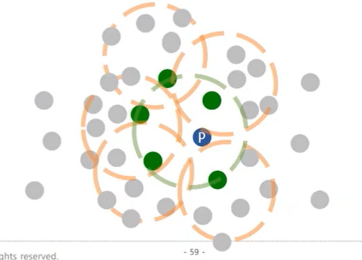

- Case 2: 자기 자신(p) 주변의 밀도가 낮은 경우 ⇒ 작은 $lrd_k(p)$

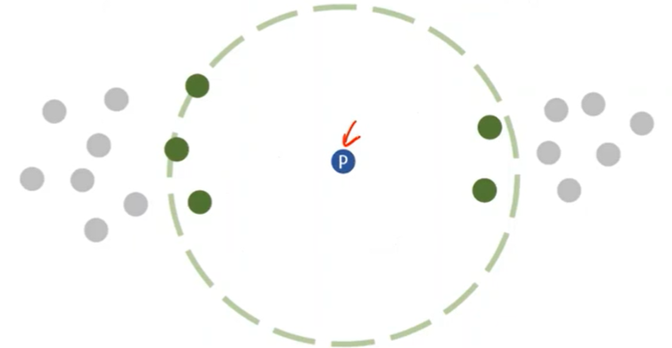

- Case 2: 자기 자신(p) 주변의 **밀도가 낮은** 경우 ⇒ 상대적으로 큰 $lrd_k(o)$

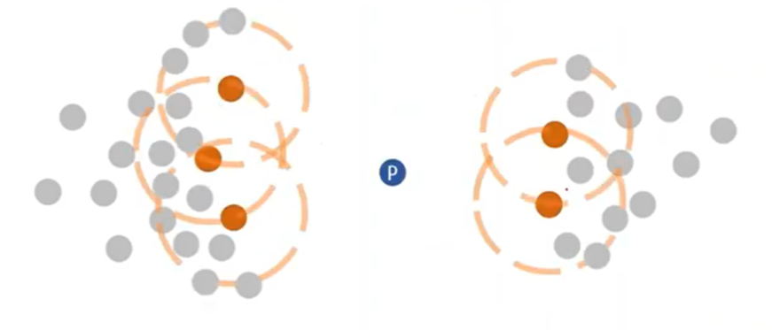

- Case 2: 자기 자신(p) 주변의 **밀도가 낮은** 경우 ⇒ 작은 $lrd_k(p)$, 큰 $lrd_k(o)$ ⇒ 큰 $LOF_k(p)$ (1보다 큼)

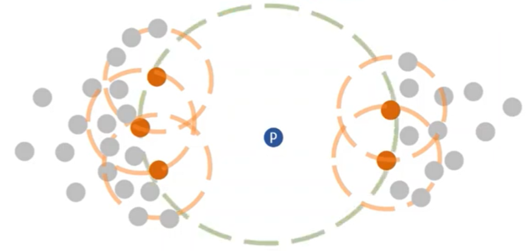

- Case 3: 자기 자신(p) 주변의 **밀도가 낮은** 경우 ⇒ 작은 $lrd_k(p)$

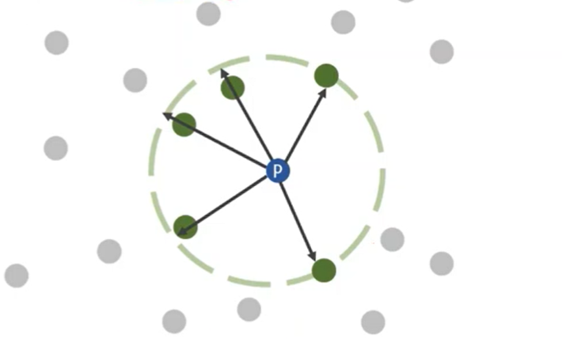

- Case 3: 자기 자신(p) 주변의 밀도가 낮은 경우 ⇒ 작은 $lrd_k(o)$

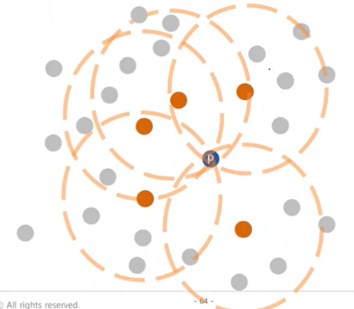

- Case 3: 자기 자신(p) 주변의 밀도가 낮은 경우 ⇒ 작은 $lrd_k(p)$, 작은 $lrd_k(o)$ ⇒ 1근방에서의 $LOF_k(p)$

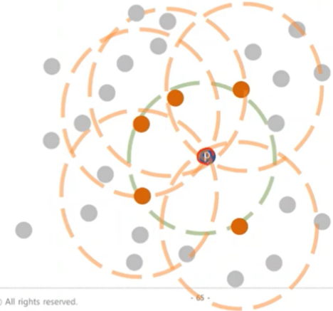

## 이슈

- K를 어떤 값으로 정할까?
    - 답변: K는 일반적으로 10에서 50 사이로 설정됩니다.
        - 설명: 이 범위는 로컬 밀도 변화에 대한 민감도와 계산 효율성의 균형을 유지합니다. K를 너무 낮게 설정하면 알고리즘이 노이즈에 지나치게 민감해질 수 있고, 너무 높게 설정하면 알고리즘이 국소적 이상을 놓칠 수 있습니다.
- LOF가 어떤 값 보다 커야지 anomaly로 정의할까? (thresholding)
    - 답변: 이상 현상을 정의하려면 LOF가 1보다 커야 합니다.
        - 설명: 1보다 큰 LOF 값은 해당 점이 이웃 밀도보다 낮기 때문에 해당 점이 특이점임을 나타냅니다.
- 한 데이터셋에서 2.1의 LOF값을 가지는 관측치와 또 다른 데이터셋에서 2.1의 LOF값을 가지는 관측치는 모두 동일하게 anomaly인가 (혹은 모두 동일하게 정상인가?)
    - 답변: 아니요, 둘 다 똑같이 변칙적이지는 않습니다.
        - 설명: LOF 값은 계산되는 데이터세트를 기준으로 합니다. 서로 다른 데이터 세트는 서로 다른 밀도 분포를 가질 수 있으므로 한 데이터 세트의 LOF 2.1이 반드시 다른 데이터 세트의 LOF 2.1과 동일한 수준의 이상치와 동일하지는 않습니다.
- 계산복잡도?
    - 답변: 인덱싱의 경우 계산 복잡도는 O(n log n)이고 LOF 계산의 경우 O(n * K)입니다.
        - 설명: 인덱싱은 일반적으로 O(n log n) 복잡성을 갖는 KD-tree 또는 ball tree와 같은 데이터 구조를 사용합니다. LOF를 계산하려면 K개의 가장 가까운 이웃까지의 거리를 계산해야 하며, 여기에는 O(n * K) 연산이 필요합니다.
- 고차원?
    - 답변: LOF는 차원의 저주로 인해 고차원 공간에서 어려움을 겪을 수 있습니다.
        - 설명: 고차원 공간에서는 점 사이의 거리가 비슷해지는 경향이 있어 밀도가 높은 영역과 희박한 영역을 구별하기 어려워 LOF의 효율성이 떨어집니다.

## 결론


> 💡 **결론적으로, 1근방의 값을 가진다면, 오밀조밀한 군집이든 크게 펼쳐진 군집이든 데이터가 그 안에 포함되어 있다고 간주하여 정상이라고 할 수 있다.**

## 코드

```python
import numpy as np
import matplotlib.pyplot as plt
from sklearn.neighbors import LocalOutlierFactor
from matplotlib.pyplot import figure
figure(num=None, figsize=(8, 6), dpi=80, facecolor='w', edgecolor='k')

np.random.seed(123)

# Generate train data
X_inliers = 0.3 * np.random.randn(100, 2) ## 정규분포에서 100*2만들고
X_inliers = np.r_[X_inliers + 2, 2*X_inliers - 2] ## 각각 2,2 혹은 -2,-2만큼 평행이동한거를 vstack. 즉 cluster 2개

# Generate some outliers
X_outliers = np.random.uniform(low=-4, high=4, size=(20, 2))
X = np.r_[X_inliers, X_outliers] ##-4,4에서 뽑은 outlier와 inlier를 vstack

n_outliers = len(X_outliers)
ground_truth = np.ones(len(X), dtype=int)
ground_truth[-n_outliers:] = -1

# fit the model for outlier detection (default)
clf = LocalOutlierFactor(n_neighbors=20, contamination=0.1)
## use fit_predict to compute the predicted labels of the training samples
## (when LOF is used for outlier detection, the estimator has no predict, decision_function and score_samples methods).
y_pred = clf.fit_predict(X) # 1,-1로 나온다.
n_errors = (y_pred != ground_truth).sum()
X_scores = clf.negative_outlier_factor_ ## 음수 LOF scsore

plt.title("Local Outlier Factor (LOF)")
plt.scatter(X[:, 0], X[:, 1], color='black', s=3., label='Data points')
# plot circles with radius proportional to the outlier scores
radius = (X_scores.max() - X_scores) / (X_scores.max() - X_scores.min())
plt.scatter(X[:, 0], X[:, 1], s=500 * radius, edgecolors='g',
            facecolors='none', label='Outlier scores')
n = np.copy(X_scores)
n[n>-2] = np.nan ## LOF scsore(음수)의 threshold는 2
n = np.round(n,2)
n = -1 * n ## 양수변환

# LOF만 txt표기
for i, txt in enumerate(n):
    if np.isnan(txt):continue
    plt.annotate(txt, (X[i,0], X[i,1]))
legend = plt.legend(loc='upper left')
plt.show()
```

# 참조 문헌

> 📚`<br/>`
> 📖 [https://www.youtube.com/watch?v=wADcqMdpuv4&t=2177s&ab_channel=‍김성범[교수%2F산업경영공학부]](https://www.youtube.com/watch?v=wADcqMdpuv4&t=2177s&ab_channel=%E2%80%8D%EA%B9%80%EC%84%B1%EB%B2%94%5B%EA%B5%90%EC%88%98%2F%EC%82%B0%EC%97%85%EA%B2%BD%EC%98%81%EA%B3%B5%ED%95%99%EB%B6%80%5D) <br/>
> 📖 https://velog.io/@tjddls321/Anomaly-Detection-Local-Outlier-Factor-LOF <br/>
> 📖 https://en.wikipedia.org/wiki/Local_outlier_factor <br/>

