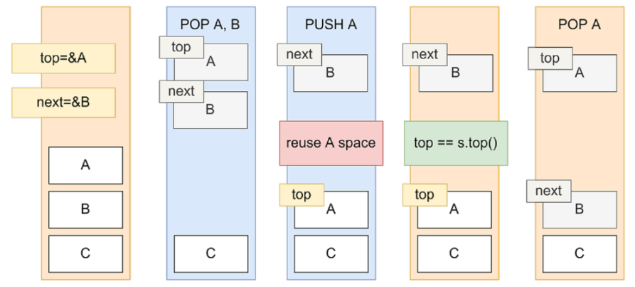
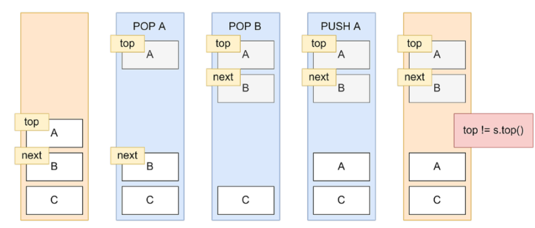

## 1. ABA 문제란?
>💡 CAS연산에서 공유 객체에 대한 변화를 감지하지 못할 때 발생하는 현상을 **ABA 현상**이라고 한다.

---

## 2. 발생 과정



스택에는 A, B, C가 차례대로 있다.

그리고 스레드1과 스레드2가 있는데, 스레드 2가 훨씬 더 빠르다고 하자.

1. 스레드 1에서 `POP` A
2. 스레드 2에서 `POP` A, `POP` B, `PUSH` A를 실행한다.

이때 `POP` A, `POP` B 부분에서 A와 B의 할당 메모리를 해제한다.

그런데, A와 B는 해제 되었으니 재사용 할 수도 있다.

바로 뒤의 `PUSH` A 가 실행되고 처음 사용했던 A공간을 재활용 한다

스레드 1은 그것도 모르고, top값이 원래 알고있던 값과 같으니 CAS를 통과해 버린다.

그리고 next인 B를 top으로 설정한다.

이미 B공간은 free가 된 상태라서 이후 스택을 쓴다면 오류가 발생할 것이다.
(free 공간을 참조하면 OS에서 memory validation error를 일으킨다)

이런 오류를 해결하려면 DCAS(Double compare-and-swap)이나 Hazzard Pointer방법을 쓰면된다.



A, B, C를 노드 객체로 만들어 버리면 pop이 된 상태여도 pointing되어있기 때문에 메모리 해제가 일어나지 않고, 새로 들어온 A노드 객체와 pop된 A노드 각체가 다르기 때문에 CAS를 통과하지 못한다.

---

## 3. DCAS(Double compare-and-swap)


> 💡 ABA 문제를 해결하기 위해 최상위 노드에 대한 포인터와 관련 버전 또는 개수가 원자적으로 업데이트되도록 보장하는 **DCAS**


- pop의 Count를 포함한 double check를 통해서 주소값을 CAS해주고, `pop`한 count 또한 CAS해주면서 일관성을 보장해준다.

```java
CAS(&s->top, top, new_top) && CAS(&->pop_count, pop_count, pop_count+1)
```

### 초기 설정:

- 각 스택 노드는 버전 카운터와 연결
- 스택은 (최상위(top) 노드, 버전 카운터) 쌍으로 표시

### DCAS 기반 Pseudo code

#### 데이터 구조

- 노드: 각 노드에는 값과 다음 노드에 대한 포인터 존재
- 스택: **상단 포인터**와 **버전 카운터**를 사용하여 두 값에 대한 원자성을 보장
- `Push`: 상단 포인터와 버전 카운터를 모두 원자적으로 업데이트합니다.
- `pop`: 상단 포인터와 버전 카운터를 모두 원자적으로 확인하고 업데이트합니다.

```python
// DCAS : 상단 포인터와 버전 카운터 모두를 원자적으로 확인하고 업데이트
DCAS(currentTop, currentVersion, newTop, newVersion):
    if (top == currentTop && version == currentVersion):
        top = newTop
        version = newVersion
        return true
    else:
        return false

// push 연산
PUSH(value):
    newNode = Node(value)
    do:
        currentTop = top
        currentVersion = version
        newNode.next = currentTop
    while (!DCAS(currentTop, currentVersion, newNode, currentVersion + 1))

// pop 연산
POP():
    do:
        currentTop = top
        currentVersion = version
        if currentTop == null:
            throw "Stack is empty"
        newTop = currentTop.next
    while (!DCAS(currentTop, currentVersion, newTop, currentVersion + 1))
    return currentTop.value

```

### DCAS 시나리오

1. 스레드 1은 `POP` A로 시작
- Read: top(A) 및 version(V1).
1. 스레드 2는 다음 작업을 빠르게 수행
- `POP` A:
    - 스택: (top: B, version: V2)
- `POP` B:
    - 스택: (top: C, version: V3)
- `PUSH` A:
    - 스택: (top: A, version: V4)
1. 스레드 1이 재개되고 `POP` A를 시도
- Check: top(A) 및 version(V1)
- version이 V1에서 V4로 변경. 이는 스레드 1의 초기 읽기 이후 스택이 수정되었음을 나타냄.
- DCAS 검사가 실패하여 스레드 1이 오래된 데이터에 대해 `POP` 작업을 잘못 수행하는 것을 방지

#### DCAS 구현 설명

- `PUSH` 작업:
    - 새로운 노드가 생성
    - 최상위(top) 노드와 버전은 CAS(compareAndSwap)을 사용하여 원자적으로 업데이트
- `POP` 작업:
    - 최상위(top) 노드와 버전은 원자적으로 확인되고 업데이트
    - CAS(compareAndSwap)은 업데이트하기 전에 노드와 버전이 모두 예상 값과 일치하는지 확인

#### DCAS 사용

- DCAS 작업: DCAS가 '최상위(top)' 노드와 '다음(next)' 또는 '버전' 필드가 모두 원자적으로 업데이트되도록 보장한다고 가정
- 이렇게 하면 스레드 2가 스택을 수정하는 경우(A 및 B를 `POP`한 다음 A를 `PUSH`) top 또는 version 상태가 예상 값과 일치하지 않으면 스레드 1의 CAS 작업이 실패
- 일관성: DCAS는 스택의 상태가 여러 필드에서 일관되게 업데이트되도록 보장하여 전체 상태를 원자적으로 처리하여 ABA 문제를 방지

#### 키 포인트

- DCAS는 여러 관련 변수를 함께 처리하여 두 변수 모두에서 원자성을 보장
- 원자성: DCAS는 여러 값을 동시에 확인하고 업데이트함으로써 일관성을 유지하고 오래된 상태에 따른 잘못된 가정을 방지


> 💡 **DCAS**는 여러 관련 변수에 대한 원자성 연산을 제공하고 동시 상태가 일관되게 유지되도록 하며 변수가 수정된 다음 원래 값으로 되돌아가는 문제를 방지함으로써 ABA 문제를 방지


---

## 4. Hazzard Pointer


> 💡 DCAS는 여러 필드에서 원자적 연산을 수행하여 문제를 직접 처리하는 반면, **Hazzard Pointer**는 한 스레드에서 참조되는 노드가 다른 스레드에서 실수로 재사용되거나 삭제되지 않도록 보장하여 문제를 다르게 처리


- **Hazzard Pointer**는 한 스레드에서 액세스하는 노드가 다른 스레드에서 할당 해제되거나 재사용되는 것을 방지하기 위해 잠금 없는 데이터 구조에서 사용되는 메커니즘
- 이는 각 스레드가 현재 작동하는 노드에 대한 포인터(Hazzard Pointer) 목록을 유지하도록 하여 이를 수행

### Hazzard Pointer 작동 방식

1. **각 스레드에는 Hazzard Pointer가 존재**: 스레드가 노드에서 작동하려고 하면 먼저 해당 노드에 Hazzard Pointer를 게시
2. **메모리 관리**: 스레드가 노드를 삭제하거나 재사용하기 전에 모든 Hazzard Pointer를 확인하여 현재 해당 노드에 액세스하는 다른 스레드가 없는지 확인
3. **가비지 수집(GC)**: 노드를 가리키는 Hazzard Pointer가 없으면 노드 할당을 취소하거나 재사용하는 것이 안전함.
   이 프로세스에는 종종 노드가 삭제되기 전에 폐기 목록에 배치되어 위험이 남지 않도록 하는 지연된 회수 형태가 포함

### Hazzard Pointer가 있는 시나리오

#### 초기 스택 상태

- 스택 상단: A
- 중간: B
- 스택 하단: C

#### 스레드

- 스레드 1: 느린 스레드
- 스레드 2: 더 빠른 스레드

#### Hazzard Pointer의 단계별

1. 스레드 1은 `POP` A로 시작
    - 스레드 1은 Hazzard Pointer를 A로 설정
    - 스택: A(Hazzard) -> B -> C
2. 스레드 2는 다음 작업을 빠르게 수행
    - 스레드 2는 Hazzard Pointer를 A로 설정하고 `POP` A를 수행
        - 스택: B(Hazzard) -> C
    - 스레드 2는 Hazzard Pointer를 B로 설정하고 `POP` B를 수행
        - 스택: C(Hazzard)
    - 스레드 2는 `PUSH` A를 수행
        - 스택: A(top) -> C
3. 스레드 1이 재개되고 `POP` A 완료를 시도
    - 스레드 1은 Hazzard Pointer를 확인하고 A가 다른 스레드에서 아직 사용 중인지 Check
    - 스레드 1은 스택의 top을 다시 읽고 `POP`할 올바른 노드를 찾아야 함
4. GC:
    - A와 B가 더 이상 Hazzard Pointer에 의해 참조되지 않으면 안전하게 재사용하거나 삭제할 수 있다.
    - 노드는 폐기 목록에 배치되며, 해당 노드를 참조하는 Hazzard Pointer가 없는지 확인한 후 회수할 수 있다.

### Hazzard Pointer에 대한 Pseudo code

#### 데이터 구조

- 노드: 값과 다음 포인터를 포함
- Hazzard Pointer: 각 스레드에 의해 유지되며 액세스되는 노드

```python
class Node {
    int value;
    Node next;
}

class HazardPointer {
    Node hazard;
}

class Stack {
    AtomicReference<Node> top;
    List<HazardPointer> hazardPointers;

    // Push 연산
    void push(int value) {
        Node newNode = new Node(value);
        do {
            Node currentTop = top.get();
            newNode.next = currentTop;
        } while (!top.compareAndSet(currentTop, newNode));
    }

    // Pop 연산
    int pop(Thread thread) {
        Node currentTop;
        do {
            currentTop = top.get();
            if (currentTop == null) {
                throw "Stack is empty";
            }

            // hazard pointer 설정
            thread.hazardPointer.hazard = currentTop;
            // 변경 사항이 발생하지 않았는지 확인하기 위해 상단을 Re-read
            if (top.get() != currentTop) {
                continue;
            }

            // top 업데이트 시도
            Node newTop = currentTop.next;
        } while (!top.compareAndSet(currentTop, newTop));

        // hazard pointer 삭제
        thread.hazardPointer.hazard = null;
        return currentTop.value;
    }

    // nodes 회수 
    void reclaim(Node node) {
        // Add node to retire list and later check hazard pointers to ensure safe deletion
    }
}

```

- Hazzard Pointer는 잠금 없는 데이터 구조에서 메모리를 안전하게 관리하는 방법을 제공하여 한 스레드에서 액세스하는 노드가 다른 스레드에서 할당 해제되거나 재사용되지 않도록 하여 ABA 문제를 방지
- 이 방법에는 Hazzard Pointer를 설정 및 확인하고 지연된 회수를 사용하여 노드가 안전할 때만 삭제되거나 재사용되도록 보장하는 방법이 포함됨

> 💡 DCAS는 ABA를 해결하는 직접적인 접근 방식인 반면, Hazzard Pointer는 노드 액세스 및 회수를 관리하여 메모리 안전을 보장

---

## 5. Java에서의 ABA문제

- Java에서는 포인터를 직접 사용하지 않고 GC(가비지 수집) 기능이 있어도 ABA 문제가 계속 발생할 수 있다.
- Java에서는 CAS(Compare and Swap)과 같은 원자적 연산을 사용할 때 잠금 없는 데이터 구조에서 ABA 문제가 발생할 수 있다.
- 문제는 CAS가 변경 이력을 확인하지 않고 값만 확인하기 때문에 값을 수정했다가 원래 상태로 복원하면 아무 것도 변경되지 않았다고 잘못 가정할 수 있다는 점이다.

### 1) AtomicStampedReference

> 💡 `AtomicStampedReference`는 동시 프로그래밍의 ABA 문제를 해결하도록 설계된 Java의 java.util.concurrent.atomic 패키지에 있는 클래스

- Stamp (정수 버전)를 참조와 연결하여 간단한 비교 및 스왑 작업을 버전을 포함하는 비교 및 이중 스왑 작업으로 효과적으로 전환함으로써 수행
- 주요 방법
    - `getReference()`: 현재 참조를 반환
    - `getStamp()`: 현재 스탬프를 반환.
    - `get(int[] stampHolder)`: 현재 참조를 반환하고 제공된 stampHolder 배열을 현재 스탬프로 업데이트합니다.
    - `compareAndSet(V ExpectReference, V newReference, int ExpectStamp, int newStamp)`: 현재 참조와 스탬프가 예상 값과 같은 경우 새 참조와 스탬프를 원자적으로 설정합니다.

#### AtomicStampedReference 예제 코드

```java
import java.util.concurrent.atomic.AtomicStampedReference;

class Node {
    int value;
    Node next;

    Node(int value) {
        this.value = value;
    }
}

public class ABAStack {
    private AtomicStampedReference<Node> top = new AtomicStampedReference<>(null, 0);

    public void push(int value) {
        Node newNode = new Node(value);
        int[] stampHolder = new int[1];
        Node oldTop;
        int oldStamp;
        do {
            oldTop = top.get(stampHolder);
            oldStamp = stampHolder[0];
            newNode.next = oldTop;
        } while (!top.compareAndSet(oldTop, newNode, oldStamp, oldStamp + 1));
    }

    public int pop() {
        int[] stampHolder = new int[1];
        Node oldTop;
        Node newTop;
        int oldStamp;
        do {
            oldTop = top.get(stampHolder);
            if (oldTop == null) {
                throw new IllegalStateException("Stack is empty");
            }
            oldStamp = stampHolder[0];
            newTop = oldTop.next;
        } while (!top.compareAndSet(oldTop, newTop, oldStamp, oldStamp + 1));
        return oldTop.value;
    }

    public static void main(String[] args) {
        ABAStack stack = new ABAStack();
        stack.push(1); // Push A
        stack.push(2); // Push B
        stack.push(3); // Push C

        // Thread 1
        new Thread(() -> {
            stack.pop(); // Pop A (1)
        }).start();

        // Thread 2
        new Thread(() -> {
            int a = stack.pop(); // Pop B (2)
            stack.pop(); // Pop C (3)
            stack.push(a); // Push A (1)
        }).start();
    }
}
```

- Java의 가비지 수집 및 직접 포인터 부족으로 일부 문제가 완화되지만 CAS 작업을 사용하는 동시 환경에서는 ABA 문제가 계속 발생할 수 있다.
- `AtomicStampedReference` 클래스는 참조와 관련 스탬프를 동시에 업데이트하기 위한 원자적 작업을 제공
- 업데이트가 발생하려면 참조와 스탬프가 모두 예상 값과 일치해야 하므로 변경 사항을 보다 효과적으로 추적하고 ABA 문제를 피할 수 있다.
- 버전 번호 또는 `AtomicStampedReference`와 같은 기술을 사용하면 이 문제를 감지하고 예방하여 동시 데이터 구조의 정확성을 보장할 수 있다.

---

## 참고문헌

> 📚<br/>
> 📖 https://2jun0.tistory.com/57 <br/>
> 📖 https://blog.naver.com/jjoommnn/130040068875 <br/>
> 📖 https://wannabe-gosu.tistory.com/29 <br/>

