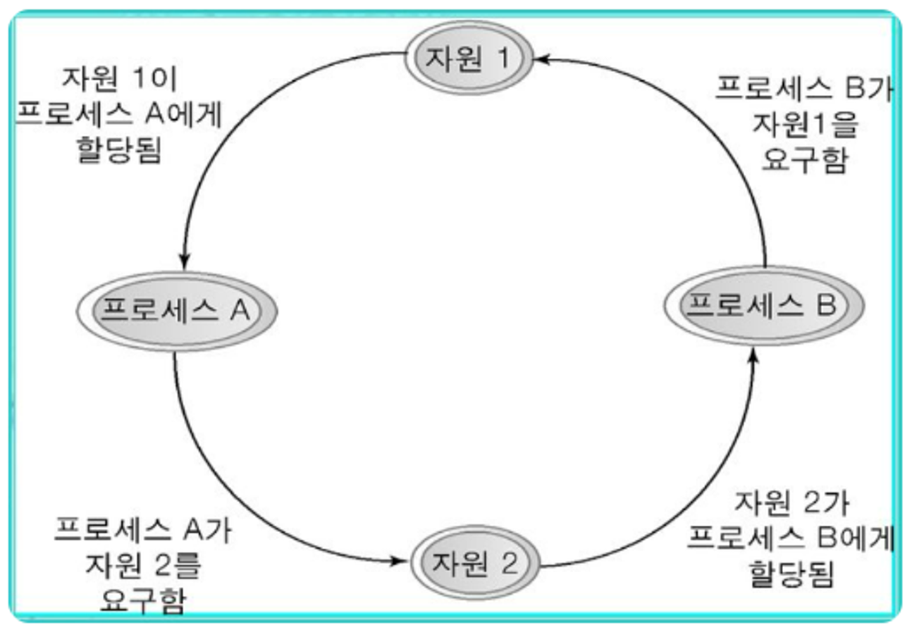
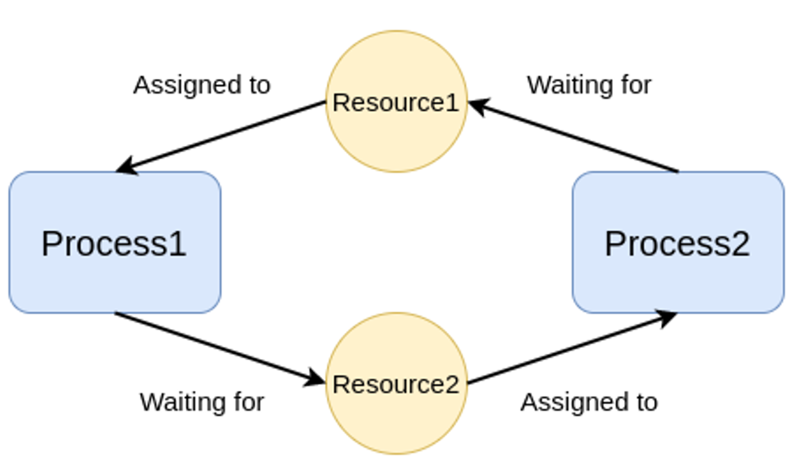
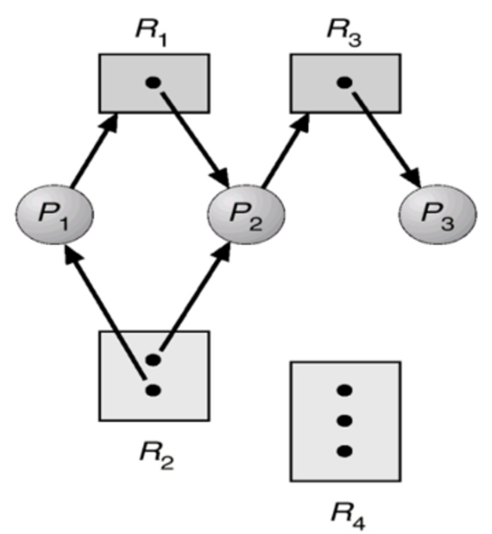

##  1. 교착상태(Dead Lock)란?

> - 두 개 이상의 작업이 서로 상대방의 작업이 끝나기만을 기다리고 있기 때문에 결과적으로 아무것도 완료되지 못하는 상태
> - 둘 이상의 프로세스가 각각의 프로세스가 점유 하고 있는 자원을 서로 기다릴때 무한대기에 빠지는 상황

### 1.1 교착상태 발생 경우

- Process1 이 Resource1 을 점유하고 있다.
- Process2 가 Resource2 를 점유하고 있다.
- 여기까지는 괜찮다.
- Process1 이 Resource2의 자원을 사용하기 위해 기다린다.
- Process2 가 Resource1의 자원을 사용하기 위해 기다린다.
- 이렇게 자원 해제가 안되어있고 무한정 기다리고 있는 상태이다.

### 1.2 교착상태 발생 조건

- **상호 배제 :** 하나의 프로세스가 자원을 사용중일 때 다른 프로세스는 그를 사용할 수 없다.
- **점유 대기 :** 최소 하나의 자원을 점유하고 있으면서 다른 프로세스가 사용중인 자원을 추가로 점유하기 위해 대기하는 프로세스가 존재한다.
- **비선점 :** 다른 프로세스가 자원을 사용중인 경우 그 사용이 끝날 때 까지 강제로 뺏을 수 없다.
- **순환 대기 :** 프로세스의 집합에서 순환형태로 자원을 대기하고 있어야 한다.

### 1.3 교착상태 해결 방법

#### **1.3.1 교착 상태 예방 및 회피**

> 💡 교착 상태가 되지 않도록 하기 위해 교착 상태를 예방하거나 회피하는 프로토콜을 이용하는 방법이다.

**예방**

교착상태의 발생 조건 중 하나를 제거하면서 예방.

- **상호 배제 부정 :** 여러 프로세스가 공유 자원 사용
- **점유 대기 부정 :** 프로세스 실행 전 모든 자원 할당
- **비선점 부정 :** 점유중인 자원을 다른 프로세스가 요구하는 경우 그를 반납
- **순환 대기 부정 :** 자원에 고유 번호를 할당한 후 순서대로 자원 요구

**회피**

**은행원 알고리즘**

- 프로세스가 자원을 요구할 때 시스템은 자원을 할당한 후에도 안정 상태로 남아있게 되는지 미리 검사하여 교착 상태를 회피한다. 안정 상태인 경우만 자원을 할당하고 그렇지 않은 경우 다른 프로세스들의 자원 해지시 까지 대기한다.
- 은행에서 모든 고객의 요구가 충족되도록 현금을 할당하는 데서 유래한 기법으로 병렬 수행 프로세스 간의 교착 상태를 방지하기 위한 방법이다. 프로세스가 자원을 요구할 때 시스템이 자원을 할당한 후에도 안정한 상태인지 사전에 검사하여 교착 상태를 회피하는 기법이다. 은행원 알고리즘은 프로세스의 모든 요구를 유한한 시간 안에 할당하는 것을 보장한다.

#### **1.3.2 교착 상태 탐지(발견) 및 회복**

> - 교착 상태가 발생했는지 점검하고 교착 상태에 있는 프로세스와 자원을 발견하고 교착 상태를 일으킨 프로세스를 종료하거나 프로세스에 할당된 자원을 선점하여 프로세스나 자원을 회복한다.
> - **교착 상태 탐지(발견)**에는 **교착 상태 발견 알고리즘**과 **자원 할당 그래프** 등을 사용할 수 있다.

**교착 상태 회복**

교착 상태 회복 기법에는 프로세스 종료, 자원 선점 방법이 있다.

- **프로세스 종료 :** 교착 상태에 있는 프로세스를 종료하는 방법으로 교착 상태에 있는 모든 프로세스를 종료하는 방법과 프로세스들을 하나씩 종료하면서 교착 상태를 해결하는 방법이 있다.
- **자원 선점 :** 교착 상태의 프로세스가 점유하고 있는 자원을 선점해 다른 프로세스에 할당하여 해당 프로세스를 일시적으로 멈추는 방법이다. 우선순위가 낮은 프로세스, 수행된 정도가 적은 프로세스, 사용되는 자원이 적은 프로세스 등을 위주로 해당 프로세스의 자원을 선점한다.

#### **1.3.3 교착 상태 무시**

대부분 교착 상태가 잘 발생하지 않기에 교착 상태 예방, 회피, 탐지, 복구는 비용이 많이 든다. 또 예방 또는 회피를 프로그래밍해서 넣으면 성능이 큰 영향을 미칠 수 있다. 때문에 교착 상태의 발생 확률이 비교적 낮으면 별 다른 조치를 취하지 않는다.

## 2. 기아상태(Starvation)란?

> 특정 프로세스의 우선 순위가 낮아서 원하는 자원을 계속 할당받지 못하는 상태를 말함  
> 여러 프로세스가 자원을 점유 할때 특정 프로세스에게 자원이 아예 할당 안되는 경우

### 2.1 기아상태 해결 방법

- 프로세스 우선순위 수시 변경을 통해 각 프로세스 높은 우선순위를 가지도록 기회 부여
- 오래 기다린 프로세스의 우선순위 높이기
- 우선순위가 아닌 요청 순서대로 처리하는 요청큐 사용

## 3. 경합 조건란?

> 둘 이상의 입력 또는 조작의 타이밍이나 순서 등이 `공유자원에 동시에 접근`하여 결과값에 영향을 줄 수 있는 상태

### 3.1 경합 조건의 예시

아들은 은행에 10000원의 잔고가 있었고, 현금 인출기를 통해 잔고 10000원을 출금하고 있다. 그 사이 엄마는 아들에게 용돈을 5000원 입금 해주었다. 그렇다면 잔고는 얼마일까? 
아들은 10000원을 인출했기 때문에 잔고는 0원이 되고, 이후 엄마가 5000원을 입금해주신 덕분에 잔고는 5000원이 되리라 기대할 것이다. 
하지만 경쟁상태일 때 
동시에 출금과 입금이 이루어지는 경우 
아들의 입장 : 현재잔고 10000원 – 10000원 출금 = 기대잔고 0원 
엄마의 입장 : 현재잔고 10000원 – 5000원 입금 = 기대잔고 15000원 

이처럼 경쟁 조건는 `공유 데이터(잔고)에 최종값을 보장할 수 없는 상황`을 말한다.

이 경쟁 조건로 생기는 영역이`임계구역(Critical Section)`이다.

- **정의:** 경쟁 조건은 시스템의 동작이 스레드가 실행되도록 예약된 순서와 같은 이벤트의 상대적 타이밍에 따라 달라질 때 발생
- **원인:** 여러 스레드나 프로세스의 실행 순서가 비결정적이기 때문에 발생

#### 임계구역(critical section)

공유 자원에 접근할 때 순서 등의 이유로 결과가 달라지는 영역이다. 
이 임계구역을 해결하는 방법이 `동기화 메커니즘(ex. 세마포어)`을 사용하는 것이다. 
동기화 메커니즘의 근간이 바로 `락(Lock)`을 사용하는 것이다. 

경쟁 조건와 교착상태에서는 다양한 동기화 기술과 알고리즘이 사용됨

## 4. 기타

### 4.1 **교착 상태 vs 기아 상태**

교착상태는 프로세스가 자원을 얻지 못해 다음 처리를 하지 못하는 상태를 말하고 기아 상태는 프로세스가 원하는 자원을 계속 할당 받지 못하는 상태이다. 즉 교착 상태는 여러 프로세스가 동일한 자원 점유를 원할 때 발생하고 기아 상태는 여러 프로세스가 자원을 점유하기 위해 경쟁 할 때 특정 프로세스는 영원히 자원 할당을 받지 못하는 것이다.

- **교착상태** : 여러 프로세스가 동일 자원 점유를 요청할 때 발생
- **기아상태** : 여러 프로세스가 부족한 자원을 점유하기 위해 경쟁할 때 발생

### 4.2 교착 상태 vs 경쟁 조건

교착 상태와 경쟁 조건은 모두 동시성 문제인 반면, 교착 상태는 리소스에 대한 순환 종속성을 포함하여 완전한 정지를 초래하는 반면, 경쟁 조건은 예측할 수 없는 작업 인터리빙과 관련되어 동시 리소스 액세스로 인해 예상치 못한 결과를 초래

- **교착 상태:** 교착 상태는 두 개 이상의 프로세스가 서로의 리소스 해제를 기다리고 있기 때문에 진행할 수 없는 상황. 이로 인해 순환 대기 시나리오가 발생하고 관련 프로세스가 무기한 차단됨
- **경쟁 조건:** 경쟁 조건은 시스템의 동작이 이벤트의 상대적인 타이밍, 특히 스레드나 프로세스가 실행되도록 예약된 순서에 따라 달라질 때 발생함. 비결정적인 실행 순서로 인해 예측할 수 없는 결과가 발생함

