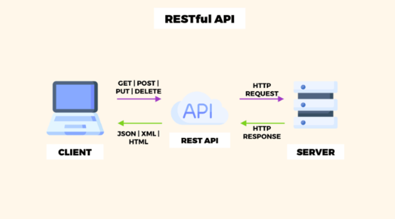
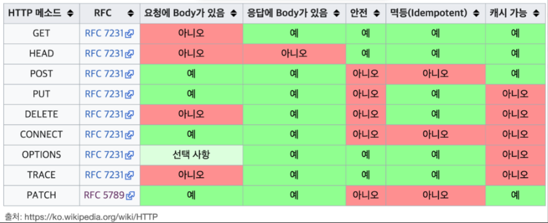

## REST API란?

> 💡 REST는 Representational State Transfer의 약자로, 웹에서 데이터를 전송하고 처리하는 방법을 정의한 하나의 인터페이스를 말한다.



REST API의 개략적인 구조(출처 : cloudinary)

## REST API 6가지 특징

1. **무상태(Statelessness):** 클라이언트에서 서버로의 각 요청은 해당 요청을 이해하고 처리하는 데 필요한 모든 정보를 포함해야 합니다. 서버는 요청 사이에 클라이언트 상태에 대한 정보를 저장해서는 안 됩니다.
2. **클라이언트-서버 아키텍처:** 클라이언트와 서버는 네트워크를 통해 통신하는 별개의 엔터티입니다. 클라이언트는 사용자 인터페이스와 사용자 경험에 책임을 지고, 서버는 요청을 처리하고 리소스를 관리합니다.
3. **일관된 인터페이스:** 아키텍처를 단순화하고 분리하는 일련의 제약 조건입니다. 일관된 인터페이스는 URI(Uniform Resource Identifier)를 통한 리소스 식별, 표현을 통한 리소스 조작, 표준 HTTP 메서드(GET, POST, PUT, DELETE) 사용 등의 원칙을 포함합니다.
4. **리소스 중심:** 리소스(데이터 객체 또는 서비스와 같은)는 URI에 의해 식별되며 표준 HTTP 메서드를 사용하여 조작됩니다.
5. **표현(Representation):** 리소스는 여러 표현(JSON 또는 XML과 같은)을 가질 수 있으며 클라이언트는 서버와 표현을 협상할 수 있습니다.
6. **무상태 통신(Stateless Communication):** 클라이언트에서 서버로의 각 요청은 해당 요청을 이해하고 처리하는 데 필요한 모든 정보를 포함해야 합니다. 서버는 요청 사이에 클라이언트 상태를 저장하지 않습니다.
7. **무상태 서버(Stateless Server):** 서버는 클라이언트 상태를 저장하지 않습니다. 각 요청은 해당 요청을 이해하고 처리하는 데 필요한 모든 정보를 포함합니다.
8. **캐시 가능성(Cacheability):** 서버에서의 응답은 명시적으로 캐시 가능하거나 캐시 불가능하게 표시될 수 있어 클라이언트가 응답을 캐시하여 성능을 향상시킬 수 있습니다.
9. **계층화된 시스템(Layered System):** 아키텍처는 여러 계층(프록시, 게이트웨이 및 방화벽과 같은)으로 구성될 수 있어 시스템의 확장성과 보안을 향상시킬 수 있습니다.

## **REST API를 잘 작성하기 위한 15가지 방법**

### **1. 엔드포인트 경로에는 명사를 사용**

**검색하거나 조작하는 엔터티를 나타내는 명사를** 항상 경로 이름으로 사용해야 하며 항상 **복수형** 지정을 사용하는 것이 좋다. **HTTP 요청 메서드** 에 이미 동사가 있고 실제로 새 정보를 추가하지 않으므로 엔드포인트 경로에 동사를 지양해야한다.

작업은 우리가 만들고 있는 HTTP 요청 메서드로 표시되어야 함. 
가장 일반적인 방법은 GET, POST, PATCH, PUT 및 DELETE이다.




> 💡 **HTTP 요청메소드**
> - GET은 리소스를 검색합니다.
> - POST는 새 데이터를 서버에 제출합니다.
> - PUT/PATCH는 기존 데이터를 업데이트합니다.
> - DELETE는 데이터를 제거합니다.
> - HEAD: GET과 동일하지만 응답 본문이 없습니다. 리소스의 헤더만 검색하는 데 사용됩니다.
> - TRACE: 대상 리소스에 대한 경로를 따라 메시지 루프백 테스트를 수행하는 데 사용됩니다.
> - OPTIONS: 대상 리소스에 대한 통신 옵션을 설명하는 데 사용됩니다.<br/>
>   브라우저는 서버의 CORS 헤더를 확인하기 위해 실행 전 요청
> - CONNECT: 동적으로 터널로 전환할 수 있는 프록시와 함께 사용하도록 예약되어 있습니다. 네트워크 터널을 설정하는 데 사용됩니다.


1. GET /members
2. GET /get-members

위에서 권장한 방법대로라면, 1번이 옳은 것. 이미 GET이라는 HTTP 메소드가 해당 API의 역할을 충분히 설명하고 있기 때문에, 마지막 경로에 동사를 넣게 되면 중복된 설명이 된다.

해당 방법으로 HTTP 요청 메소드를 보면 아래처럼 예시를 보여줄 수 있다.


> 💡 회원 목록 /members -> GET<br/>
> 회원 등록 /members -> POST<br/>
> 회원 조회 /members/{id} -> GET<br/>
> 회원 수정 /members/{id} -> PATCH, PUT, POST<br/>
> 회원 삭제 /members/{id} -> DELETE<br/>


### 2. 데이터 송수신 포멧으로는 JSON을 사용하자.

예전에는 XML을 이용했지만, 최근에는 JSON(JavaScript Object Notation)가 API 데이터 송수신 표준 형식이 되었다.

JSON의 장점을 간략하게 설명하면 다음과 같다.

- 인간이 읽을 수 있는 텍스트로, 사용이 편리함
- 최소한의 정보를 함축적으로 표현(XML에 비해 적은 용량으로 빠르게 통신 가능)
- 언어에 독립적

일반적으로 제공되는 form-data는 클라이언트가 텍스트 또는 숫자 형식의 데이터를 보낼 때는 적합하지 않고, 어차피 대부분의 프레임워크에서 클라이언트가 데이터를 전송할 때 JSON을 사용할 수 있도록 기능을 제공하고 있다. 간단하게 헤더의 Content-Type 부분을 application/json으로 설정하기만 하면 된다.

### 3. HTTP 상태코드를 적극적으로 활용하자.

HTTP에는 이미 수많은 사람들이 사용하고 있는 상태 코드들이 정의되어 있다. API 처리가 정상적으로 이루어졌는지, 혹 아니라면 무슨 이유인지 명확하게 표현하기에 가장 적합하다.

상태 코드에는 대표적으로 아래와 같은 종류가 있다.


> 💡 **대표적인 상태 코드**
> - 200 : 클라이언트의 요청이 정상적으로 수행되었음
> - 201 : 클라이언트가 생성과 관련된 요청을 하였고, 이 요청이 정상적으로 완료됨(POST)
> - 301 : 클라이언트가 요청한 데이터의 URI가 변경되었을 경우
> - 400 : 클라이언트의 요청이 부적절한 경우
> - 401 : 클라이언트가 인증과정(로그인 등)을 거치지 않은 상태에서 보안된 데이터에 접근하려고 하는 경우
> - 403 : 클라이언트가 인증과 관련 없이, 존재는 하지만 응답할 수 없는 데이터를 요청한 경우 (일반적으로 사용 X)
> - 404 : 클라이언트가 인증과 관련 없이, 응답할 수 없는 데이터를 요청한 경우 (일반적으로 사용 O)
> - 405 : 클라이언트가 요청한 데이터에 해당 메소드가 존재하지 않거나 사용 불가능 상태인 경우
> - 500 : 서버에 문제가 있을 경우


이 외에도 수많은 상태 코드들이 있는데, 중요한 것은 ‘가장 최소한의 개수를 사용’하여 클라이언트가 API 요청 또는 응답에 적절한 상태 코드를 부여할 수 있도록 하는 것이다.

### 4. 응답 메시지는 표준화 된 내용으로 반환하자.

어떠한 요청에 대한 데이터라 하더라도, 서버로부터 항상 유사한 형태의 표준화된 응답 구조를 사용해야 한다. 그렇게 해야 클라이언트는 동일한 구조 내에서 원하는 값을 예측해서 가져올 수 있게 된다. 만약 아래와 같은 구조가 존재한다고 하자.

```json
[
  {
     bookId: 1,
     name: "The Republic"
  },
  {
     bookId: 2,
     name: "Animal Farm"
  }
]
```

또는 아래와 같이 조금 더 중첩된 구조를 가질 수도 있다

```json
{
   "data": [ 
     {
       "bookId": 1,
       "name": "The Republic"
     },
     {
       "bookId": 2,
       "name": "Animal Farm"
     }
   ],
   "totalDocs": 200,
   "nextPageId": 3
}
```

만약 새로운 책을 추가한다고 하자. 성공했을 경우 권장하는 응답 메시지는 아래와 같다.

```json
// POST /books
{
     "bookId": 3,
     "name": "Toy Story"
}
```

만약 여기서 ‘책이 성공적으로 등록되었습니다’ 라는 메시지를 추가하면 어떨까? 답은 ‘불필요하다’이다. 우리는 위에서 상태코드를 통해 해당 요청이 정상적으로 완료되었는지 혹은 문제가 생겼는지를 확인하자고 했다. 추가적인 메시지는 중복된 내용을 포함하는 꼴만 만들게 된다.

오히려 문제가 발생한 경우에 대해서는 무슨 오류가 있었는지에 대한 메시지를 적어주는 것이 좋다. 그렇게 해야 클라이언트가 해당 문제를 빠르게 확인하고 조치를 취할 수 있기 때문이다. 아래와 같은 응답이 적절한 예시가 될 수 있을 것이다.

```json
{
  "code": "book/not_found",
  "message": "A book with the ID 6 could not be found"
}
```

응답 메시지에 HTTP 상태 코드를 포함할 필요까지는 없지만, 그래도 사용자 또는 클라이언트가 해당 오류에 대해 빠르게 확인할 수 있도록 오류를 매핑한 코드와 이를 간략하게 설명한 메시지 정도는 정의해두는 것이 좋다. 물론 운영환경에서는 불필요한 보안 정보를 노출하게 될 수 있기 때문에, 개발 단계에서만 이를 노출하는 것이 좋다.

### **5. 페이징 기법을 활용하여 컬렉션으로 받은 많은 데이터를 효율적으로 처리하자.**

데이터가 많아질수록, 데이터를 어떻게 반환해서 보여줄지가 굉장히 중요해진다. 위에서 정의한 API 중, 등록된 전체 책의 개수를 반환하려고 한다고 가정하자. 책의 개수가 적을 때는 문제가 없겠지만, 수백만권 혹은 수천만권의 책이 있다고 한다면 해당 API를 호출하는 것은 성능이나 대역폭 측면에서 좋지 못한 선택이 될 수 있다.

페이징 기법(Pagination)을 사용하는 방법으로는 크게 skip, limit 또는 keyset이 있다. 일반적으로 skip, limit을 사용하지만, 페이징 기법을 위해서라도 keyset을 사용하는 것을 권장한다.


> - skip : 출력할 데이터의 시작부분을 설정한다. 입력값으로 들어온 값 + 1부터 출력한다.
> - limit : 출력할 데이터의 개수를 제한한다. 입력값으로 들어온 값 만큼만 반환한다.
> - keyset : 식별자 또는 ID를 참조 값으로 받아서 테이블을 별도로 스캔하지 않고 조건에 맞게 페이징하여 반환한다.


추가로 API의 결과 값을 필터링 또는 정렬할 수 있는 기능도 필요하다. 성능을 향상시키기 위해 DB 인덱스에 접근(Access) 패턴을 적용하기도 하는데, 결론적으로 API 호출에 필요한 필터와 정렬은 쿼리 파라미터에 정의되어야 한다.

```json
# romance 범주에 속하는 책 10권을 조회한다고 가정하는 API
GET /books?limit=10&category=romance
```

### **6. PUT 보다는 PATCH를 사용하자.**

PUT과 PATCH의 가장 큰 차이는 ‘데이터 내에 변경되는 요소의 범위’이다.

- PUT : 데이터 내 모든 요소를 수정
- PATCH : 데이터 내 요소 중 일부만 수정

일반적으로 데이터 내에 있는 모든 요소를 한번에 변경하는 일은 거의 발생하지 않는다. 추가로 의도하지 않게 변경해서는 안되는 요소마저도 변경될 소지가 존재한다. 그렇기 때문에 되도록이면 PATCH를 권장하며, PUT을 절대 사용해서는 안되는 것은 아니다.

### 7. Extended 옵션을 사용해서 선택적으로 결과 값을 반환하자.

시스템이 커질수록 데이터 내 요소들도 증가할 수 밖에 없다. 문제는 모든 클라이언트에서도 증가한 요소들을 전부 사용하진 않는다는 것이다.

이를 해결하기 위해 extended라는 옵션을 사용한다. 아래는 extended 옵션의 유무에 따른 결과 값의 차이를 보여준다.

```json
GET /books/:id
{
   "bookId": 1,
   "name": "Harry Potter"
}
GET /books/:id?extended=true
{
   "bookId": 1,
   "name": "Harry Potter"
   "tags": ["fantasy", "magic", "UK"],
   "author": {
      "id": 1,
      "name": "J.K.Rowling"
   }
}
```

### 8. 적절하게 엔드포인트의 크기를 나눠주자.

API의 기본 사상은 ‘주어진 하나의 일을 잘 수행하자’ 이다. 한번에 여러 작업을 해결할 수 있는 것 보다, 한 눈에 사용 가능한 기능을 확인할 수 있는 작은 단위의 API 설계가 중요하다(어찌보면 books이라는 엔드포인트는 어떻게보면 굉장히 큰 단위일 수 있다). 그리고 이러한 작은 단위의 API를 적절하게 통합하여 클라이언트가 쉽게 기능을 예측하고 이해할 수 있도록 돕는 것이 좋다.

### 9. 정확한 API 문서를 제공하자.

API의 궁극적인 목적은 ‘클라이언트가 원하는 기능을 한눈에 알아보고 적절하게 프로그램 상에 배치해서 기능을 수행할 수 있도록 하는 것’이다. 이를 위해서는 API에 대해 잘 정리된 문서가 중요하다.

문서에는 각 엔드포인트의 목적과 이를 실행하기 위한 권한, 호출하였을 때의 응답 예시, 그리고 실패하였을 때의 오류 메시지가 꼭 명시되어야 한다. 그리고 API의 버전이 변경됨에 따라 내부 기능의 변화 과정을 문서에 꼭 작성해야 한다. 기본적으로 Swagger와 같이 API의 개발과 문서 작성을 동시에 해주는 도구가 있다. 혹은 Postman으로 API를 테스트하고, 이를 문서화 된 파일로 저장해주는 도구도 존재한다.

### 10. 보안을 위한 기능을 꼭 적용하자.

가장 일반적인 방법으로 SSL을 서버에 적용하면, 클라이언트-서버 간 안전한 통신을 보장하면서 잠재적으로 발생 가능한 공격을 막을 수 있다.

웹 상에서는 Origin이라는 개념이 존재하는데, 이는 URL 상에서 프로토콜, 도메인, 포트 번호를 합친 부분을 말한다. 접속중인 웹사이트의 Origin은 window.location.origin 명령어를 통해 확인할 수 있다.

웹 브라우저는 보안 때문에 같은 Origin끼리 통신할 수 있도록 하는 SOP(Same Origin Policy)와 다른 Origin으로도 요청을 보낼 수 있도록 예외를 허용하는 CORS(Cross Origin Resource Sharing) 정책이 존재한다. API의 특성 상 서로 다른 Origin 간 통신은 당연히 발생하기 때문에, CORS를 이용하여 적절하게 HTTP 통신을 제한할 수 있는 기능을 지원해야 한다.

CORS 프로토콜은 브라우저가 사전 요청(preflight request)을 서버에 보내고, 이를 승인 받은 경우에만 통신할 수 있도록 한다. 이 사전 요청은 HTTP 요청 중 OPTION 메소드를 사용하는데, 이를 위해서는 아래의 사항을 선택적으로 응답 헤더에 넣어야 한다.


> 💡 **응답헤더**
>  - Access-Control-Allow-Origin: *
>  - Access-Control-Allow-Methods: GET, POST, PUT, PATCH, DELETE
>  - Access-Control-Allow-Headers: Content-Type, Authorization


### 11. API 버전을 명시하자.

개발 과정이 되었든 운영 중에 API 엔드포인트를 변경하거나 내부 구조를 변경하였든, API와 관련된 어느것이라도 변경이 발생하였다면 이를 버전화해야 한다. 클라이언트가 모르는 상태로 갑자기 API의 엔드포인트를 변경해서는 안된다. API는 어떠한 변경이 발생하더라도, 이전의 통신 상태에까지 영향을 주어서는 안된다. 즉, 기존의 방법대로 통신하는 어플리케이션이 하나라도 존재한다면, 해당 기능을 임의대로 정지해서는 안된다.


> 1. 헤더에 추가: "x-version=v2"
> 2. 파라미터에 추가: "?apiVersion=2"
> 3. URL에 포함:  "/v2/books/:id"


### 12. 캐시 데이터를 사용해서 성능을 향상시키자.

빈번하게 사용되면서 동시에 변경이 거의 발생하지 않는 데이터는 캐싱하는 것이 좋다. 인메모리(in-memory) 또는 캐시 데이터베이스(cached-database)를 이용하는 것이 메인 데이터베이스를 접근하는 것보다 훨씬 좋은 성능을 보인다.

다만 캐싱된 데이터의 경우 만료기간이 존재할 수 있기 때문에, 적절한 시기에 이를 업데이트 할 수 있도록 구현하는 것이 중요하다. 캐시된 데이터를 사용할 때에는 반드시 HTTP 헤더에 Cache-Control를 포함해야 한다.

### 13. 표준 UTC를 사용하자.

API는 시간 또는 공간에 상관없이 어디에서나 호출될 수 있다. 그렇기 때문에 동일한 날짜 표준 방식을 통해 일관성 있는 출력을 보여줄 필요가 있다. ISO8601은 날짜/시간 데이터의 국제 표준 방식으로, 날짜는 Z 또는 UTC 형식이어야 한다.

```json
{
    "createdAt": "2022-03-08T19:15:08Z"
}
```

### 14. 주기적인 헬스체크를 해주자.

API에 문제가 생겨서 시스템을 정지해야 할 경우, 해당 API는 어쩔 수 없이 복구가 될 때까지는 사용이 불가능하다. 이를 위해 API 호출 시점에 해당 API가 정상적으로 사용 가능한지 확인할 수 있는 헬스체크(Health-check) 시스템이 엔드포인트 상에 적용되어야 한다.

`GET /health`

일반적으로 이러한 헬스체크 기능은 로드밸런서 등에서 호출될 수 있으며, API의 동작 여부 뿐만 아니라 유지 보수 기간에 대한 개략적인 기준을 제시할 수도 있다.

### 15. API Key 인증을 허용하자.

API Key로 인증하게 되면, 3rd party 어플리케이션에서 해당 API를 손쉽게 사용하도록 만들 수 있다. 이를 위해서는 X-Api-Key 또는 Api-Key와 같은 커스텀 HTTP 헤더를 사용해야 한다. 특히 Key의 사용 기한을 정해서 만료일이 있도록 해야 보안상 문제가 발생하였을 경우 이를 무효화할 수 있다는 것을 염두하자.


> 💡 참고 문헌
> - https://medium.com/@liams_o/15-fundamental-tips-on-rest-api-design-9a05bcd42920
> - https://restfulapi.net/rest-api-design-tutorial-with-example/
> - https://wnjoon.github.io/2022/11/08/swe-restapi_design/

