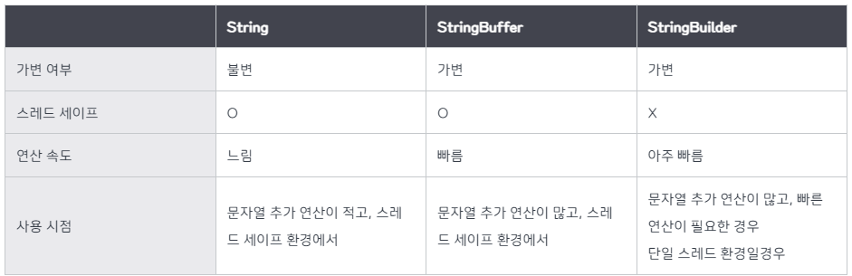
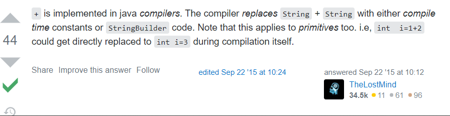

## 1. String
 > **Java의 String은 불변입니다. 즉, 일단 생성된 값은 변경할 수 없습니다.** <br> 
 > 'String'을 수정하는 것처럼 보이는 작업을 수행할 때마다 실제로는 새로운 'String' 개체를 생성하는 것입니다.

```java
public class StringExample {
    public static void main(String[] args) {
        String str1 = "Hello";
        String str2 = "World";

        // Concatenation creates a new String object
        String result = str1 + ", " + str2;

        System.out.println(result); // Output: Hello, World
    }
}
```

```java
public class StringExample {
    public static void main(String[] args) {
        
        String str1 = "Hello";
        System.out.println("str1 address: " + System.identityHashCode(str1));
        //   str1 address: 81628611
        
        str1="World";
        System.out.println("str1 address: " + System.identityHashCode(str1));
        //   str1 address: 1072408673
        
        String str2 = "Hello";
        System.out.println("str2 address: " + System.identityHashCode(str2));
        //    str2 address: 81628611
    }
}
```


### 특성
- **Immutable(불변)**: String 객체가 생성되면 해당 값을 변경할 수 없습니다.<br>
- **Thread-safe(스레드로부터 안전함)**: String 객체는 불변이기 때문에 데이터 손상 위험 없이 여러 스레드 간에 안전하게 공유될 수 있습니다.<br>
- **Slower Concatenation(느린 연결)**: '+' 연산자를 사용하여 문자열을 연결하는 것은 비효율적일 수 있습니다. 특히 루프에서는 매번 새 개체가 생성되므로 비효율적일 수 있습니다.<br>
- **사용 사례**: <br>
  - 문자열의 값이 자주 변경되지 않을 것으로 예상되는 경우. 스레드 안전성이 중요한 상황.

## 2. StringBuffer
   > StringBuffer도 시퀀스의 문자를 나타내도록 설계되었지만 String과 달리 변경할 수 있습니다. 
   > 즉, 새 개체를 만들지 않고도 StringBuffer 개체의 내용을 수정할 수 있습니다.

```java
public class StringBufferExample {
    public static void main(String[] args) {
        StringBuffer buffer = new StringBuffer("Hello");

        // Modifying StringBuffer
        buffer.append(", ").append("World");

        System.out.println(buffer.toString()); // Output: Hello, World
    }
}
```

### 특성
- **Mutable(변경 가능)**: 새 객체를 생성하지 않고도 StringBuffer의 내용을 수정할 수 있습니다.
- **Thread-safe(스레드로부터 안전함)**: StringBuffer 메소드가 동기화되어 멀티 스레드 환경에서 사용하기에 안전합니다.<br>
- **Slower performance(느린 성능)**: 동기화로 인해 StringBuffer 작업은 StringBuilder 작업보다 느립니다.<br>
- **사용 사례**:<br>
  - 스레드 안전성이 요구되는 멀티스레드 환경에서. 문자열에 대한 동적 수정이 필요한 경우.

## 3. StringBuilder
   > StringBuilder는 변경 가능한 문자 시퀀스를 나타낸다는 점에서 StringBuffer와 유사합니다. 
   > 그러나 StringBuffer와는 달리 동기화되지 않으므로 단일 스레드 환경에서 더 빠릅니다.

```java
public class StringBuilderExample {
    public static void main(String[] args) {
        StringBuilder builder = new StringBuilder("Hello");

        // Modifying StringBuilder
        builder.append(", ").append("World");

        System.out.println(builder.toString()); // Output: Hello, World
    }
}
```
### 특성
- **Mutable(변경 가능)**: StringBuffer와 마찬가지로 새 객체를 생성하지 않고도 StringBuilder의 내용을 수정할 수 있습니다.
- **Not thread-safe(스레드 안전하지 않음)**: StringBuffer와 달리 StringBuilder 메서드는 동기화되지 않으므로 멀티 스레드 환경에서 사용하기에 적합하지 않습니다.
- **Faster performance(더 빠른 성능)**: 'StringBuilder'는 동기화 부족으로 인해 'StringBuffer'보다 빠릅니다.
- **사용 사례**:
  - 스레드 안전성이 문제가 되지 않는 단일 스레드 환경에서. 문자열에 대한 동적 수정이 필요하고 성능이 중요한 경우.

## 결론


### String 을 사용해야 할 때 :
- String은 불변성
- 문자열 연산이 적고 변하지 않는 문자열을 자주 사용할 경우
- 멀티쓰레드 환경일 경우 


### StringBuilder 를 사용 해야 할 때 :
- StringBuilder는 가변성
- 문자열의 추가, 수정, 삭제 등이 빈번히 발생하는 경우
- 동기화를 지원하지 않아, 단일 쓰레드이거나 동기화를 고려하지 않아도 되는 경우
- 속도면에선 StringBuffer 보다 성능이 좋다.
- 더 나은 성능을 갖춘 단일 스레드 환경에서 변경 가능한 문자열이 필요한 경우 'StringBuilder'를 선택

### StringBuffer 를 사용해야 할 때 :
- StringBuffer는 가변성
- 문자열의 추가, 수정, 삭제 등이 빈번히 발생하는 경우
-  스레드 안전성이 중요한 경우 'StringBuffer'를 선택
- 동기화를 지원하여, 멀티 스레드 환경에서도 안전하게 동작
<br>

## 참고사항


 사실 <span style="color:orange"> 자바는 문자열에 + 연산을 사용하면, 컴파일 전 내부적으로 StringBuilder 클래스를 만든 후 다시 문자열로 돌려준다고 한다.</span>

즉, "hello" + "world" 문자열 연산이 있다면 이는 new StringBuilder("hello").append("world").toString() 과 같다는 말이다.

```java
    String a = "hello" + "world";

    /* 는 아래와 같다. */
    String a = new StringBuilder("hello").append("world").toString();
// StringBuilder를 통해 "hello" 문자열을 생성하고 "world"를 추가하고 toString()을 통해 String 객체로 변환하여 반환Copy
```

이처럼 겉으로는 보기에는 문자열 리터럴로 + 연산하거나, StringBuilder 객체를 사용하거나 어차피 자동 변환해줘서 차이가 없어 보일지도 모른다.<br>
하지만 다음과 같이 문자열을 합치는 일이 많을 경우 단순히 + 연산을 쓰면 성능과 메모리 효율이 떨어지게 된다.
``` java

    String a = "";
    
    for(int i = 0; i < 10000; i++) {
        a = a + i;
    }
    
    /* 위의 문자열 + 연산 식은 결국 아래와 같다. */
    /* 즉, 매번 new StringBuilder() 객체 메모리를 생성하고 다시 변수에 대입하는 멍청한 짓거리를 하고 있는 것이다. */
    
    String a = "";
    
    for(int i = 0; i < 10000; i++) {
        a = new StringBuilder(b).append(i).toString();
    }
```


#### 📖 참고문헌 📖
- https://inpa.tistory.com/entry/JAVA-☕-String-StringBuffer-StringBuilder-차이점-성능-비교#문자열_자료형_비교_총정리
