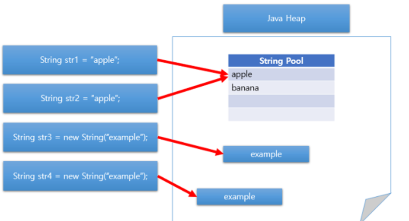

## String 재사용(Interning)

```java
public class StringTest {

    public static void main(String[] args) {
        String str1 = new String("Hi");
        String str2 = "Hi";
        String str3 = "Hi";
    }
}
```

해당 코드를 실행하면 **객체가 3개가 아니라 2개**가 만들어진다.

왜 2개일까?

이 두가지의 문자열 생성 방식은 JVM이 관리하는 메모리 구조상에서 차이가 발생한다.

String은 다른 객체들에 비해 광범위하고, 빈번하게 사용되므로 String을 사용할 때마다 객체를 생성하는 방식으로 사용하게 된다면, 새로운 객체를 계속 만들어내는 것이기 때문에 **메모리 관리 측면에서 비효율적**이다.
이러한 String을 효율적으로 관리하기 위해, Heap 메모리영역 속에 **String Constant Pool**을 만들었다.
이곳에는 생성된 문자열의 값을 보관하고 있으며, 리터럴””로 생성된 같은 값을 가지는 객체는 같은 레퍼런스(참조값, 주소)를 가지게 된다.



위 코드에서는 new String 연산자로 생성된 객체(Heap 메모리 영역에 저장), 그리고 리터럴로 생성된 객체(String Pool에 저장), 총 2개의 객체가 생성되는 것이다.

Java에서 String은 불변(immutable) 객체입니다. 이 덕분에 JVM은 String Constant Pool에 각 문자열 리터럴의 복사본을 하나만 저장하여, 문자열에 할당되는 메모리 양을 최적화할 수 있습니다.
그리고 해당 과정을 재사용(Interning)이라고 합니다.
<br>
String 변수를 만들고 값을 할당할 때 JVM은 String Constant Pool에서 동일한 값의 String을 검색합니다.
만약 동일한 값을 가진 String이 발견된다면 자바 컴파일러는 추가 메모리를 할당하는 것이 아니라, 단순히 해당 String의 주소에 대한 참조를 반환합니다.
<br>
만약 존재하지 않는다면 해당 값은 String Constant Pool에 추가되고(인턴) 해당 값에 대한 참조가 반환됩니다.

## 가비지 컬렉터

Java 7 이전에는 JVM이 고정된 크기를 가진 PermGen이라는 공간에 String Constant Pool을 배치했습니다.
PermGen이라는 공간은 크기가 고정되어 있어서 런타임 시 확장이 불가능하며 garbage collection에 적합하지 않습니다.

PermGen에서 너무 많은 문자열을 재사용(interning)하는 경우 JVM에서 OutOfMemory 오류가 발생할 수 있습니다.
<br>
Java7 이후부터 String Constant Pool은 JVM에 의해 Garbage Colleted되는 Heap 메모리 영역에 배치되었습니다.
Heap 영역에 배치되는 것의 장점은, 참조되지 않은 String은 GC에 의해 String Constant Pool에서 제거되어 메모리가 해제되기 때문에 OutOfMemory 오류의 위험이 감소한다는 점입니다.
(참고로 PermGen은 Java8부터 Metaspace로 대체되었습니다.)

## 참고 - Compact Strings

Java 8버전까지는 String은 내부적으로 UTF-16으로 인코딩된 문자 배열인 char[]로 표현되어 대부분의 언어가 1바이트로 표현이 가능했음에도 불구하고 2바이트의 메모리를 사용했습니다.
그러나 Java 9에서는 Compact Strings를 제공함으로써, 저장된 문자열의 내용에 따라 char[]과 byte[] 사이에서 적절한 인코딩을 선택하여 사용합니다.
따라서 Heap 메모리 사용양이 상당히 줄어들었고, JVM에서 GC 오버헤드가 줄어들었습니다.

## 왜 String Constant Pool은 Heap 영역에 존재할까?

자바에서는 객체를 생성하거나 변수를 선언할 때마다 메모리에 저장됩니다.
자바에서 메모리는 Stack과 Heap영역, 이렇게 두 가지 영역으로 나눕니다.
Stack 영역과 Heap 영역은 서로 저장하는 데이터가 다르며, 데이터를 저장하는 방법과 데이터에 접근하는 방식이 다릅니다.

위에서도 배웠지만 String 리터럴(literal)을 선언할 때, JVM은 해당 String 객체를 이곳(String Constant Pool)에 저장하고, Stack 메모리 영역에서 이를 참조합니다.
<br>
(추가로 지금부터 설명하는 String 생성은 특별한 언급이 없는 이상 모두 리터럴로 생성되는 String입니다.)
<br>
<br>
각각의 String 객체를 메모리에 생성하기 전에, JVM은 메모리의 오버헤드를 줄이기 위해 몇가지 과정을 수행합니다.
<br>
String constant pool은 HashMap으로 구현되어 있습니다. Hashmap 각각의 bucket(저장공간)은 같은 해시코드를 가진 String list를 저장합니다. (옛날 버전의 자바에서는 String constant pool의 저장공간은 고정된 크기였으며, 종종 "객체 Heap을 저장하기 위한 충반한 공간이 없습니다"라는 오류를 발생시켰습니다.)
<br>
<br>
시스템이 클래스를 로드할 때(클래스 로더에 의해 로드될 때) 모든 클래스의 문자열 리터럴은 application-level pool(String constant pool)로 이동하는데, 이는 서로 다른 클래스의 String 리터럴들은 동일한 객체여야 하기 때문입니다.
그리고 현재 상황(String 리터럴들이 String constant pool로 이동한 상황)에서, pool속에 들어있는 데이터들은 어떠한 종속성 없이도 각각의 Class들에서 사용이 가능해야 합니다.
<br>
일반적으로 Stack 메모리 영역에는 수명이 짧은 데이터들이 저장됩니다. 지역변수, (Heap에 저장된 실제 객체의 주소값을 참조하는) 참조변수, 그리고 실행중인 메소드들이 Stack 메모리 영역에 저장되는 데이터들입니다.
<br>
Heap 메모리 영역은 동적인 메모리 할당을 허용하며 런타임 시 Java의 객체 및 JRE 클래스를 저장합니다.

참고

- https://ttl-blog.tistory.com/388
- https://coding-factory.tistory.com/536